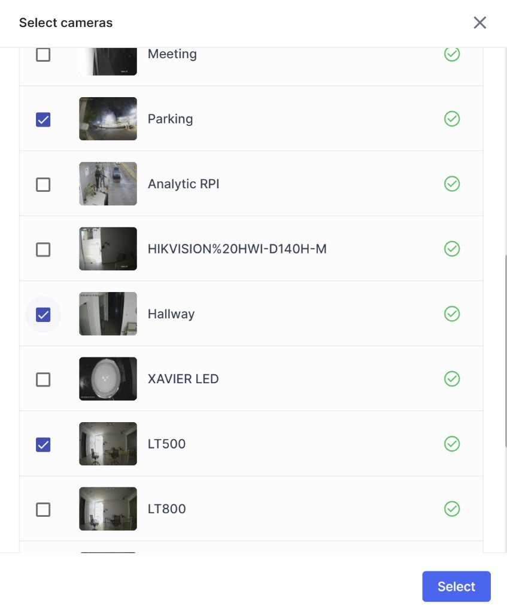

# Multi-camera playback

Lumana enables investigators to create customizable, on-the-fly video walls that synchronize feeds from various cameras. This functionality empowers users to scrub through multi-camera thumbnails, providing a comprehensive view of an incident. This advanced feature empowers investigators to efficiently manage and analyze video footage from different angles getting a broader context of the incident.

 

Accessing multi-camera playback within the Lumana platform is a breeze, as it offers users the flexibility to do so from various locations. Simply click the "**Add cameras**" button wherever you encounter thumbnail views. Whether you're navigating through camera feeds, search results, or even reviewing alerts, this intuitive feature allows you to seamlessly integrate and synchronize multiple camera perspectives for comprehensive playback and analysis. 

 

Select the cameras you would like to scrub in the synchronized view 

Once you hit select you will be able to scrub between all the cameras at once scrolling over the wall ruler. Note: The green highlighted on camera LD800 indicates that the object searched for exists in those frames.

The **Multi-Camera Playback** feature allows users to select and view recorded footage from **up to 4 cameras simultaneously**, synchronized on a unified timeline. This feature is designed to streamline event analysis and provide better spatial context across multiple camera views.

## Feature Capabilities
- **Synchronized playback**: All selected cameras play back in sync, maintaining the same timestamp across all views.

- **Up to 4 streams**: Users can choose any combination of up to 4 cameras for parallel playback.

- **Unified controls**: Playback actions (play, pause, seek, speed change) are applied uniformly to all views.

## Use Cases and Benefits
Multi-Camera Playback is designed to improve situational awareness and streamline video review workflows in the following scenarios:

- **Incident reconstruction**: Analyze events that span multiple zones (e.g., tracking a subject across entrances, hallways, and exits) by viewing all relevant camera angles in parallel. This reduces the time and effort needed to piece together timelines manually.

- **Operational and compliance audits**: Evaluate activities across several points in a workflow (e.g., warehouses, production lines, or public spaces) to identify inefficiencies, rule violations, or safety issues — all within a synchronized view.

- **Alert and event verification**: Validate motion triggers, anomalies, or security alerts by checking multiple camera perspectives. This helps confirm or rule out events and reduces false positives.

- **Coverage evaluation**: Identify blind spots, overlaps, or inconsistencies in camera placement by observing how areas interact in real time.

### How to use Multi-Camera Playback
1. Navigate to the desired camera and select the relevant time range.
2. Change to video tab.

3. Click on 

4. Select up to 3 additional cameras that you want to review.

5. All selected cameras will now play in sync. You can adjust playback speed, navigate along the timeline, and export footage to the archive.

