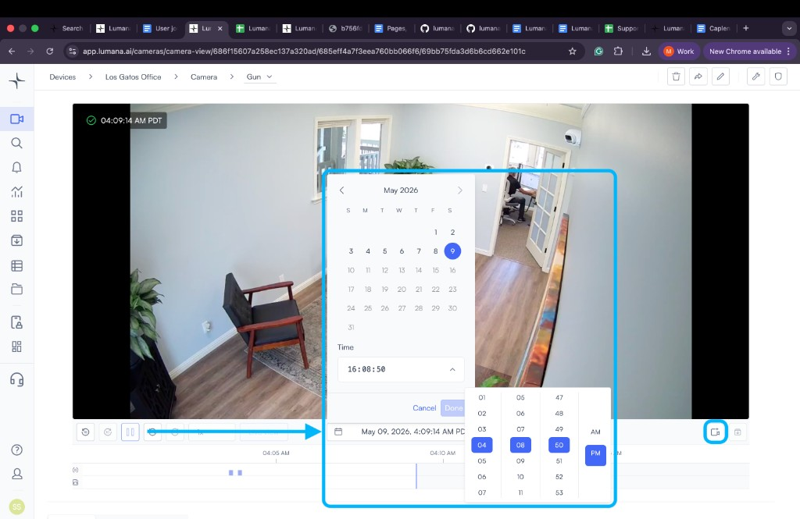
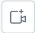
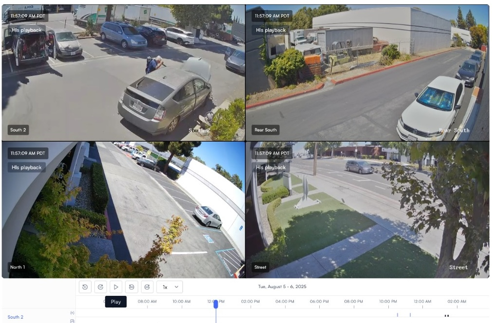

# Use multi-camera playback

Use multi-camera playback to review footage from up to four cameras on one synchronized timeline. This helps you compare activity across nearby cameras, reconstruct incidents, and confirm alerts without scrubbing each feed separately.

## Prerequisites

Make sure usable footage exists around the playback moment you need. Confirm you can reach other cameras before you attach them.

You can open a camera viewer from feeds, thumbnails in search results, alerts, or **Devices**.

## Set up a multi-camera playback view

Open one camera viewer, anchor playback on a date and clock instant, then add up to three more synchronized feeds.

1. Open the camera you want first.
2. Select the date-and-time control below the player.

   The calendar and clock picker opens.

3. Choose the playback date and clock fields for the instant you want. That moment anchors playback.

4. Select **Done**.

5. Select the  multi-camera playback icon at the bottom-right edge of the video.

6. Select up to three more cameras inside the picker, then select the **Select** button.

7. Review the synchronized playback view.

   All selected cameras stay on one timeline. You can scrub across the incident, change playback speed, and export footage to the archive.

If you need fewer rows on screen after you attach cameras, search cameras or drill into locations from the same picker.


In search-based playback, a green highlight on a camera timeline marks frames where the searched object appears.


## Next steps

After you review synchronized footage, you can continue with related live monitoring tasks.

- Use [Live view](live-view.md) to monitor cameras in real time.
- Read [Use video walls and shared displays](video-walls-and-shared-displays.md) to build saved or temporary camera layouts.