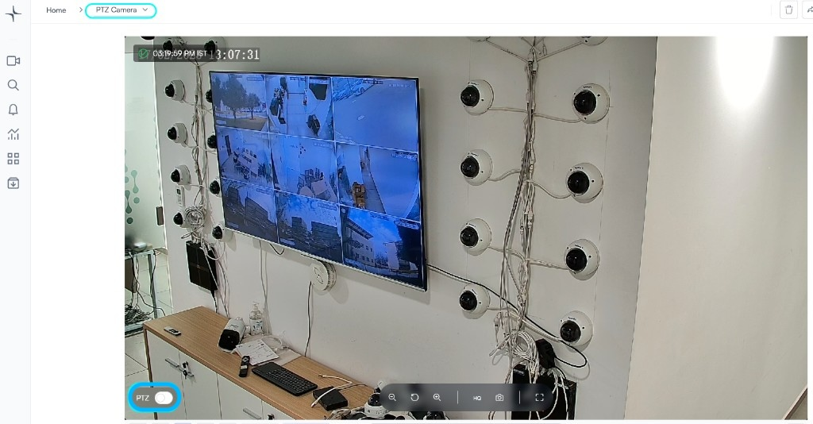
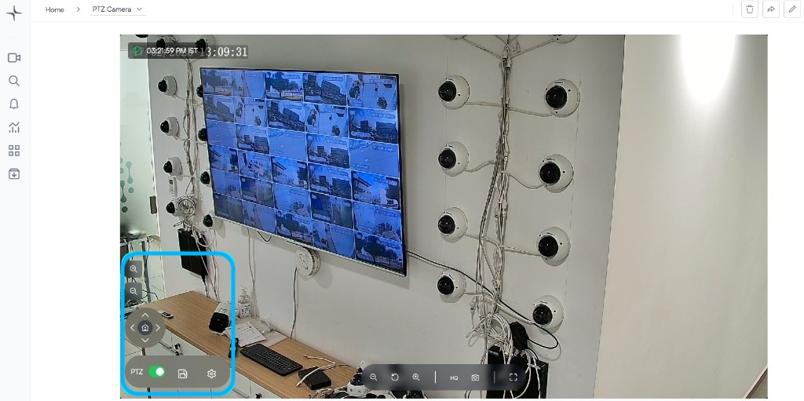

# PTZ control

Use pan, tilt, and zoom from live view when your permissions allow it and an administrator has enabled PTZ for that camera in **Edit camera**. For setup (driver, path, port), see [Enable PTZ control](../set-up-cameras-and-devices/enable-ptz-control.md).

## Use PTZ in live view

1. Open the camera from the **Devices** list.
2. Enable **PTZ control** at the bottom of the camera view.

   

3. Use the on-screen controls:

   * **Arrow controls** to pan and tilt
   * **Zoom controls** to adjust magnification

   

For PTZ from the Lumana mobile app, see [PTZ (pan, tilt, zoom) control](../the-lumana-mobile-app/access-camera-control/ptz-pan-tilt-zoom-control.md).
