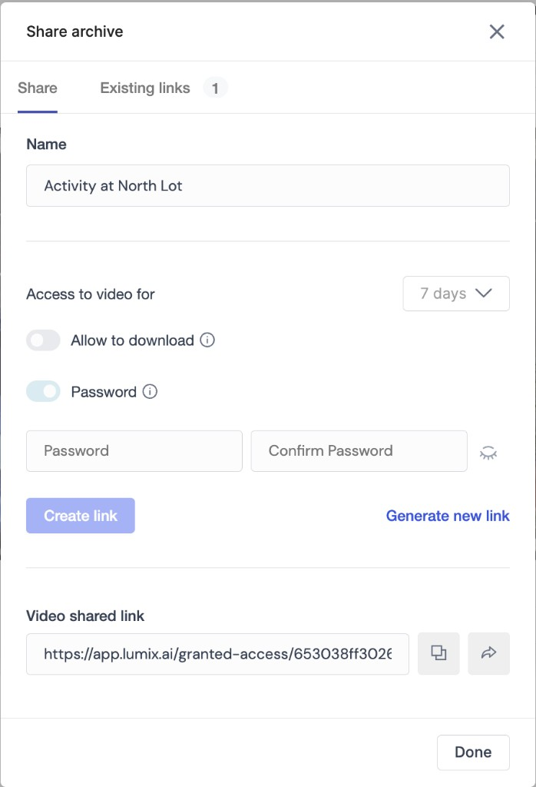
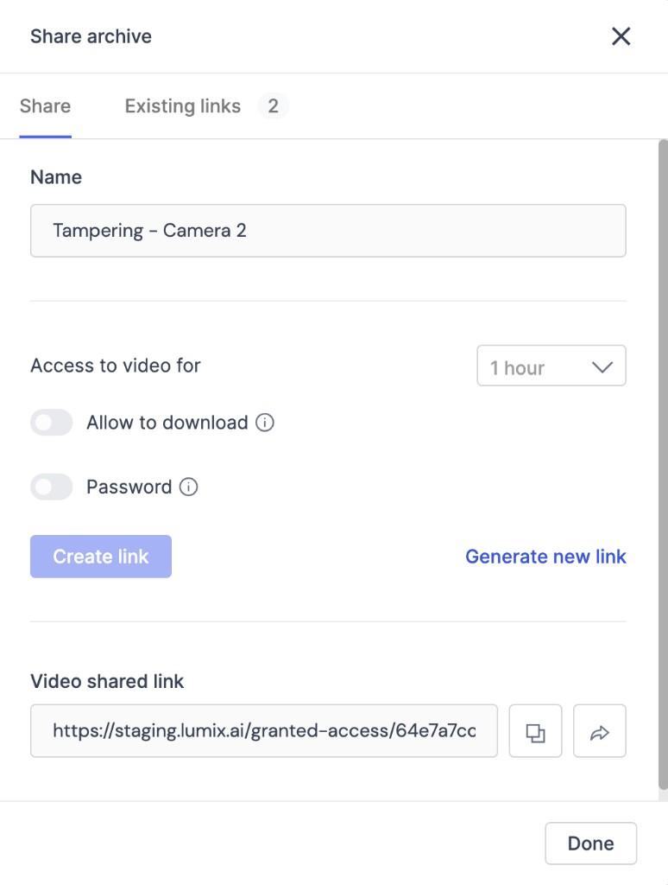

# Share video

Use Lumana sharing options to send live camera views and archived footage to other viewers. You can start from a live camera, an alert, search results, or an existing archive, then control how long access lasts and whether viewers need a password or can download the footage.

## Before you begin

Make sure you can access the camera, alert, search result, or archive you want to share. If you want to send the share directly from Lumana, have the recipient's email address or phone number ready.

## Choose sharing options

When you share footage from Lumana, the **Share archive** dialog lets you choose how people receive access and what restrictions apply.

* **Sharing methods:** Generate a shareable link, send the share by email, or send it by SMS.
* **Access controls:** Set how long the share stays available, require a password, and choose whether viewers can download the archive.

## Share a live camera

Use this option when you want someone to watch a live camera feed.

1. Select the desired camera.
2.  In the upper-right corner of the live view page, click **Share**.

    The **Share archive** dialog opens.

## Share an alert

Use this option when you want to share footage from a specific alert.

1. Choose the alert you’d like to share by clicking on it.
2.  In the upper-right corner of the alert view window, click **Share**.

    The **Share archive** dialog opens.

## Share search results

Use this option when you want to share a clip based on search results.

1. Choose the correct thumbnail in the search results.
2.  Click **Create archive**.

    The archive creation flow opens for the selected footage.
3. Give the archive a name.
4. Select the clip duration, then click **Create**.
5.  Click **Share**.

    The **Share archive** dialog opens.

## Share an existing archive

Use this option when the archive already exists and you only need to manage sharing settings.

1. Navigate to the archive page.
2. Select the archive you want to share, then click **Share**.
3. Choose how long access stays available and whether viewers can download the archive or need a password.

4.  Click the arrow button next to the share link.

    You can enter one or more email addresses or phone numbers.
5. Click **Send**.

## Next steps

After you share footage, you can continue with related review and monitoring tasks.

* Use [Multi-camera playback](multi-camera-playback.md) to review recorded footage across multiple cameras before you share it.
* Use [Live view](live-view.md) to monitor cameras in real time.
* Read [Working with Lumana Archives](https://support.lumana.ai/hc/en-us/articles/13735010412306) for more detail about archive workflows.
