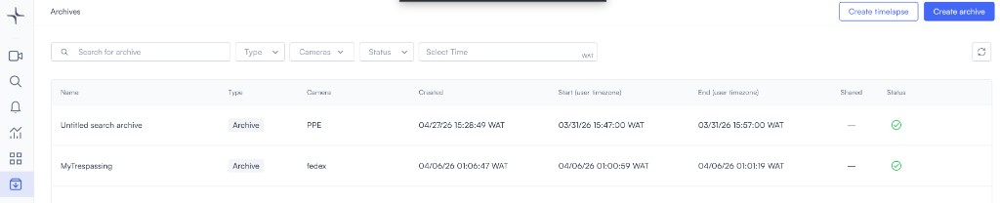
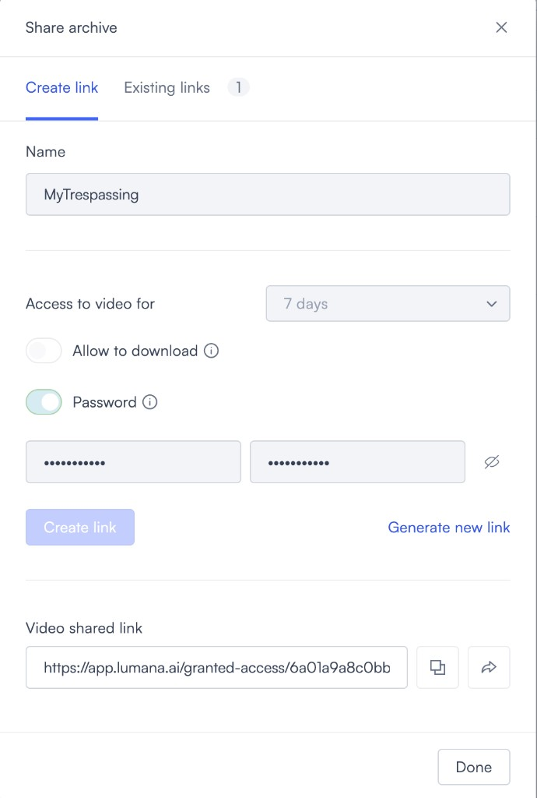
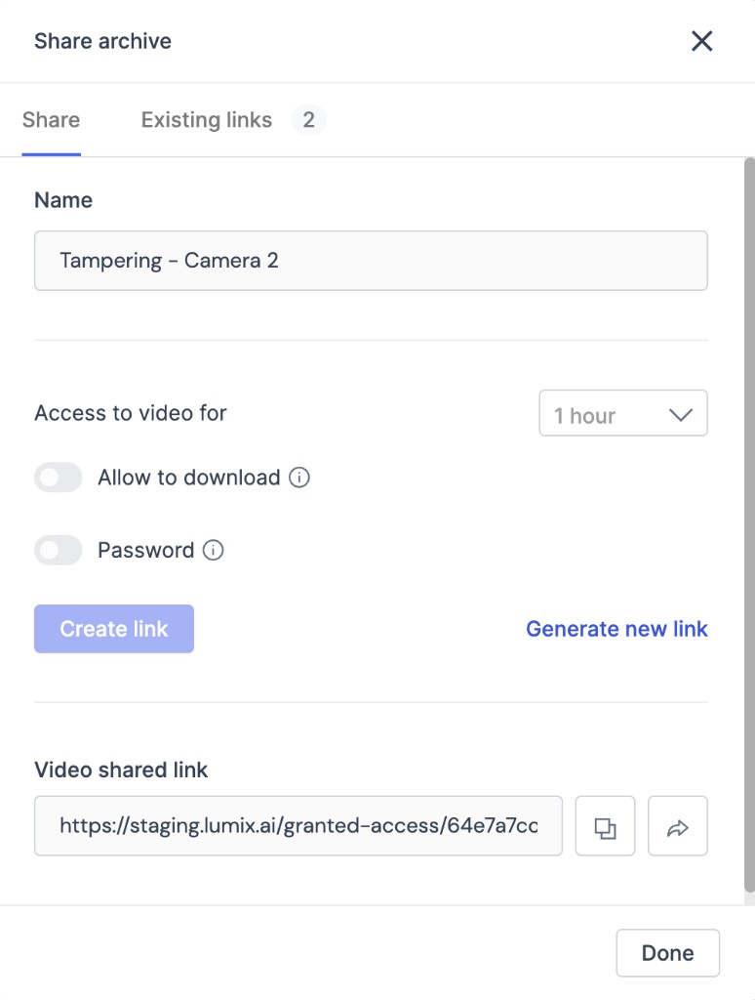
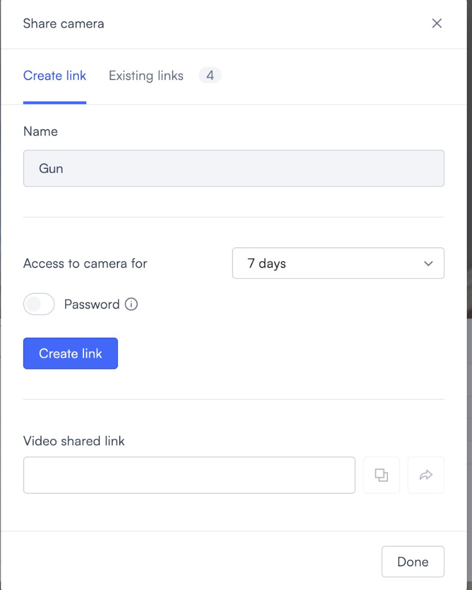
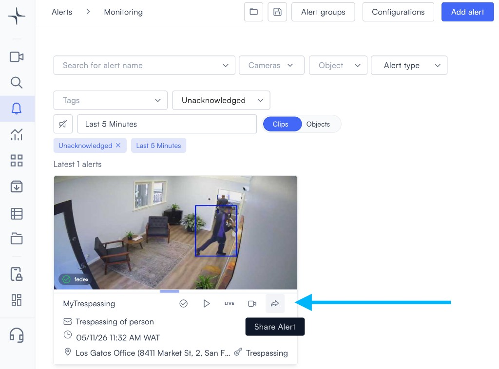
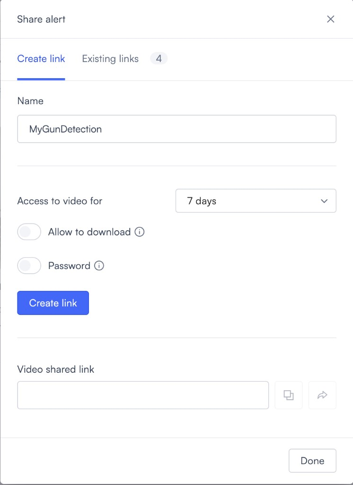

# Share video

Use Lumana sharing options to send live camera views and archived footage to other viewers. You can start from a live camera, an alert, search results, or an existing archive. Then choose how long access lasts and whether viewers need a password or can download the footage.

## Prerequisites

Make sure you can access the camera, alert, search result, or archive you want to share. If you want to send the share directly from Lumana, have the recipient's email address or phone number ready.

## Choose sharing options

**Share archive** is the dialog you use to create a **Video shared link** for saved footage. The steps below follow the **Archives** path. Use this when the clip **already appears** in **Archives** or after you **Create archive** (for example from search) and return to the list.

From live view, **Share camera** opens when you select **Share**. From an alert on **Monitoring**, **Share alert** opens. Both use the same **Create link** pattern with label differences (see [**Share a live camera**](#share-a-live-camera) and [**Share an alert**](#share-an-alert)).

**Go to Archives**

1. In the left sidebar, select **Archives**.

   The **Archives** page lists saved clips and timelapses. Use **Search for archive** and the row filters when the list is long.

2. Select the archive you want to share.

   If it is not in the list yet, select **Create archive** in the upper right. Finish the archive workflow, then return to **Archives**.

3. Select the archive to open it, then select **Share**.

   **Share archive** opens. The **Create link** tab is active by default. **Existing links** may show a count badge if you saved links before.

**Create link and copy or send**

4. Enter a **Name** for this share (for example the incident or camera name).
5. Open **Access to video for** and choose how long the link works, for example **7 days**.
6. Turn **Allow to download** on or off so viewers can save the file or stream only (**Share camera** omits this toggle; **Share archive** and **Share alert** include it).
7. Turn **Password** on, then type and confirm a password if viewers must enter one before playback.
8. Select **Create link**.

   Lumana fills **Video shared link** with the URL. Select the copy icon to copy the address. Select the share icon to send it through another channel where your deployment supports it (for example email or SMS).

9. Open the **Existing links** tab when you need an earlier link or want to send one by email or SMS.

### Send the link by email or SMS

1. Select the arrow button next to the share link.

   You can enter one or more email addresses or phone numbers.

2. Select **Send**.

10. Select **Done** to close **Share archive**.

## Share a live camera

Use this option when you want someone to watch a live camera feed.

1. Select the desired camera.
2. In the upper-right corner of the live view page, select **Share**.

   The **Share camera** dialog opens.

3. Complete steps 4–10 in [**Choose sharing options**](#choose-sharing-options). On **Share camera**, use **Access to camera for** instead of **Access to video for**, and skip step 6.

## Share an alert

Use this option when you want to share footage from a specific alert.

1. Open **Alerts**, then select **Monitoring**.

2. Find the alert you want (for example under **Latest** alerts). On the alert card, select **Share** in the action row next to the title (curved arrow icon; hover shows **Share Alert**).

   The **Share alert** dialog opens.

3. Complete steps 4–10 in [**Choose sharing options**](#choose-sharing-options). **Share alert** matches **Share archive** on **Create link**, including **Access to video for** and **Allow to download**.

## Share search results

Use this option when you want to share a clip based on search results.

1. Run your search and select the thumbnail or row for the footage you want. For search-specific steps, see [Search video footage for people or vehicles](../databases-analytics-and-search/search-video-footage-for-people-or-vehicles.md), [Filter people, faces, vehicles, and license plates from the camera view](../databases-analytics-and-search/search-video-footage-for-other-objects.md), or [Free text search](../databases-analytics-and-search/free-text-search.md).
2. Select **Create archive**, finish saving the clip, then select **Share** so **Share archive** opens.

Continue with steps 4–10 in [**Choose sharing options**](#choose-sharing-options). To send by email or SMS from **Existing links**, use [**Send the link by email or SMS**](#send-the-link-by-email-or-sms).

## Next steps

After you share footage, you can continue with related review and monitoring tasks.

- Use [Multi-camera playback](multi-camera-playback.md) to review recorded footage across multiple cameras before you share it.
- Use [Live view](live-view.md) to monitor cameras in real time.
- Read [Working with Lumana Archives](https://support.lumana.ai/hc/en-us/articles/13735010412306) for more detail about archive workflows.