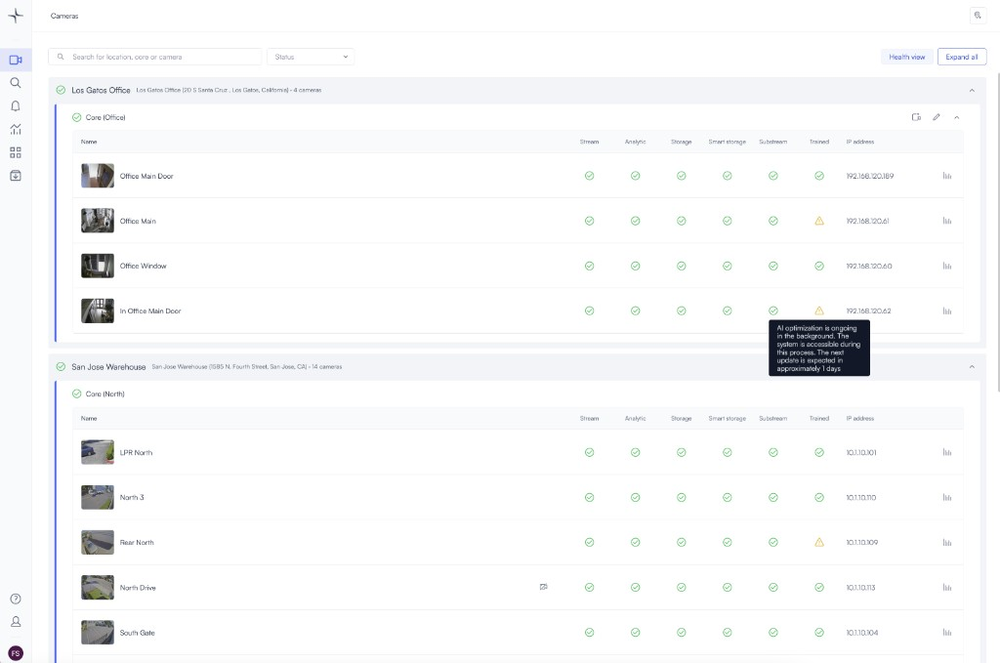
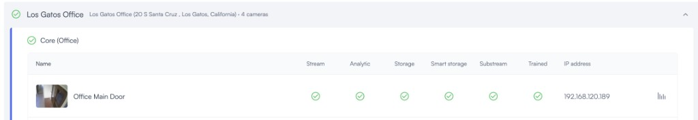

# Use the system health dashboard

Use the system health dashboard to check the current status of your Lumana Core, cameras, and storage, and to review recent health history for each camera. This helps you spot outages, recording issues, and analytics problems before they affect monitoring or investigation work.

## Before you begin

Make sure you can open a camera view page in your organization. You also need access to the Cores and cameras you want to review.

## Open the system health dashboard

Open the dashboard from a camera view page to see the current health status of your organization's Cores and cameras.

1.  On the camera view page, click **Health view**.

    The system health dashboard opens and shows the current status of your Cores, cameras, storage, and recent recording status information.

    

    

## Review camera health history

Use the row controls to inspect recent online and offline history for an individual camera.

1.  In the rightmost column for a camera, click the small bar-chart icon.

    A camera-specific status view opens and shows recent online and offline activity.
2.  Hover over the status bars to see more detail.

    Hover details appear for the selected time segment.
3.  Adjust the number of days to change the time window.

    The status view updates to match the selected time range.

    

Once you review recent status history, the health indicators help you identify which part of the camera workflow needs attention.

## Understand health indicators

Use the status indicators to identify which part of the camera workflow needs attention.

* **Stream:** Shows whether the camera stream is online or offline.
* **Analytics:** Shows the status of AI analytics. If this area is unhealthy or offline, alerts and search may be affected.
* **Storage:** Shows the status of 24/7 local storage on the Core. Retention is based on your 30-day, 60-day, or 90-day subscription.
* **Smart Storage:** Shows the status of alerts and detected objects saved to the cloud in high quality.
* **Substream:** Supports storage retention and smart storage. If a substream is not configured, then this indicator may not appear. If it is unhealthy or offline, storage may be affected.
* **Trained:** Shows the status of the camera's AI optimization cycle. This process runs automatically and usually requires no action. An unhealthy status can mean the camera was recently added and is still completing its first training cycle. It can also mean another training cycle is due.


If the **Trained** indicator stays unhealthy and you are not sure why, contact your Customer Success Manager.


## Next steps

After you review system health, you can continue with related monitoring tasks.

* Use [Live view](live-view.md) to monitor cameras in real time.
* Use [Multi-camera playback](multi-camera-playback.md) to review recorded footage across multiple cameras.
