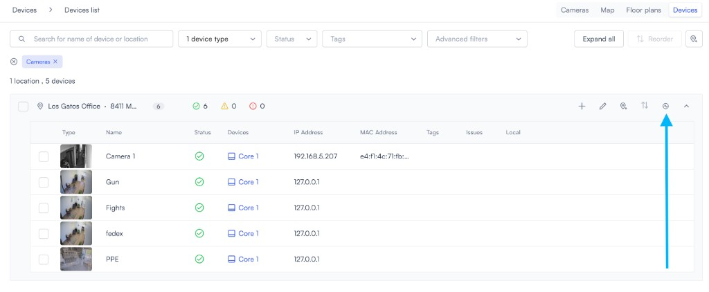
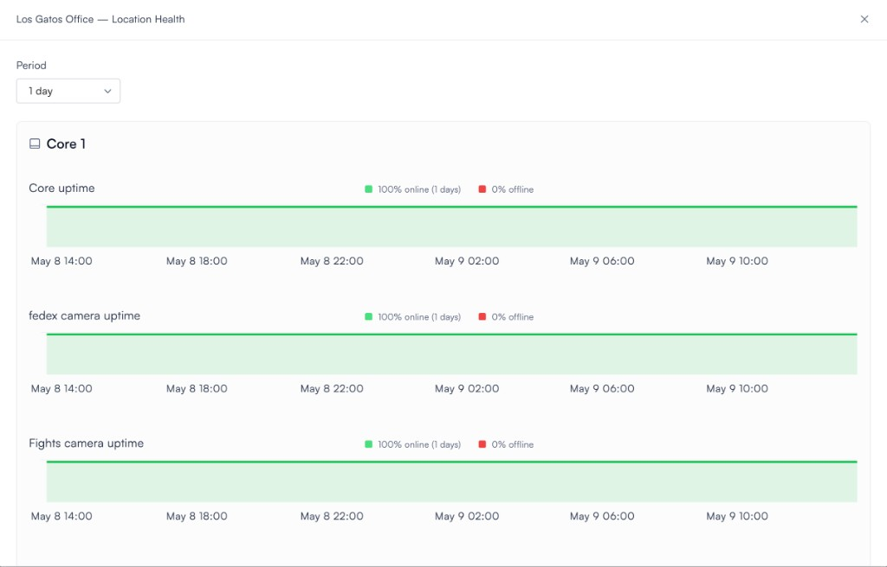

# Use the system health dashboard

Use the system health dashboard to check the status of your Lumana Core, cameras, and storage. Review recent health history for each camera. This helps you spot outages, recording issues, and analytics problems before they affect monitoring or investigation work.

## Prerequisites

Make sure you can open **Devices** and view the **Devices list** in your organization. You also need access to the Cores and cameras you want to review.

## Open the system health dashboard

Open the dashboard from the **Devices list** to see the current health status of your organization's Cores and cameras for a location.

1. Go to **Devices** > **Devices list**. If another tab is selected at the top of the page (for example **Cameras** or **Map**), then select **Devices** so the devices table is visible.

2. In the header row for the location, select the **System health** icon (pulse/line graph). The icon sits to the right, near the add, edit, and reorder actions. The screenshot below shows the **Devices list** with that icon highlighted; you are still on **Devices list** until the dashboard loads.

   

3. After you select **System health**, the system health dashboard opens. It shows the current status of your Cores, cameras, storage, and recent recording for that location.

## Review location uptime history

In **Location Health**, review uptime for each Core and its cameras.

1. Open **Period** and choose the time range to review (for example **1 day**).

2. Under each **Core**, read the uptime rows for the Core and for each camera. Green shows time online; red or breaks show offline time.

3. Hover a segment of a bar for interval details.

   

## Understand health indicators

Use the status indicators to identify which part of the camera workflow needs attention.

- **Stream**: Shows whether the camera stream is online or offline.
- **Analytics**: Shows the status of AI analytics. If this area is unhealthy or offline, then alerts and search might be affected.
- **Storage**: Shows the status of 24/7 local storage on the Core.
- **Retention**: Reflects the 30-day, 60-day, or 90-day subscription tier attached to that storage.
- **Smart Storage**: Shows the status of alerts and detected objects saved to the cloud in high quality.
- **Substream**: Supports storage retention and smart storage. If a substream is not configured, then this indicator might not appear. If it is unhealthy or offline, then storage might be affected.
- **Trained**: Shows the status of the camera's AI optimization cycle. Training runs automatically and usually requires no action. An unhealthy **Trained** status can mean the camera was recently added and is still completing its first cycle, or that another cycle is due.


If the **Trained** indicator stays unhealthy and you are not sure why, then contact your Customer Success Manager.


## Next steps

After you review system health, you can continue with related monitoring tasks.

- Use [Live view](live-view.md) to monitor cameras in real time.
- Use [Multi-camera playback](multi-camera-playback.md) to review recorded footage across multiple cameras.
