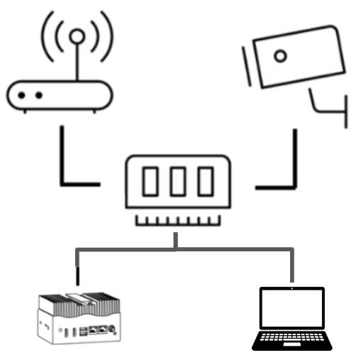
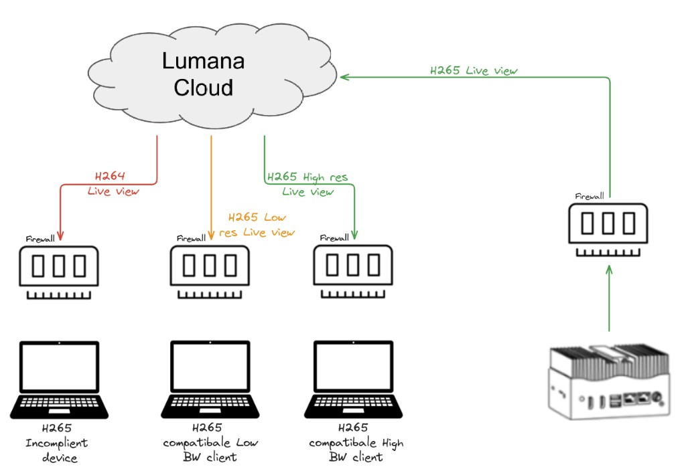
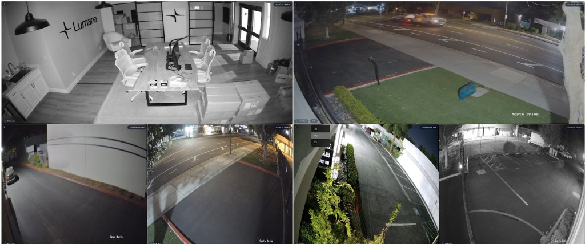

# Understand live view streaming and quality

This page explains how Lumana delivers live video, when local or cloud streaming is used, and how stream quality changes based on your device, browser support, and layout.

## How live view delivery works

Lumana can deliver live video through a local connection or through Lumana Cloud. The available path depends on your network, device, browser support, and the number of streams you open.

In most cases, the biggest factors are whether the viewing device can reach Lumana Core directly on the network and whether the browser or device supports the available stream format. Stream layout and bandwidth then affect which quality level Lumana can use.

## Local streaming

Local streaming sends video from Lumana Core directly to the viewing device without relying on Lumana Cloud. This reduces internet traffic and can improve live view performance on the local network.

This matters most when you need lower latency and more consistent live view performance on the same local network.

### Requirements for local streaming

Use local streaming when the viewing device can reach Lumana Core directly on the network.

* Direct access to the Lumana Core local IP.
* No proxy between the client and Lumana Core.


If a camera uses H.265 and the viewing browser or device does not support H.265, then medium-quality (MQ) local streaming may work while high-quality (HQ) local streaming does not.


### Local live view flow

When you open Live view, Lumana first checks whether the viewing device can reach Lumana Core on the local network. If the connection is available, then Lumana starts the stream directly from Lumana Core.

## Cloud streaming

Cloud streaming delivers live video through Lumana Cloud when local streaming is not available. Use this path when the viewing device cannot connect directly to Lumana Core. This lets you keep using Live view remotely or across restricted networks where a direct local connection is not possible.

This is especially useful when you need to access live video from another location or when local network constraints prevent a direct connection.

### Cloud live view flow

If Lumana cannot establish a local connection, then it switches to cloud streaming. Cloud streaming uses WebRTC to deliver the live view to the client. This keeps Live view available when the client cannot reach Lumana Core directly, though latency and compatibility may vary by browser, device, and connection quality.

Cloud streaming also helps distribute live video to multiple viewers without requiring each viewer to connect directly to Lumana Core.

## Manage streaming quality

Lumana can adjust live view quality automatically, and you can also change it manually in the player.

This helps balance video clarity, bandwidth use, and playback performance across different layouts and network conditions.

### How quality selection works

Lumana supports standard quality (SQ), medium quality (MQ), and high quality (HQ) live view modes. The selected mode depends on the stream layout, the available bandwidth, and the player size.

* Lumana may choose a lower quality automatically when you open multiple streams at the same time.
* You can change the stream quality manually from the player controls.
* In multi-camera layouts, Lumana may prioritize smoother playback over higher quality.

In the example above, the top cameras use `MQ`, while the lower cameras use `SQ`. Hovering over a stream lets you change the stream quality.

### Reference values

Use the following table as a reference for typical local and cloud live view resolutions and approximate bitrates. Values may vary by codec, scene complexity, and camera configuration.

| Native resolution | Quality    | Resolution | Estimated bitrate |
| ----------------- | ---------- | ---------- | ----------------- |
| 3480x2160 (8MP)   | HQ (Local) | 3480x2160  | 5.12 Mbps         |
| 3480x2160 (8MP)   | HQ (Cloud) | 1920x1080  | <3 Mbps           |
| 3480x2160 (8MP)   | MQ         | 960x540    | <0.8 Mbps         |
| 3480x2160 (8MP)   | SQ         | 426x240    | <0.2 Mbps         |
| 2880x1620 (5MP)   | HQ (Local) | 2880x1620  | 3.5 Mbps          |
| 2880x1620 (5MP)   | HQ (Cloud) | 1920x1080  | <3 Mbps           |
| 2880x1620 (5MP)   | MQ         | 960x540    | <0.8 Mbps         |
| 2880x1620 (5MP)   | SQ         | 426x240    | <0.2 Mbps         |
| 2592x1944 (5MP)   | HQ (Local) | 2592x1944  | 3.5 Mbps          |
| 2592x1944 (5MP)   | HQ (Cloud) | 1440x1080  | <3 Mbps           |
| 2592x1944 (5MP)   | MQ         | 720x540    | <0.8 Mbps         |
| 2592x1944 (5MP)   | SQ         | 320x240    | <0.2 Mbps         |
| 2560x1440 (4MP)   | HQ (Local) | 2560x1440  | 3 Mbps            |
| 2560x1440 (4MP)   | HQ (Cloud) | 1920x1080  | <3 Mbps           |
| 2560x1440 (4MP)   | MQ         | 960x540    | <0.8 Mbps         |
| 2560x1440 (4MP)   | SQ         | 426x240    | <0.2 Mbps         |
| 1920x1080 (2MP)   | HQ (Local) | 1920x1080  | 2 Mbps            |
| 1920x1080 (2MP)   | HQ (Cloud) | 1920x1080  | <2 Mbps           |
| 1920x1080 (2MP)   | MQ         | 960x540    | <0.8 Mbps         |
| 1920x1080 (2MP)   | SQ         | 426x240    | <0.2 Mbps         |
| 1280x720 (HD)     | HQ (Local) | 1280x720   | 1.8 Mbps          |
| 1280x720 (HD)     | HQ (Cloud) | 1280x720   | <1.8 Mbps         |
| 1280x720 (HD)     | MQ         | 960x540    | <0.8 Mbps         |
| 1280x720 (HD)     | SQ         | 426x240    | <0.2 Mbps         |

## Next steps

* Use [Use live view](live-view.md) to work with the player, thumbnails, and controls.
* Use [Video walls and shared displays](video-walls-and-shared-displays.md) to monitor multiple cameras in one layout.
* Use [Multi-camera playback](multi-camera-playback.md) to review more than one camera at the same time.
