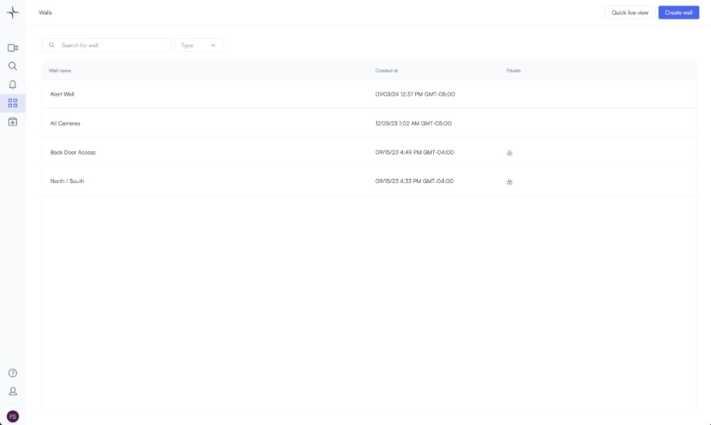
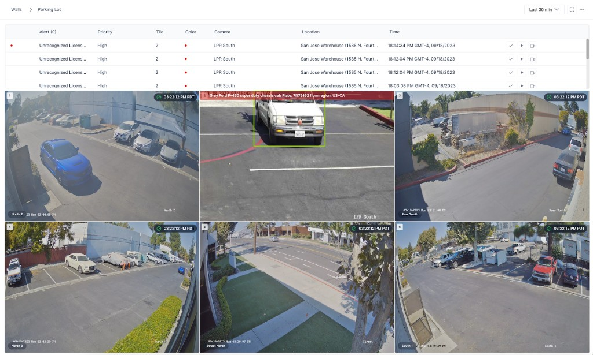
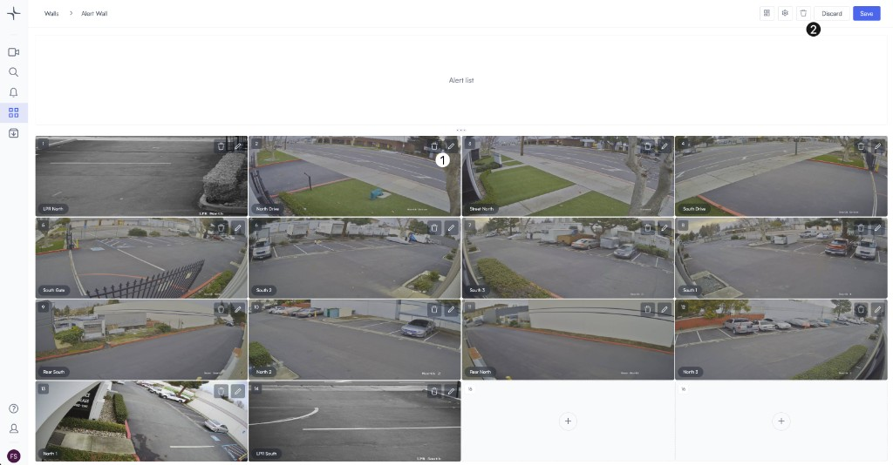
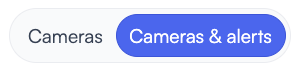
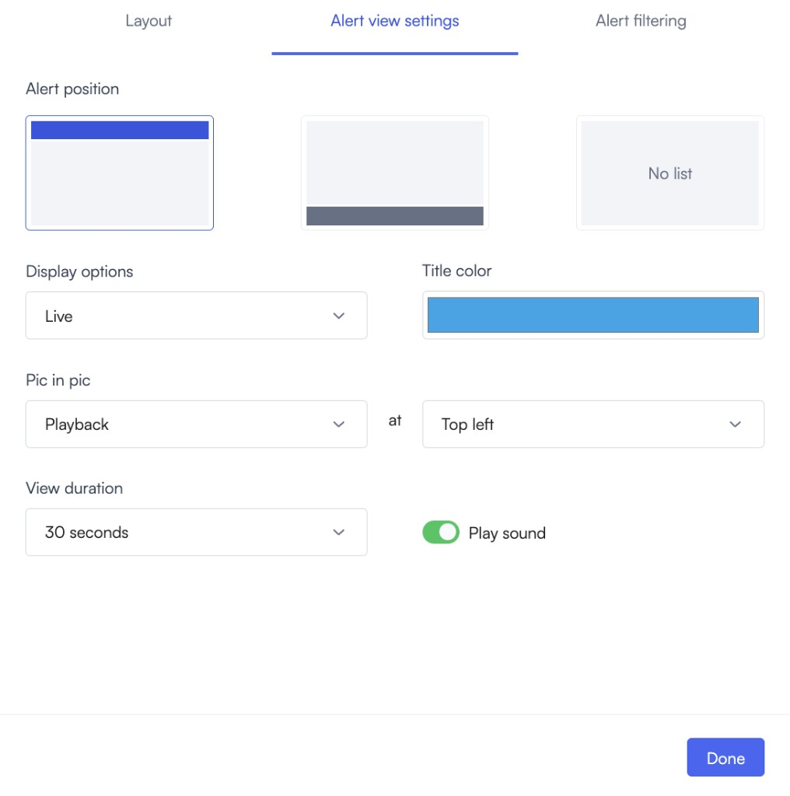
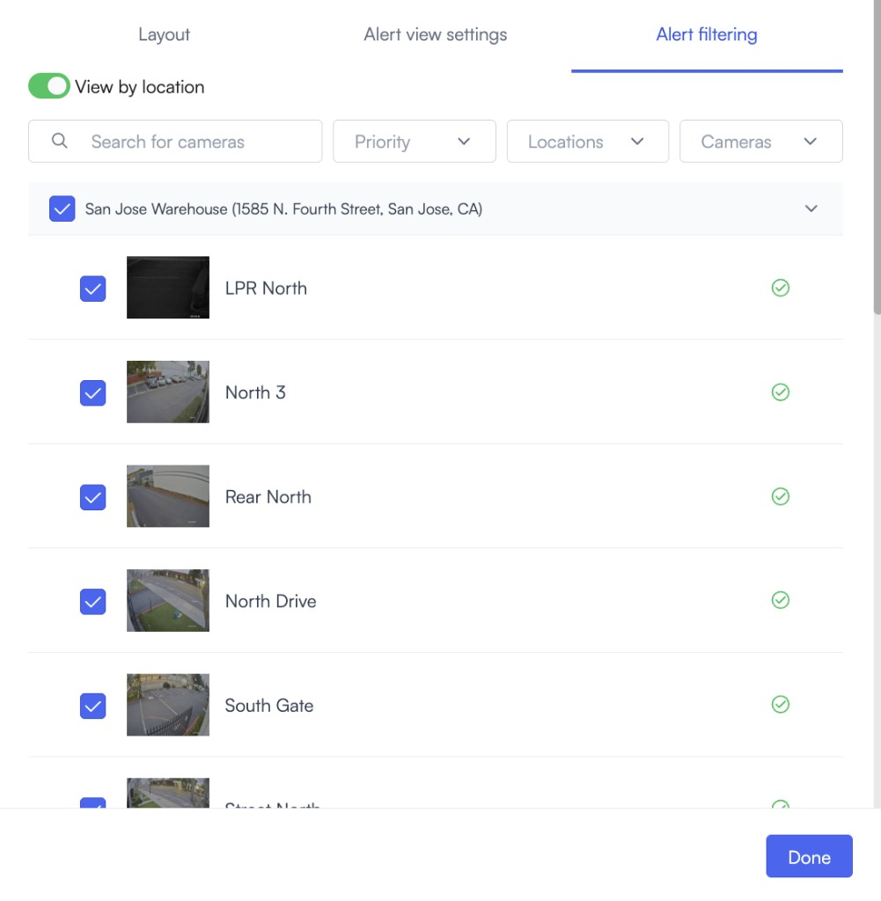
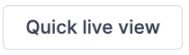
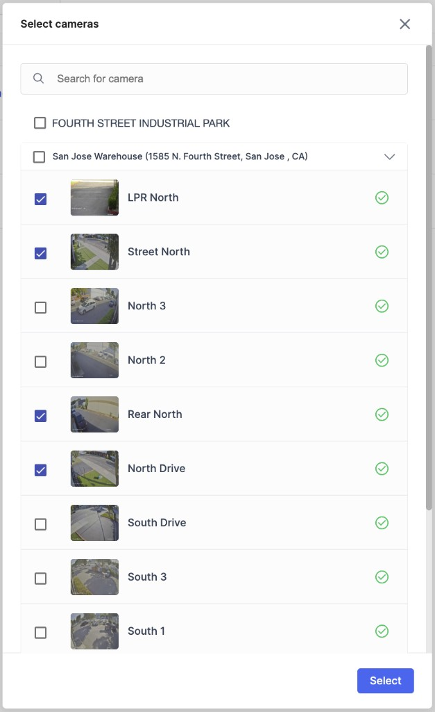
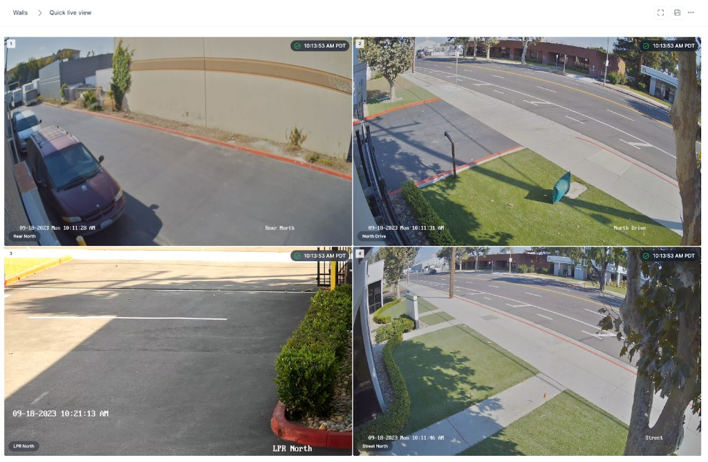
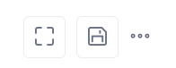

# Video walls and shared displays

Use video walls and shared displays to monitor multiple cameras on one screen, combine live cameras with alerts, and share selected views with other viewers. Lumana supports saved walls for ongoing monitoring, quick live view walls for fast temporary layouts, and shared external video walls for secure external access.

## Before you begin

Make sure you can access the cameras and locations you want to display. If you plan to create a shared external video wall, you'll also need access to API keys and camera IDs.

## Choose the right wall type

Choose the wall type based on how long you need the layout and who needs to view it.

- **Saved walls:** Use a saved wall when you need a reusable layout with camera tiles, alert tiles, and alert filtering.
- **Quick live view:** Use **Quick live view** when you need a temporary wall quickly and may want to save it later.
- **Shared external video wall:** Use a shared external video wall when you need a secure URL for viewers outside Lumana.
- **Standard camera and alert tiles:** Use standard camera tiles and alert tiles when you need to combine live monitoring with event visibility in the same wall.
- **Advanced alert tile:** Use the advanced alert tile when you want alerts to stream directly to the video wall without extra clicks.

## View and edit walls

Use the **Walls** page to open existing walls and make changes to saved layouts.

1. Open **Walls**.

   The wall list shows the walls available in your organization.



2. Click a wall to open it.

   A wall can show multiple live camera tiles, alert tiles, or both in the same layout.



3. Hover over the wall you want to change and click the pencil icon.

   Editing lets you change the wall layout, update individual tiles, and save the revised wall.



4. Click the pencil icon on a tile to replace that tile with a different camera.
5. Use the upper-right controls to change the layout, adjust alert settings and filters, delete the wall, discard changes, or save changes.

## Create a wall

Create a saved wall when you need a reusable layout for ongoing monitoring.

1. On **Walls**, click **Create wall**.
2. Enter a wall name and choose a layout that fits the number of cameras or alert tiles you want to show.
3. Open **Cameras & alerts** to add camera tiles and alert tiles.

   Alert tiles help you monitor real-time events without opening a separate view.



4. Open **Alert view settings** to choose how alerts appear on the wall.

   You can position the alert list, choose display and picture-in-picture options, set the view duration, and enable alert sound.



5. Configure alert filtering to choose which alerts appear on the wall.

   You can filter by location, camera, and priority so the wall only shows the events that matter to your team.



6. Click **Done**, then click **Create**.

## Create a quick live view wall

Use **Quick live view** when you need a temporary wall without building a full saved wall first.

1. On **Walls**, click **Quick live view**.



2. Select the cameras you want to display, then click **Select**.

   Quick live view is useful when visibility matters immediately and you need to open a wall fast.



3. Review the temporary wall.



4. Use the upper-right controls to open full-screen mode, adjust the settings, or save the wall.



5. Save the wall if you want it to appear in your wall list later.

Quick live view walls also use the same live view controls available in [Use live view](live-view.md).

## Create a shared external video wall

Use a shared external video wall when you need a secure, video wall URL for external viewers. No app installation or login is required, and access is controlled through a token in the generated URL.

### Create an API token

1. Open **Settings** -> **Organization Settings** -> **API Keys**.
2. Click **Create API Key**.
3. Copy the generated token.

   You will use this token in the shared video wall URL.

### Collect camera IDs

1. Open **Edit Camera** for each camera you want to include.
2. Copy the camera ID for each selected camera.

### Choose display options

Choose the video quality and whether to show camera names in the shared wall.

- `0` = standard quality (SQ)
- `1` = medium quality (MQ)
- `2` = high quality (HQ)

Higher resolution improves clarity but increases bandwidth usage.

To show camera names, add `cameraNames=1` to the URL. This is useful when you share the wall with viewers who are unfamiliar with camera placements.

### Build the video wall URL

Use the following format:

```text
https://external-walls.lumana.ai/live-view-wall.html?resolution=<0|1|2>&cameraNames=1&cameraIds=<CAMERA_ID1>,<CAMERA_ID2>&token=<YOUR_API_TOKEN>
```

For example:

```text
https://external-walls.lumana.ai/live-view-wall.html?resolution=1&cameraNames=1&cameraIds=<CAMERA_ID1>,<CAMERA_ID2>&token=<YOUR_API_TOKEN>
```

Parameter details:

- `resolution=1` uses medium quality.
- `cameraNames=1` shows camera names.
- `cameraIds=...` lists the selected camera IDs, separated by commas.
- `token=...` uses your API token to secure access.

## Next steps

- Use [Use live view](live-view.md) to work with player controls and thumbnails.
- Read [Understand live view streaming and quality](understand-live-view-streaming-and-quality.md) to understand how live video delivery and quality selection work.
