# Video walls and shared displays

Use video walls and shared displays to monitor multiple cameras on one surface. Combine live cameras with alert tiles or share walls with partners who sit outside Lumana.

Lumana offers saved walls plus quick live grids plus secure external walls you can open anywhere.

## Before you begin

Make sure you can access the cameras and locations you want to display. If you plan to create a shared external video wall, then you'll also need access to API keys and camera IDs.

## Choose the right wall type

Choose the wall type based on how long you need the layout and who needs to view it.

- **Saved walls**: Use a saved wall when you need a reusable layout with camera tiles, alert tiles, and alert filtering.
- **Quick live view**: Use it when you need a temporary wall quickly and may want to save it later.
- **Shared external video wall**: Use a shared external video wall when you need a secure URL for viewers outside Lumana.
- **Standard camera and alert tiles**: Use standard camera tiles and alert tiles when you need to combine live monitoring with event visibility in the same wall.
- **Advanced alert tile**: Use the advanced alert tile when you want alerts to stream directly to the video wall without extra selections.

## View and edit walls

Use the **Walls** page to open existing walls and make changes to saved layouts.

1. Open **Walls**.

   The wall list shows the walls available in your organization.

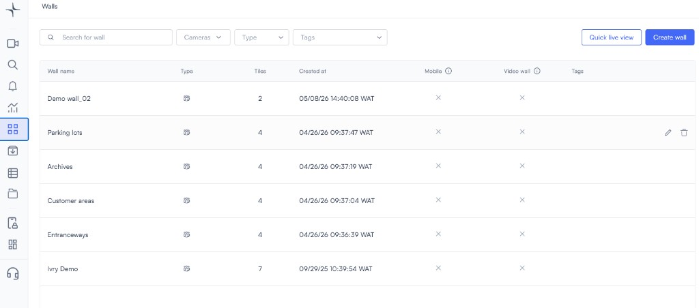

2. Select a wall to open it.

   A wall can show multiple live camera tiles, alert tiles, or both in the same layout.

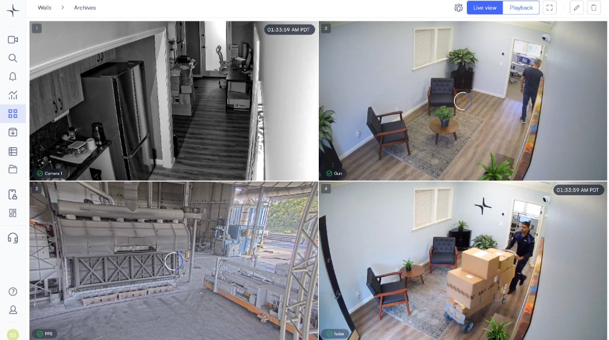

3. Hover over the wall you want to change and select the pencil icon.

   Editing lets you change the wall layout, update individual tiles, and save the revised wall.

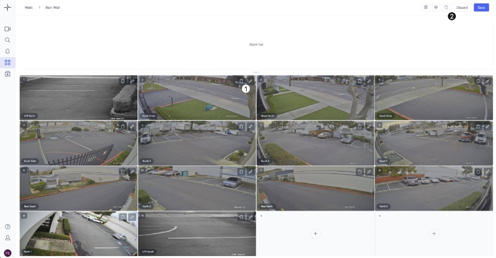

4. Select the pencil icon on a tile to replace that tile with a different camera.
5. Use the upper-right controls to change the layout, adjust alert settings and filters, delete the wall, discard changes, or save changes.

## Create a wall

Create a saved wall when you need a reusable layout for ongoing monitoring.

1. On **Walls**, select **Create wall** in the upper-left corner of the page.

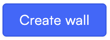

2. Enter a wall name and choose a layout that fits the number of cameras or alert tiles you want to show, and select **Done**.
3. Expand **Cameras** to choose which cameras appear on the wall, and expand **Alerts** to configure alert tiles.

   Each row shows a chevron you can expand. Alert tiles surface real-time events without opening a separate view.

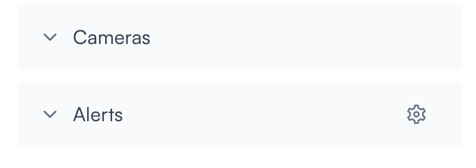

4. Select the **settings** gear next to **Alerts** to open **Alerts settings**.

   Choose **Display** (for example how the alert list renders), **View duration**, **Pic in pic** source and placement, and **Audio** (announcement style and volume). Select **Test** to preview sound. Select **Done** to close **Alerts settings**.

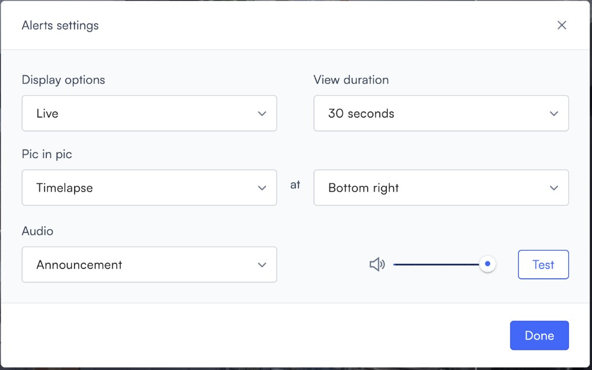

5. Select the cameras and alerts for the wall using the sidebar.

   Under **Cameras**, search by name or open a location, then select each camera you want included. Under **Alerts**, search or manage the list (**Clear all** when you want to reset), then enable the alert categories you want surfaced on the wall.

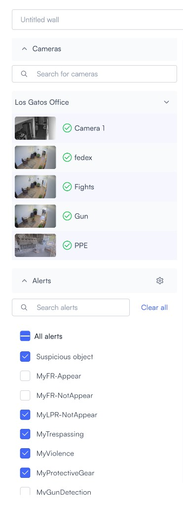

6. Select **Create wall** in the upper-right corner.

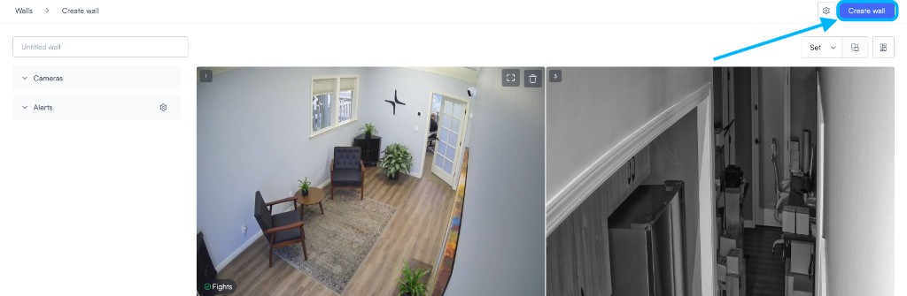

## Create a quick live view wall

Use **Quick live view** when you need a temporary wall without building a full saved wall first.

1. On **Walls**, select **Quick live view**.

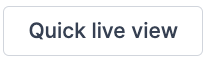

2. Select the cameras you want to display, then select **Select**.

   Quick live view is useful when visibility matters immediately and you need to open a wall fast.

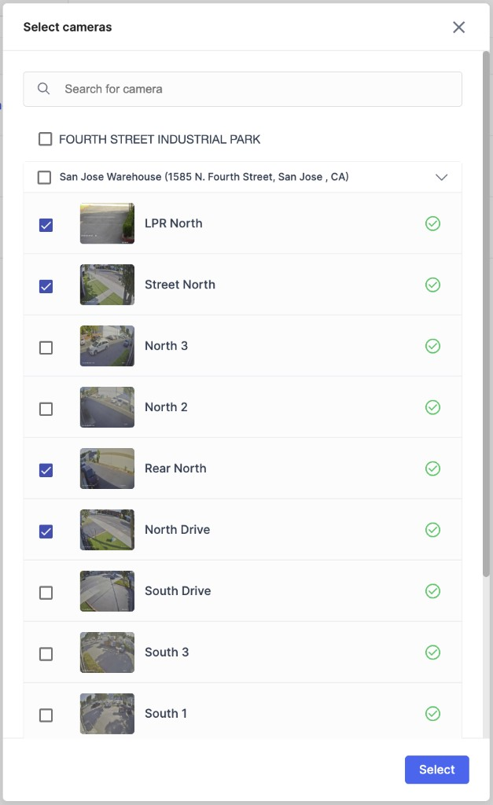

3. Review the temporary wall.

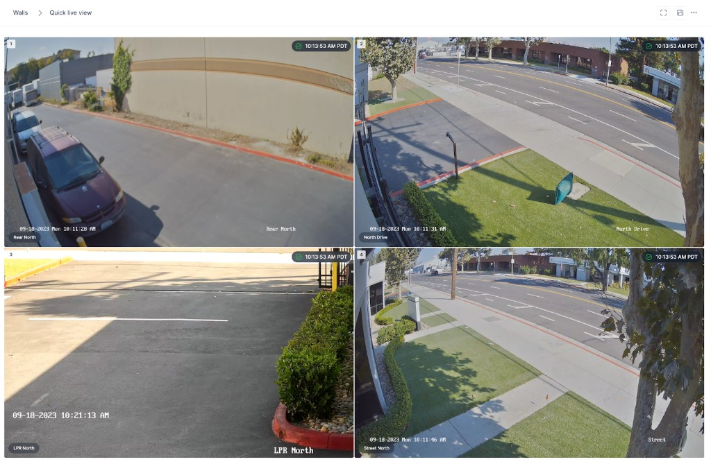

4. Use the upper-right toolbar: **Edit** (**pencil**), full-screen, or **Save as wall** when you want the layout in your **Walls** list.

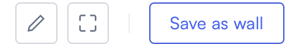

5. After **Save as wall**, confirm in **Save live view as wall** by selecting **Yes I'm sure** (or **Cancel** to go back).

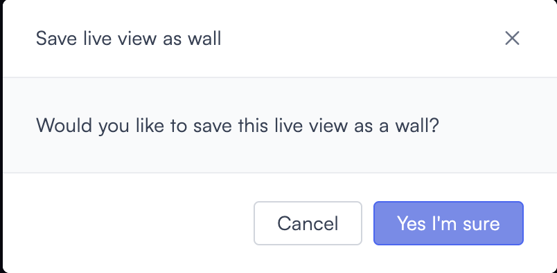

6. Enter a **Wall name**, then select **Save**.

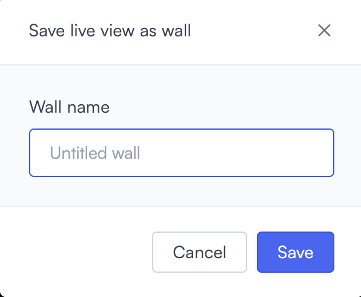

If you did not use **Save as wall**, quick live view stays temporary until you navigate away.

Quick live view walls also use the same live view controls available in [Use live view](live-view.md).

<!-- TODO: When the flow is updated for the new UI, add the section "## Create a shared external video wall" (and its steps) back here. -->

## Next steps

After you create or share a wall, you can continue with related live monitoring tasks.

- Use [Use live view](live-view.md) to work with player controls and thumbnails.
- Read [Live view streaming and quality](live-view-streaming-and-quality.md) to understand how live video delivery and quality selection work.
