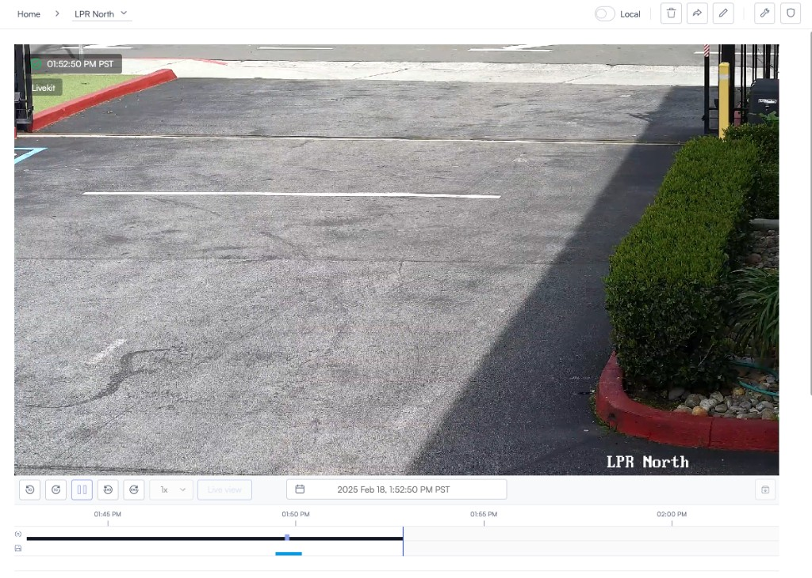
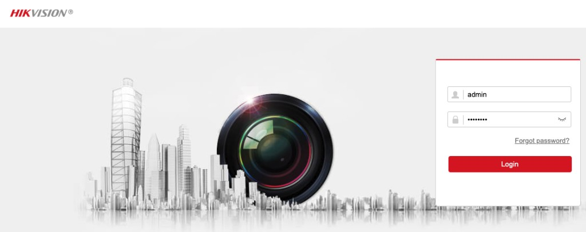
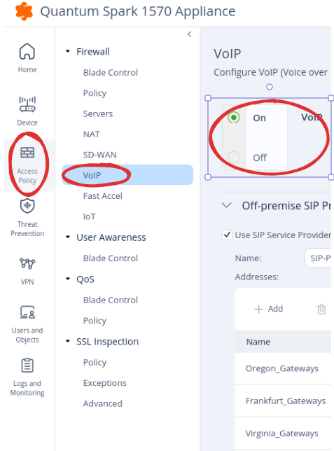
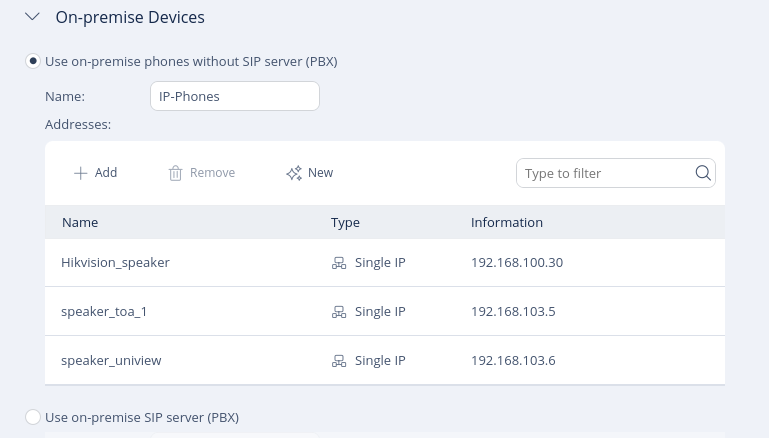
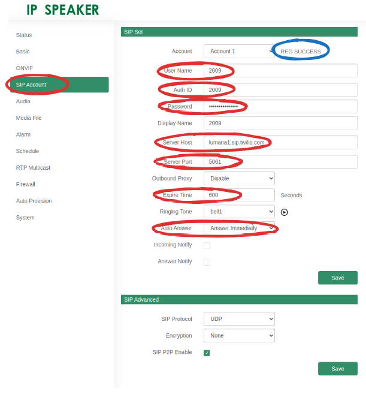
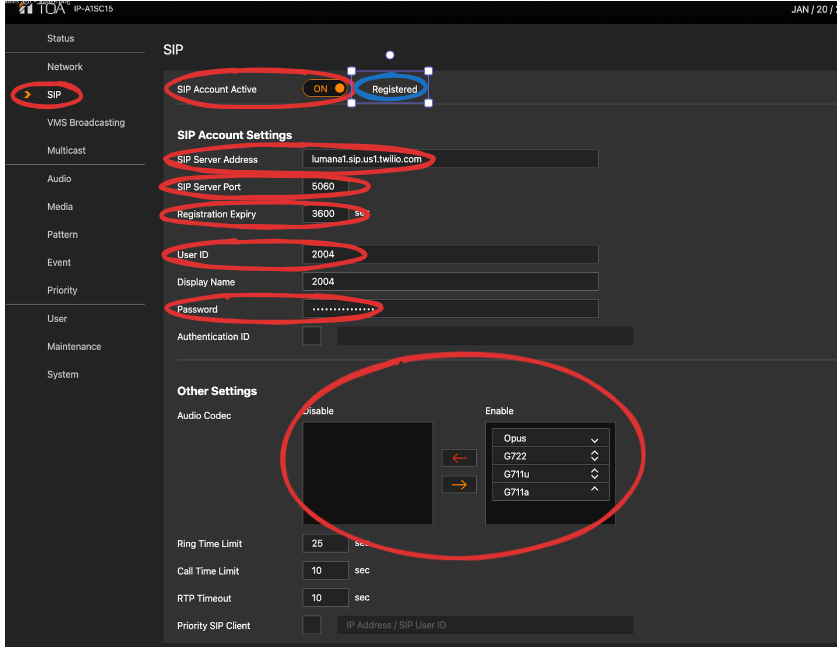

# Camera networking options

Configure how your cameras connect to and communicate within your network, including remote access and audio integrations.

This page covers common networking options used when managing cameras in Lumana.

## Remote camera access (Camera VPN)

Use Camera VPN to securely access your camera’s native interface through Lumana without exposing it directly to the internet.

### When to use this

- You need to access camera settings remotely
- You want to configure manufacturer-specific features
- Your camera is behind a private network

### Steps

1. Open the camera from the **Devices** list.

2. Click the **VPN icon** in the top-right corner of the camera player.

3. You will be redirected to the camera manufacturer’s login page.

4. Enter your camera credentials to log in.

5. Configure camera settings as needed.

> The available settings depend on the camera manufacturer. Refer to the manufacturer’s documentation for details.

## SIP configuration (Check Point router)

Use Session Initiation Protocol (SIP) configuration to enable communication between Lumana and external audio devices such as speakers.

This setup is typically required in advanced deployments using network-managed audio systems.

### Before you begin

You'll need:
- Administrative access to the Check Point router
- Access to Check Point SmartConsole
- Network topology details

### Step 1: Enable VoIP

- Log in to Check Point
- Go to **Access Policy → VoIP**
- Enable VoIP

### Step 2: Configure SIP service provider

Enable **Use SIP Service Provider** and configure the following:

#### Networks

| Name                | Address        | Subnet Mask     |
| ------------------- | -------------- | --------------- |
| Oregon\_Gateways    | 54.244.51.0    | 255.255.255.252 |
| Frankfurt\_Gateways | 35.156.191.128 | 255.255.255.252 |
| Virginia\_Gateways  | 54.172.60.0    | 255.255.255.252 |
| Media\_server\_1    | 34.203.254.0   | 255.255.255.0   |
| Media\_server\_2    | 3.235.11.128   | 255.255.255.128 |

#### Domains

- lumana1.sip.twilio.com
- lumana1.sip.us1.twilio.com

### Step 3: Configure RTP services

- Disable SIP traffic inspection
- Add the following services:

| Name           | Protocol | Port |
| -------------- | -------- | ---- |
| SIP\_TLS\_AUTH | TCP      | 5061 |
| SIP\_TCP       | TCP      | 5060 |
| SIP\_UDP       | UDP      | 5060 |
| SIP\_UDP       | UDP      | 5061 |

- Enable bidirectional traffic

### Step 4: Configure on-premise devices

Add your devices (for example):

| Name            | Type      | Address        |
| --------------- | --------- | -------------- |
| Uniview_speaker | Single IP | 192.168.100.30 |

### Step 5: Configure SIP services

Add the following services:

| Name           | Type           | Protocol | Destination Ports |
| -------------- | -------------- | -------- | ----------------- |
| SIP\_TLS\_AUTH | SIP\_TLS\_AUTH | TCP      | 5061              |
| SIP\_TCP       | SIP\_TCP       | TCP      | 5060              |
| sip\_any-tcp   | sip\_any-tcp   | TCP      | 5060              |
| SIP\_UDP       | SIP\_UDP       | UDP      | 5060              |
| Any\_TCP       | Any\_TCP       | TCP      | 1-65535           |
| SIP\_UDP       | SIP\_UDP       | UDP      | 5061              |
| Any\_UDP       | Any\_UDP       | UDP      | 1-65535           |

## Speaker configuration examples

### Uniview speaker

1. Log in to the Uniview speaker interface
2. Go to the **SIP Account** section
3. Enter:
   - Username
   - ID
   - Password
   - Display Name
   - Server Host
   - Port
4. Set **Expire Time > 600**
5. Set **Auto Answer** to *Immediately*
6. Save

Verify the status shows **Registered**

---

### TOA speaker

1. Log in to the TOA speaker interface
2. Go to the **SIP section**
3. Enter:
   - SIP Server Address
   - SIP Server Port
   - Registration Expiry > 3600
   - User ID
   - Display Name
   - Password
4. Enable all audio codecs
5. Save

