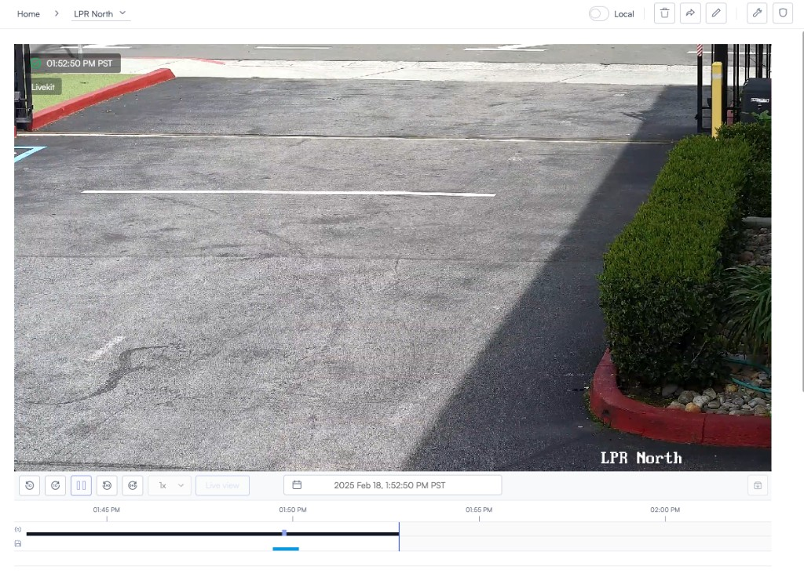
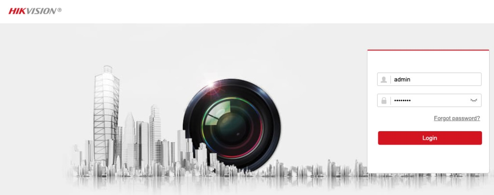
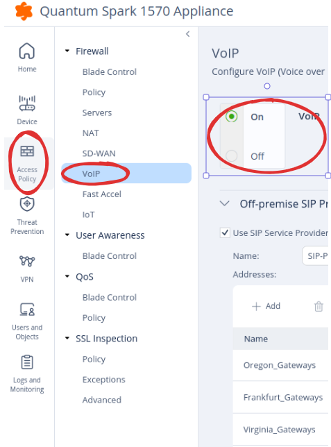
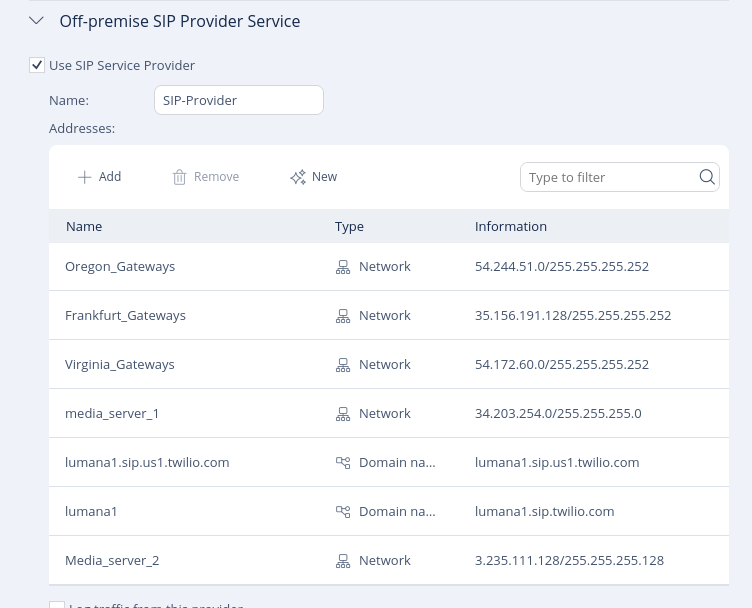
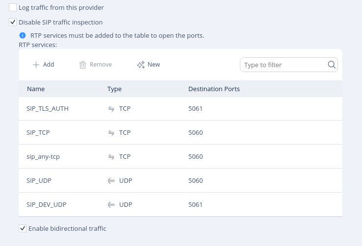
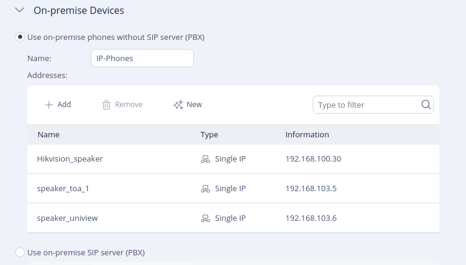
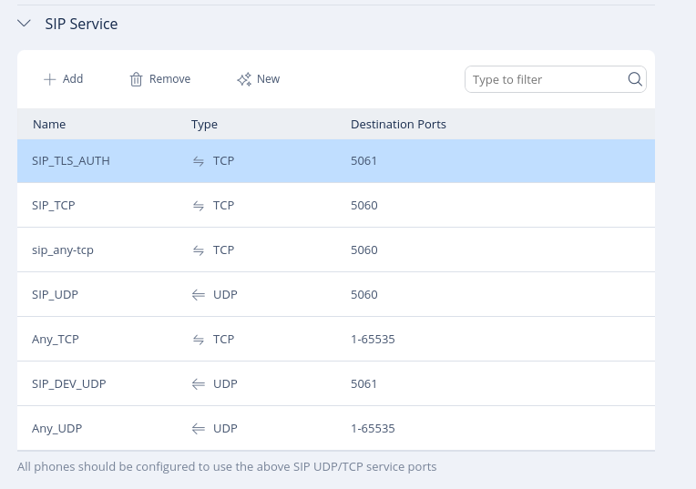
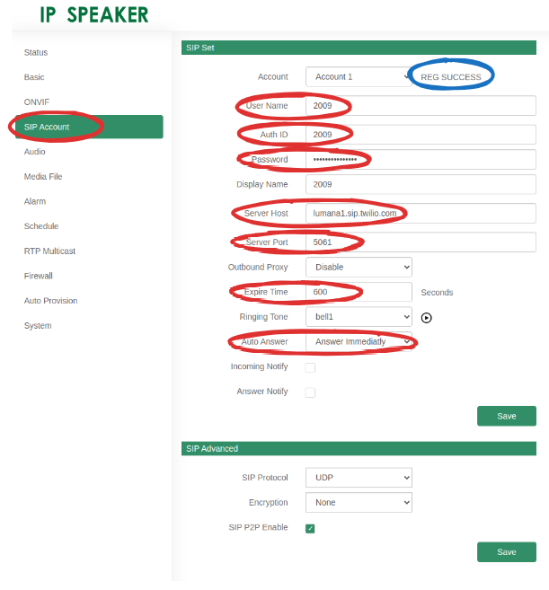
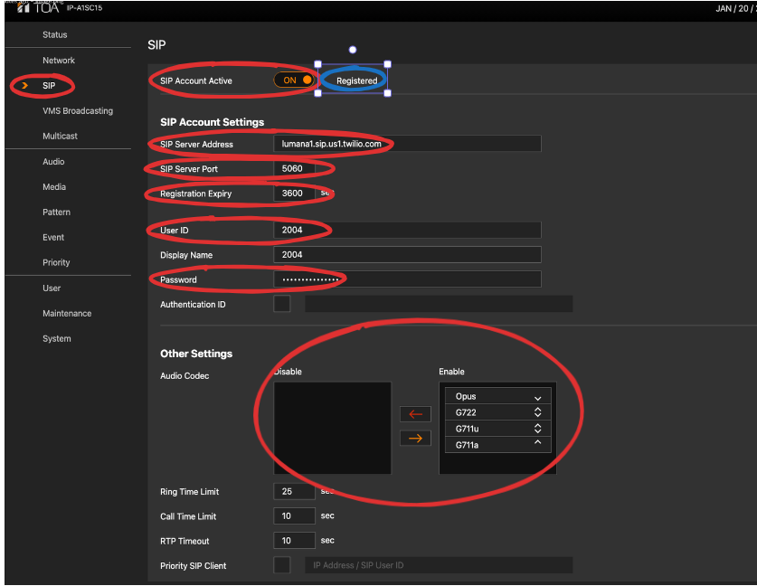

# Camera networking options

Configure how your cameras connect to and communicate within your network, including remote access through Camera VPN.

This page covers common networking options used when managing cameras in Lumana.

## Remote camera access (Camera VPN)

Use **Camera VPN** in the Lumana portal to access your camera’s native web interface when you are off the camera’s LAN. Use it for third-party cameras and for devices on a private network where you need the manufacturer’s configuration UI.

### When to use this

- You need to access camera settings remotely
- You want to configure manufacturer-specific features
- Your camera is behind a private network

### Steps

1. Open the camera from the **Devices** list.

2. Select the  **VPN** icon in the top-right corner of the camera player page.

   Lumana opens the camera manufacturer’s login page.

3. Enter your camera credentials on that page to sign in. Configure settings in the manufacturer’s web interface as your deployment requires.


The available settings depend on the camera manufacturer. Refer to the manufacturer’s documentation for details.


## Configure SIP on a Check Point router

Use Session Initiation Protocol (SIP) to let Lumana communicate with external audio devices such as speakers. You typically need this setup for advanced deployments that use network-managed audio systems.

### Prerequisites

You'll need:

- Administrative access to the Check Point router
- Access to Check Point SmartConsole
- Network topology details

### Configure the router

Complete the following steps in order on the Check Point router.

1. Enable VoIP.

   - Log in to Check Point.
   - Go to **Access Policy** > **VoIP**.
   - Enable VoIP.

   

2. Configure the SIP service provider.

   - Enable **Use SIP Service Provider**.
   - Set **Name** to **SIP-Provider**.
   - Add the networks and domains listed below.

   **Networks**:

   | Name                  | Address        | Subnet Mask     |
   | --------------------- | -------------- | --------------- |
   | Oregon\_Gateways      | 54.244.51.0    | 255.255.255.252 |
   | Frankfurt\_Gateways   | 35.156.191.128 | 255.255.255.252 |
   | Virginia\_Gateways    | 54.172.60.0    | 255.255.255.252 |
   | Media\_server\_1      | 34.203.254.0   | 255.255.255.0   |
   | Media\_server\_2      | 3.235.11.128   | 255.255.255.128 |

   **Domains**:

   - lumana1.sip.twilio.com
   - lumana1.sip.us1.twilio.com

   

3. Configure RTP services.

   - Disable SIP traffic inspection.
   - Add the services in the table below.
   - Enable bidirectional traffic.

   | Name           | Protocol | Port |
   | -------------- | -------- | ---- |
   | SIP\_TLS\_AUTH | TCP      | 5061 |
   | SIP\_TCP       | TCP      | 5060 |
   | SIP\_UDP       | UDP      | 5060 |
   | SIP\_UDP       | UDP      | 5061 |

   

4. Configure on-premise devices.

   - Use on-premise phones without a SIP server (PBX).
   - Add all relevant resources, for example:

   | Name             | Type      | Address        |
   | ---------------- | --------- | -------------- |
   | Uniview\_speaker | Single IP | 192.168.100.30 |

   

5. Configure SIP services.

   Add the following services:

   | Name           | Type           | Protocol | Destination Ports |
   | -------------- | -------------- | -------- | ----------------- |
   | SIP\_TLS\_AUTH | SIP\_TLS\_AUTH | TCP      | 5061              |
   | SIP\_TCP       | SIP\_TCP       | TCP      | 5060              |
   | sip\_any-tcp   | sip\_any-tcp   | TCP      | 5060              |
   | SIP\_UDP       | SIP\_UDP       | UDP      | 5060              |
   | Any\_TCP       | Any\_TCP       | TCP      | 1-65535           |
   | SIP\_UDP       | SIP\_UDP       | UDP      | 5061              |
   | Any\_UDP       | Any\_UDP       | UDP      | 1-65535           |

   

## Configure SIP on each speaker

After you complete the Check Point SmartConsole steps above, open each speaker's own admin interface and enter its SIP account so the device can register. The subsections below walk through Uniview and TOA speakers as examples.


**Note**: SIP credentials (address, username, password) are supplied by your CSM.


### Uniview speaker

1. Log in to the Uniview speaker interface
2. Go to the **SIP Account** section
3. Enter:

   - Username
   - ID
   - Password
   - Display Name - used as identifier to use on alerts
   - Server Host
   - Port

4. Set **Expire Time > 600**
5. Set **Auto Answer** to **Immediately**
6. Save
7. Verify the speaker's status shows **Registered**

### TOA speaker

1. Log in to the TOA speaker interface
2. Go to the **SIP section**
3. Update the following details:

   - SIP Server Address
   - SIP Server Port
   - Registration Expiry > 3600
   - User ID
   - Display Name
   - Password

4. Audio codec: Enable all audio codecs
5. Save

