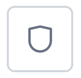

# Camera networking options

Configure how your cameras connect to and communicate within your network, including remote access through Camera VPN.

This page covers common networking options used when managing cameras in Lumana.

## Remote camera access (Camera VPN)

Use **Camera VPN** in the Lumana portal to access your camera’s native web interface when you are off the camera’s LAN. Use it for third-party cameras and for devices on a private network where you need the manufacturer’s configuration UI.

### When to use this

- You need to access camera settings remotely
- You want to configure manufacturer-specific features
- Your camera is behind a private network

### Steps

1. Open the camera from the **Devices** list.

2. Select the  **VPN** icon in the top-right corner of the camera player page.

   Lumana opens the camera manufacturer’s login page.

3. Enter your camera credentials on that page to sign in. Configure settings in the manufacturer’s web interface as your deployment requires.


The available settings depend on the camera manufacturer. Refer to the manufacturer’s documentation for details.

