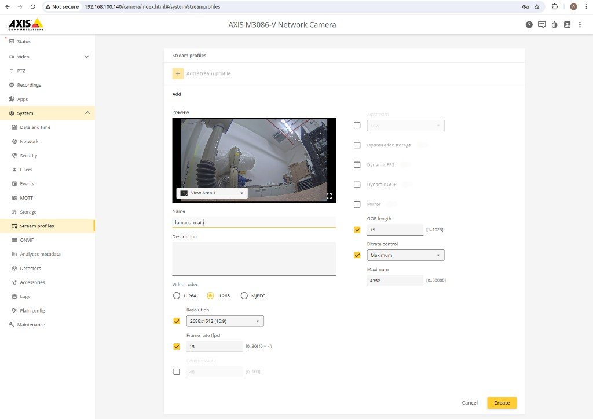
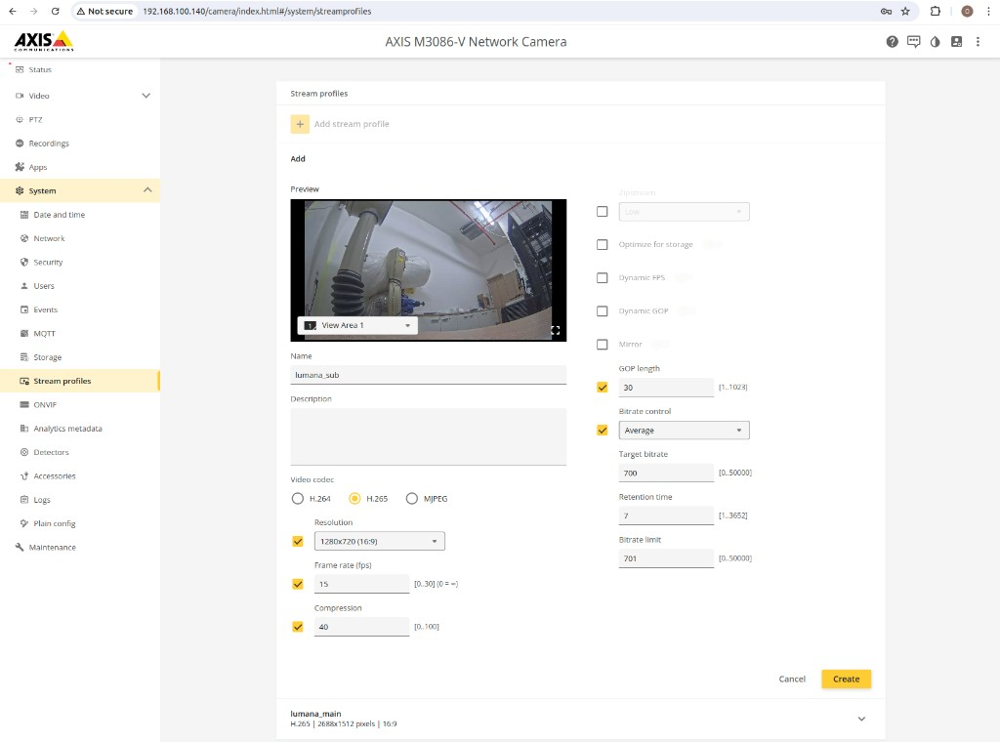

# AXIS

Axis cameras are fully supported in Lumana and provide reliable performance for analytics, monitoring, and enterprise deployments.

## Axis compatibility models

Here is a list of compatible Axis models.

* AXIS Q16 Series
* AXIS P13 Series
* AXIS M11 Series
* AXIS Q17 Series
* AXIS P14 Series
* AXIS Q92 Series
* AXIS Q38 Series
* AXIS Q36 Series
* AXIS P39 Series
* AXIS P38 Series
* AXIS P37 Series
* AXIS P32 Series
* AXIS M32 Series
* AXIS M31 Series
* AXIS M30 Series
* AXIS Q60 Series
* AXIS Q61 Series
* AXIS Q62 Series
* AXIS Q63 Series
* AXIS P54 Series
* AXIS P56 Series
* AXIS M50 Series
* AXIS Q86 Series (Thermal features will require additional integration)
* AXIS Q87 Series (Thermal features will require additional integration)
* AXIS Q29 Series (Thermal features will require additional integration)
* AXIS Q19 Series (Thermal features will require additional integration)

## Connecting your AXIS camera to Lumana Core

Choose the connection method that fits your setup:

* **Admin credentials:** Best option when available. Gives Lumana the highest level of access and compatibility.
* **ONVIF:** Useful when you need a standards-based connection, including some PTZ use cases.
* **New profile:** Useful when you do not want to use the admin account directly and want to manage access separately.


Using reduced-permission accounts may limit some functionality in Lumana.


Before connecting the camera:

* For out-of-box cameras, if your network does not have a DHCP server, the default IP address is `192.168.0.90`.
* Make sure your computer is on the same network as the camera before you start.
* Use Axis IP Utility or the camera web interface to assign a static IP address.
* Set the root password before continuing.

If you plan to connect using Open Network Video Interface Forum (ONVIF):

- In **System**, select **ONVIF**.
- Add an ONVIF user with the **Administrator** role and a strong password.
- Save your changes.
- Note: Axis disables ONVIF support until an ONVIF user is added.

To add the camera in Lumana Core, enter the camera's admin username and password. If you are using ONVIF instead, use the ONVIF user credentials you created on the camera. Use the stream profile steps in the next section if you still need to create or tune profiles on the camera before you connect.

## Stream configuration profiles

If Lumana cannot create the required stream profiles automatically, you can configure them manually on the Axis camera before connecting it. Use the recommended values from [Recommended streaming settings](../recommended-streaming-settings.md), then follow the steps below in the Axis interface.

Each Axis **stream profile** has a fixed **profile name** you assign on the camera. That name feeds the [Real Time Streaming Protocol (RTSP)](../../faq-and-reference/lumana-glossary.md#rtsp) path Lumana Core uses—for example `/axis-media/media.amp?streamprofile=<your profile name>` or `/axis-media/media.amp?profile=<your profile name>`—so Lumana resolves the encoder you configured. Decide **distinct** names up front for the main and sub streams so nothing collides. If the name in Axis and the name in Lumana do not match **exactly**, video will not attach.

### Before you create each stream profile

- **Log in to the Axis Web Portal:** Use a web browser to log into the Axis camera interface with your admin credentials.
- **Open Stream Profiles:** In the **System** tab, select **Stream Profiles** and click **Add stream Profile**.
- **Turn enhanced features off:** Set **Zipstream**, **Dynamic FPS**, and **Optimized GOP** to **Off**. These features can cause compatibility issues with Lumana Core.
- **Set the profile name before you leave the profile editor:** Enter the final **profile name** field for that stream in the Axis UI, save, then use the **same string** when Lumana asks for the RTSP path or stream profile token. If you rename it later, update Lumana to match.

**Main stream profile**

Build the main stream first. **Set the profile name** to a value you will recognize in RTSP paths (example: `lumana_main`).

* **Resolution:** Select the highest available resolution for your camera.
* **Frame Rate:** Set the frame rate to `15fps`.
* **Video Encoding:** If your camera supports **H.265**, select this option for video encoding. If **H.265** is not available, **H.264** is a suitable alternative.
* **Bitrate:** Set bitrate based on the [Recommended streaming settings](../recommended-streaming-settings.md) guide.
* **Profile name:** Save the profile with the name you chose. With profile name `lumana_main`, the RTSP path can look like `/axis-media/media.amp?profile=lumana_main` (Axis may also show `streamprofile=` forms depending on UI). Keep the **profile name segment** aligned with Lumana.

**Sub stream profile**

Repeat **Add stream Profile** for the secondary stream and **assign a separate profile name** (example: `lumana_sub`) so the main stream name is unchanged.

* **Video Encoding:** If your camera supports **H.265**, select this option for video encoding. If **H.265** is not available, **H.264** is a suitable alternative.
* **Resolution, Frame Rate, and Bitrate:** Set these values based on the [Recommended streaming settings](../recommended-streaming-settings.md) guide.
* **Profile name:** Save with the secondary name—for example `/axis-media/media.amp?profile=lumana_sub` should reference `lumana_sub`.

After **both profiles are saved** with their stable names applied in Axis, return to Lumana Core and connect the camera using its **admin** credentials unless your workflow uses dedicated users or ONVIF as described earlier. When onboarding asks for URLs or profiles, reuse the profile names verbatim.
