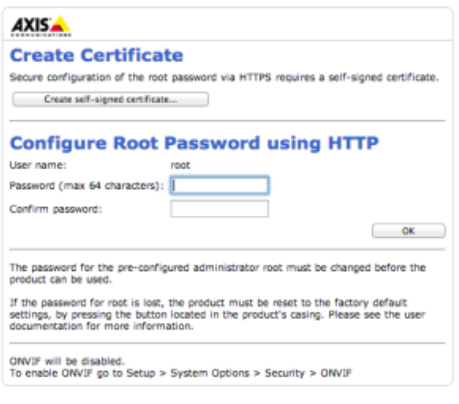
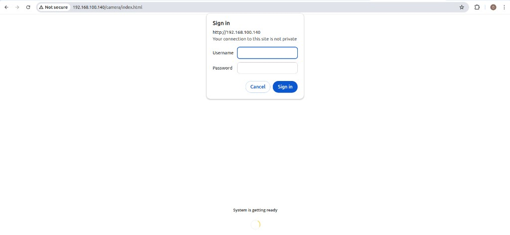
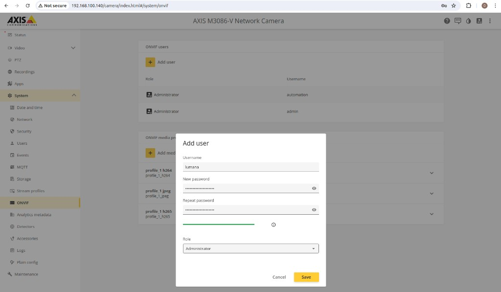
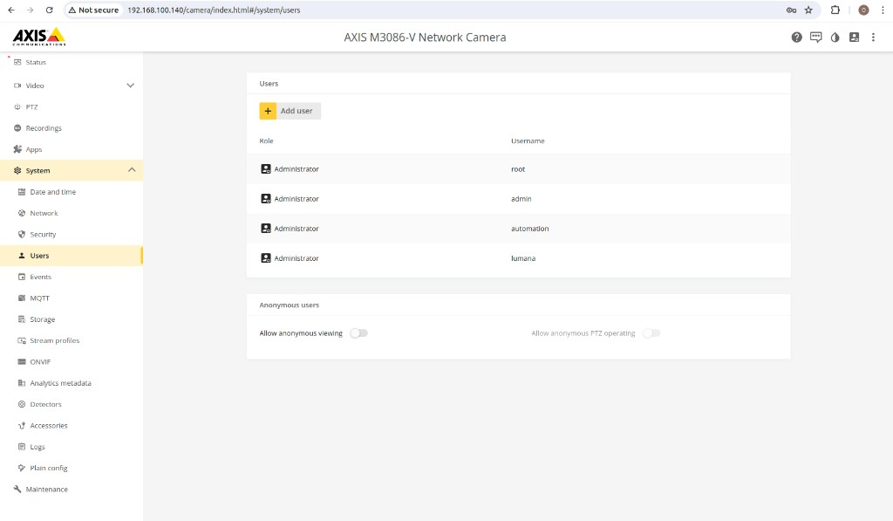
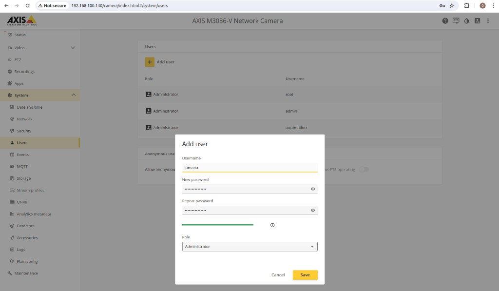
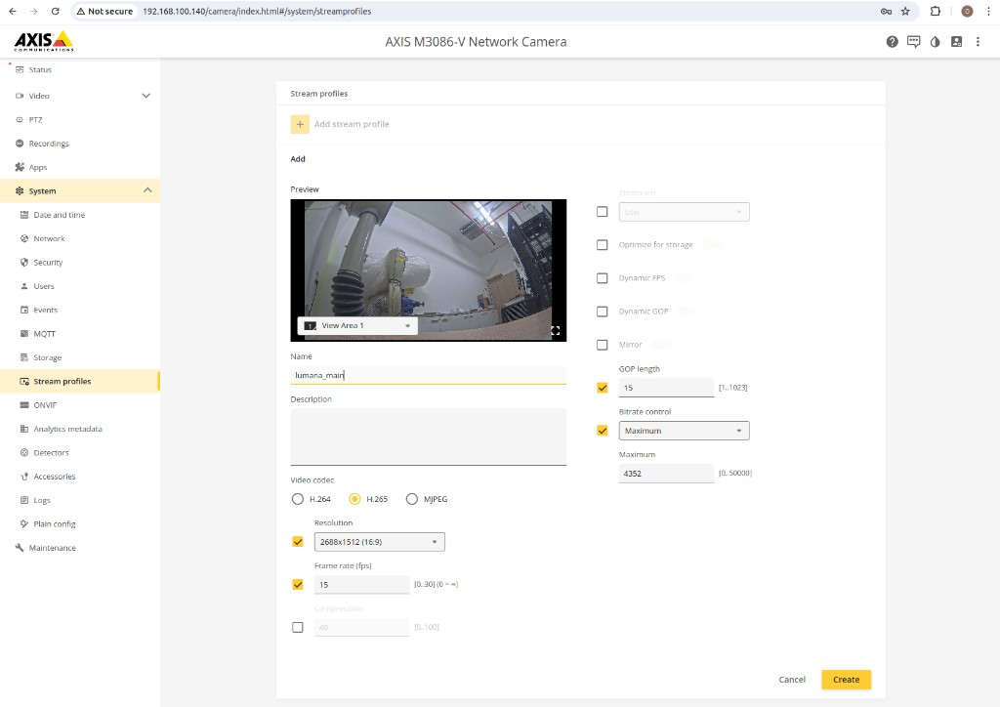
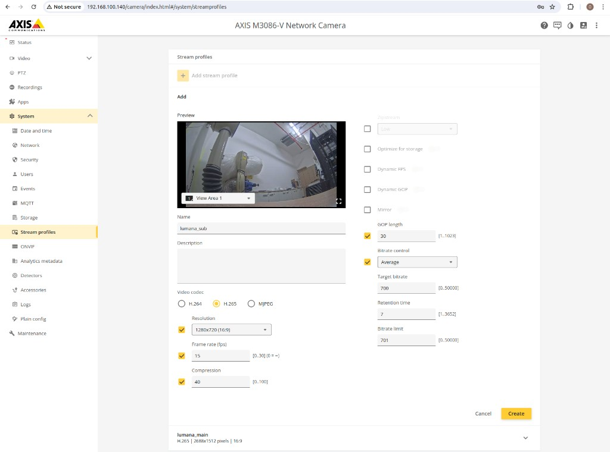

# AXIS

Axis cameras are fully supported in Lumana and provide reliable performance for analytics, monitoring, and enterprise deployments.

## Axis compatibility models

Here is a list of compatible Axis models.

* AXIS Q16 Series
* AXIS P13 Series
* AXIS M11 Series
* AXIS Q17 Series
* AXIS P14 Series
* AXIS Q92 Series
* AXIS Q38 Series
* AXIS Q36 Series
* AXIS P39 Series
* AXIS P38 Series
* AXIS P37 Series
* AXIS P32 Series
* AXIS M32 Series
* AXIS M31 Series
* AXIS M30 Series
* AXIS Q60 Series
* AXIS Q61 Series
* AXIS Q62 Series
* AXIS Q63 Series
* AXIS P54 Series
* AXIS P56 Series
* AXIS M50 Series
* AXIS Q86 Series (Thermal features will require additional integration)
* AXIS Q87 Series (Thermal features will require additional integration)
* AXIS Q29 Series (Thermal features will require additional integration)
* AXIS Q19 Series (Thermal features will require additional integration)

## Connecting your AXIS camera to Lumana Core

This guide walks you through preparing the camera, choosing how Lumana authenticates to it, optional manual stream profiles, and finally adding it in Lumana Core. For the fewest integration issues, use the camera **root** (admin) account in Lumana when that is allowed by your security policy.

Choose the connection method that fits your setup:

* **Admin credentials (recommended):** Use the camera’s root username and password in Lumana Core. This gives Lumana full access to the Axis API and settings, reduces compatibility gaps, and avoids subtle permission errors.
* **ONVIF:** Use an **ONVIF user** you create on the camera when you need a standards-based path—especially for **PTZ** cameras—or when your organization standardizes on ONVIF for third-party systems.
* **Dedicated camera user (new profile):** Add a separate **user account** on the camera (for example under **System** → **Users**) and use that account in Lumana instead of root. You can change or revoke that user later without touching the root password, and you can limit the account to what Lumana needs. Some Lumana features still expect admin-level access; see the hint below.


Using reduced-permission accounts (including some dedicated users) may limit functionality in Lumana Core compared with the root account.



When your policy allows it, connect with the camera’s **admin (root)** credentials for the highest compatibility and feature coverage.


### Before you connect the camera

* **Update the camera:** Install current firmware from Axis when possible so the web UI and codecs match what this guide expects.
* **Reach the camera on the network:** Axis devices use Ethernet. Most networks assign addresses via **DHCP**. If **no DHCP server** is present, many Axis cameras default to **`192.168.0.90`**. Put your PC on the **same subnet** before you start.
* **Discovery and addressing:** Use **[Axis IP Utility](https://www.axis.com/support/tools/axis-ip-utility)** (or the camera web interface) to find the camera, **set the root password**, and assign a **static IP**. A stable IP prevents Lumana Core from losing the device when DHCP leases change.
* **ONVIF and passwords:** After the root password is set, **Axis disables ONVIF until you add an ONVIF user** (see below). Plan that step if you will use ONVIF in Lumana.

Put the workstation you use for setup on the **same LAN** as the camera (for example, cameras and a computer on one switch) so discovery and the web UI work reliably.

**First visit — root password and HTTPS:** The first time you open the camera in a browser, you may need to create a **self-signed certificate** (for HTTPS) and set the **root** password. The page may state that **ONVIF is disabled** until you add an ONVIF user later under **System** → **ONVIF** (wording and menu paths can vary slightly by firmware).

**Sign in:** When the login page appears, enter your **root** (or administrator) credentials. A short **System is getting ready** state is normal on some units right after power-up.

If you cannot activate the camera, reach its web UI, or complete network setup, see the [General troubleshooting guide](../../troubleshooting-and-maintenance/general-troubleshooting-guide.md) or your Axis documentation for device activation.

### Configure ONVIF on your Axis camera

Use this section when you chose **ONVIF** as the connection method above.

1. **Log in to the Axis web interface:** In a browser, open the camera IP address and sign in with **administrator** credentials.
2. **Open ONVIF settings:** Select the **System** tab, then **ONVIF**.
3. **Add an ONVIF user:** Add a user intended for ONVIF access. Use a **strong password** and assign the **Administrator** role (or the role your organization requires for streaming control).
4. **Save:** Click **Save** (or equivalent). Confirm the device reports success so the account and ONVIF access are persisted.

Example — **System** → **ONVIF** → **Add user**, **Administrator** role, and **Save**:

After this, use the **ONVIF username and password** you created when you [connect the camera in Lumana Core](../../getting-started/connect-a-camera.md#connect-a-camera).

### Add a dedicated user on your Axis camera

Use this section when you chose **Dedicated camera user** instead of the root account.

1. **Log in to the Axis web interface** with an account that can manage users (typically **root**).
2. **Open user management:** Select the **System** tab, then **Users**.

3. **Add a user:** Select **Add user**. Enter a **username** and **strong password**, set **Role** to **Administrator** (or the minimum role your security team approves—know that lower roles may block some Lumana features).

4. **Save:** Click **Save** and confirm the camera stored the new user.

Use this **username and password** in Lumana Core when you [connect the camera](../../getting-started/connect-a-camera.md#connect-a-camera), not the root password, unless you switch back to the admin-credentials path.

### Connect the camera in Lumana Core

When the camera is reachable, authenticated, and—if needed—stream profiles are ready (next section), add the device in Lumana:

**[Connect a camera](../../getting-started/connect-a-camera.md#connect-a-camera)**

Enter **root** credentials if you use the admin path, the **ONVIF** user if you use ONVIF, or the **dedicated user** you created above. If Lumana still needs manual RTSP or profile strings, they come from the **stream profile names** you set on the camera.

## Stream configuration profiles

Manual profiles are needed when Lumana cannot create the required streams automatically—for example when you connect with **lower-privilege** credentials—or when you want explicit control over encoder names and quality. Use the values in [Recommended streaming settings](../recommended-streaming-settings.md), then apply them in the Axis UI.

**Why two profiles:** Configure a **main** stream at **higher resolution and quality** for identification, analytics, and event-quality video. Configure a **sub** stream at **lower resolution and bitrate** for lighter continuous use, storage efficiency, and contexts where the full main stream is unnecessary. Lumana Core can consume both; **profile names must be unique** and must match what you enter in Core.

Each Axis **stream profile** exposes a **profile name** you choose. That string is part of the [Real Time Streaming Protocol (RTSP)](../../faq-and-reference/lumana-glossary.md#rtsp) URL Lumana uses—for example `/axis-media/media.amp?streamprofile=<your profile name>` or `/axis-media/media.amp?profile=<your profile name>`. Pick **distinct** names for main and sub before you save. If the name in Axis and the name in Lumana differ **at all**, video may not attach.

### Before you create each stream profile

* **Log in to the Axis Web Portal:** Use a web browser and your admin (or sufficient) credentials.
* **Open Stream Profiles:** In the **System** tab, select **Stream Profiles**, then **Add stream Profile**.
* **Turn enhanced features off:** Set **Zipstream**, **Dynamic FPS**, and **Optimized GOP** to **Off** for both main and sub profiles. They can shrink bandwidth, but they are **not** reliable with Lumana Core and often cause compatibility problems.
* **Name the profile before you finish:** Enter the final **profile name** in the Axis editor, save, and reuse that **exact** string in Lumana’s RTSP or profile field. If you rename the profile in Axis later, update Lumana to match.

### Main stream profile

Build the **main** stream first. **Set the profile name** to something you will recognize in URLs (example: `lumana_main`).

* **Resolution:** Choose the **highest resolution** your camera offers for this profile. Higher resolution improves identification and fine detail in monitors and investigations.
* **Frame rate:** **15 fps.**
* **Video encoding:** Prefer **H.265** when available for better compression at similar quality (lower bandwidth and storage than H.264 at many settings). If **H.265** is not available, **H.264** is a suitable alternative.
* **Bitrate:** Follow [Recommended streaming settings](../recommended-streaming-settings.md).
* **Profile name and RTSP:** Save the profile. Example RTSP fragment: `/axis-media/media.amp?profile=lumana_main` (your UI may show `streamprofile=` instead of `profile=`). Keep whatever **query parameter and name** your firmware uses **identical** in Lumana.

### Sub stream profile

Select **Add stream Profile** again and assign a **different profile name** (example: `lumana_sub`) so the main profile stays unchanged.

* **Video encoding:** Same guidance as the main stream—**H.265** when supported, otherwise **H.264**.
* **Resolution, frame rate, and bitrate:** Set from [Recommended streaming settings](../recommended-streaming-settings.md) for your **sub** / secondary stream (typically lower than main).
* **Enhanced features:** Again set **Zipstream**, **Dynamic FPS**, and **Optimized GOP** to **Off**.
* **Profile name and RTSP:** Save as `lumana_sub` (or your name). Example: `/axis-media/media.amp?profile=lumana_sub`.

After **both** profiles are saved with stable names on the camera, return to Lumana Core and finish **[Connect a camera](../../getting-started/connect-a-camera.md#connect-a-camera)** using **root**, your **ONVIF** user, or your **dedicated** user as planned. Where the onboarding flow asks for URLs or profile tokens, paste the **same profile names** you configured in Axis.
