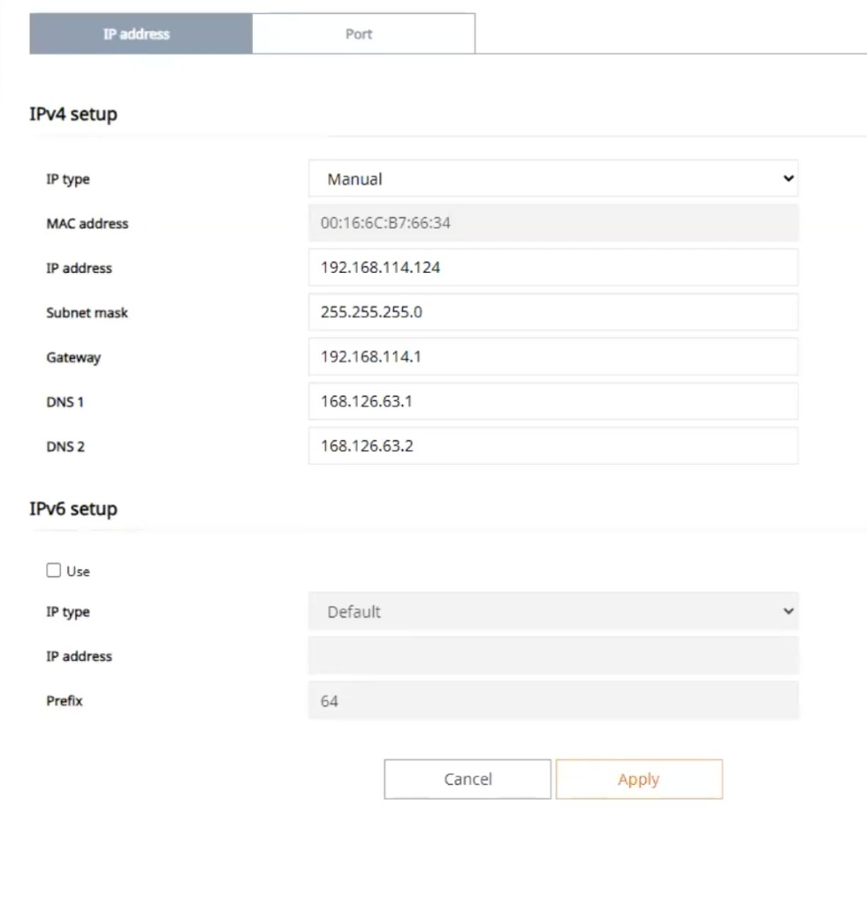
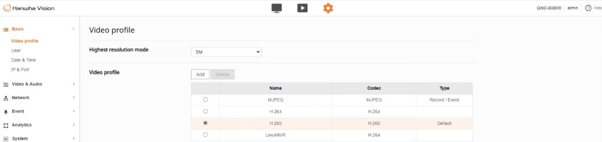
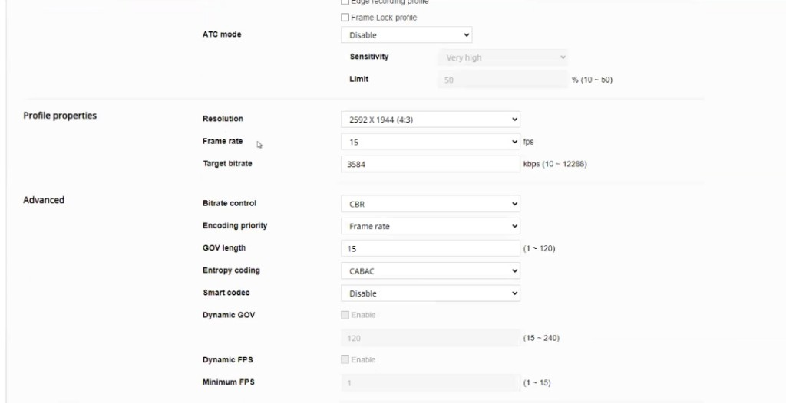
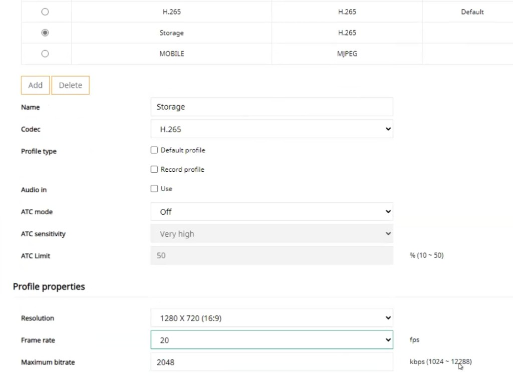

# Hanwha

Hanwha Wisenet cameras are supported in Lumana for analytics, monitoring, and typical enterprise deployments.

## Supported Hanwha models

Supported Hanwha Wisenet series:

* Hanwha Wisenet P Series
* Hanwha Wisenet X Series
* Hanwha Wisenet T Series (thermal features require additional integration)
* Hanwha Wisenet A Series
* Hanwha Wisenet L Series

## Connect your Hanwha camera to Lumana Core

This guide explains how to connect your Hanwha camera to Lumana Core. If needed, you can connect using the admin credentials, an ONVIF profile, or a new profile.

Choose the connection method that fits your setup:

* **Admin credentials:** Best option when available. Gives Lumana the highest level of access and compatibility.
* **ONVIF:** Useful when you need a standards-based connection.
* **New profile:** Useful when you do not want to use the admin account directly and want to manage access separately.


Using reduced-permission accounts may limit some functionality in Lumana.



Use the camera's admin username and password when possible. This provides the highest level of compatibility and access.


## Prepare your Hanwha camera

Update the camera firmware if needed, then work through the steps below **in order**: **set a static IP first** (so the camera stays reachable), **tune video profiles on the camera**, then **register the camera in Lumana Core**.

### Set a static IP address

Do this before video profile steps. A static IP keeps the camera on a predictable address for Lumana Core.

1. Open the camera in the Hanwha web interface or Wisenet Device Manager.
2. Go to **Basic** > **IP and port**.
3. Open the **IP address** tab, set **IP type** to **Manual**, enter **IP address**, **Subnet mask**, **Gateway**, and DNS servers, then select **Apply**.

For more context, see [Set up a static IP address](../set-up-a-static-ip-address.md).

### Configure video profiles on the camera

1. Log in to the Hanwha web portal in a browser (use the camera IP from the previous step).
2. Open **Basic** > **Video profile**.
3. Select the profile row you want for the **main** stream, or select **Add** to create a row if you need one. In the examples below, the main stream uses the **H.265** row as **profile 3**.
4. Set that row as the **Default** profile and set **Codec** to **H.265**.

5. Open the main profile’s encoding settings and apply these values:

* Set **ATC mode** to **Off** (or **Disable**).
* Set **Frame rate** to **15** fps.
* Set **Target bitrate** using [Recommended streaming settings](../recommended-streaming-settings.md).
* Set **Bitrate control** to **CBR**.
* Set **GOV length** to **15**.
* Set **Smart codec** to **Off** (or **Disable**).
* Leave **Dynamic GOV** and **Dynamic FPS** disabled.

6. Add or select a **second** profile row for the storage substream: name it **Storage**, set **Codec** to **H.265**. In the examples below, this is **profile 4**.

7. Open the **Storage** profile encoding settings and apply these values:

* Set **ATC mode** to **Off** (or **Disable**).
* Set **Frame rate** between **20** and **30** fps.
* Set **Target bitrate** (or **Maximum bitrate**) using [Recommended streaming settings](../recommended-streaming-settings.md).
* Set **Bitrate control** to **CBR**.
* Set **GOV length** to **two times** the frame rate (for example, **40** at **20** fps).
* Set **Smart codec** to **Off** (or **Disable**).
* Leave **Dynamic GOV** and **Dynamic FPS** disabled.

### Add the camera in Lumana Core

1. [Connect the camera](../../getting-started/connect-a-camera.md) with the credentials and method you chose at the top of this page (admin, ONVIF, or dedicated user).
2. When you need stream or [RTSP](../../faq-and-reference/lumana-glossary.md#rtsp) paths, use URLs that match your profile numbers. For the **profile 3** / **profile 4** layout in this guide:

* Main stream: `/0/profile3/media.smp` or `/profile3/media.smp`
* Substream (Storage): `/0/profile4/media.smp` or `/profile4/media.smp`

If your main or Storage row sits on a different profile index, change the numbers in the path to match.
