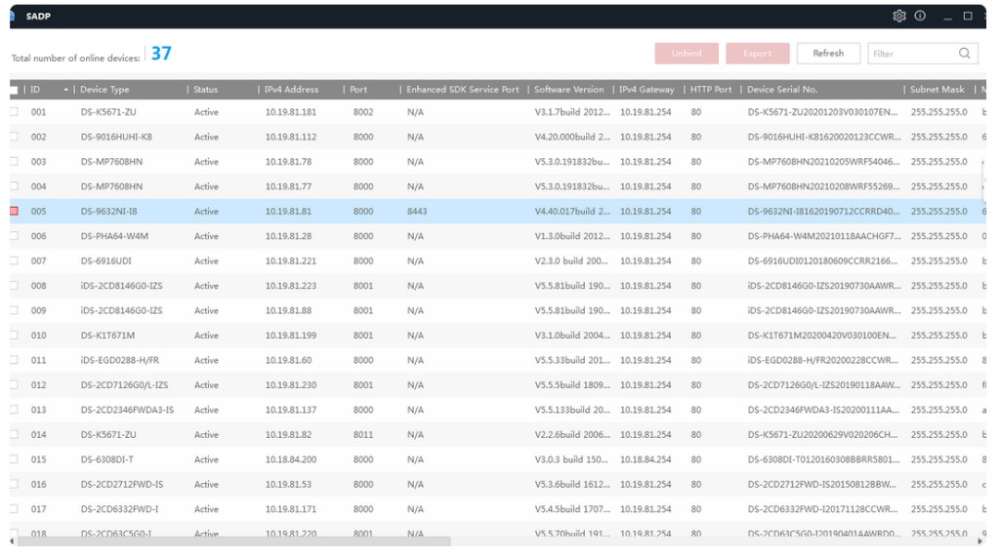
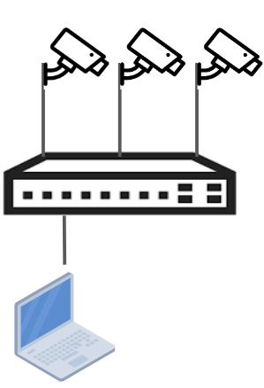
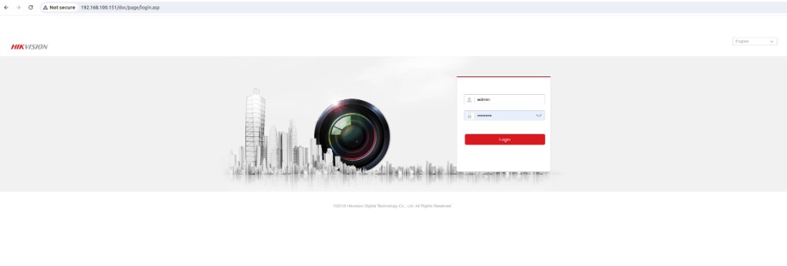
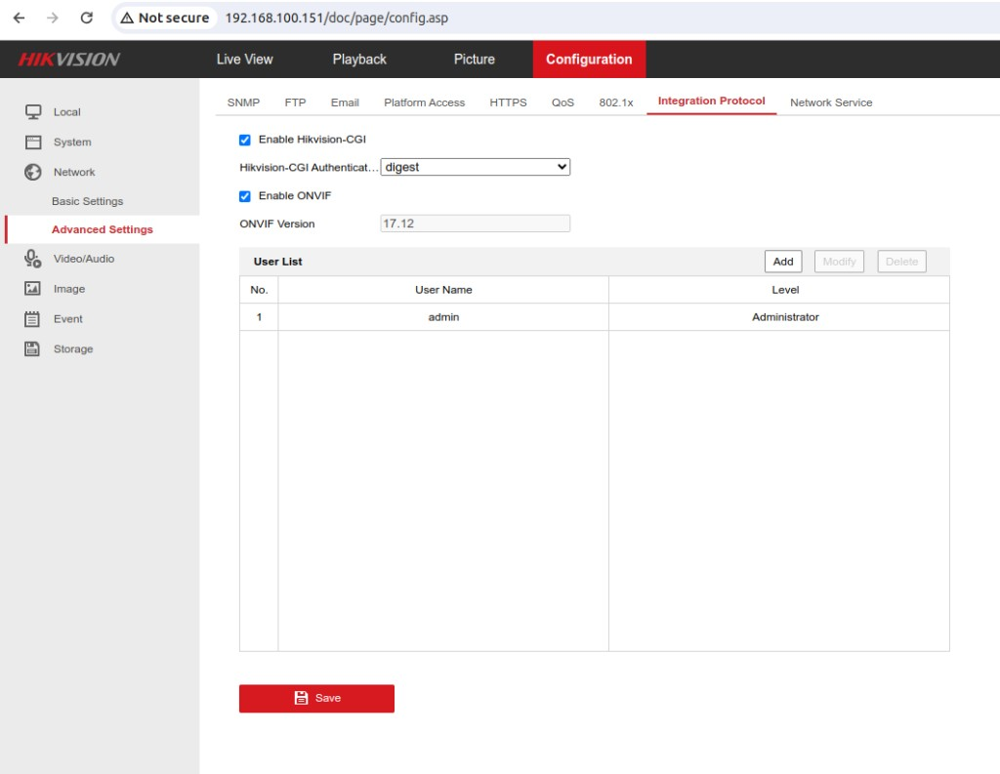
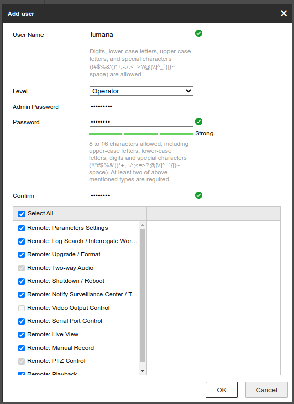
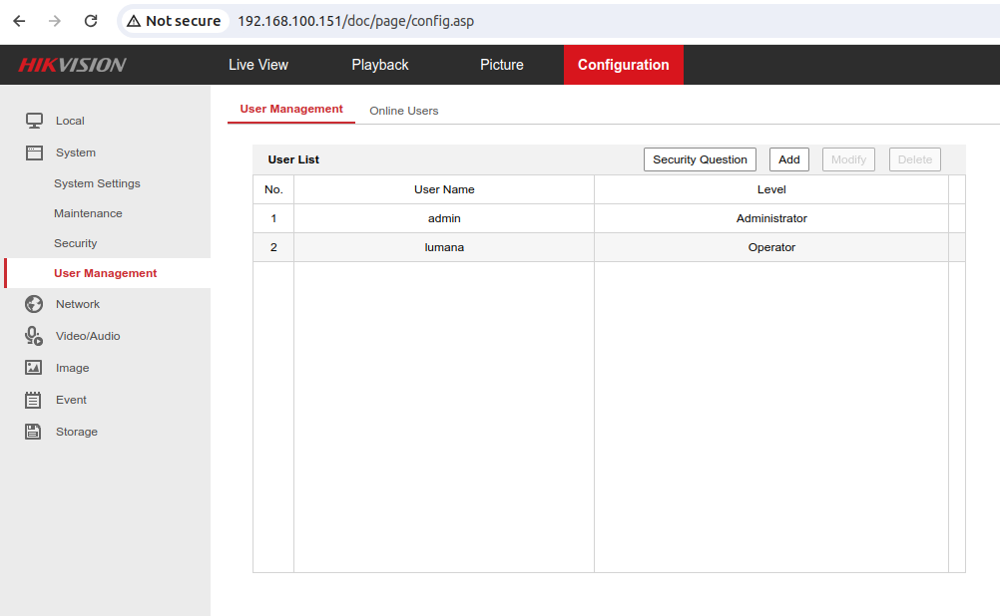

# Hikvision

Hikvision cameras are supported in Lumana when you use compatible series and recommended stream settings.

## Hikvision compatibility models

Compatible Hikvision networked camera lines include:

* Hikvision Networked camera Value series with AcuSense
* Hikvision Networked camera Value series with ColorVu
* Hikvision Networked camera DeepinView Series
* Hikvision Networked camera Panoramic Series
* Hikvision Networked camera Performance Series
* Hikvision Networked camera Solar-powered Series
* Hikvision Networked camera Value Express Series

## How to Create a Profile on Hikvision Camera

This guide provides step-by-step instructions to how to create an ONVIF or a normal profile on Hikvision Camera.

**Using Admin Credentials (recommended)**

For the most seamless integration and to ensure optimal performance between your Hikvision camera and Lumana Core, we strongly recommend using the admin username and password. This approach guarantees the highest level of compatibility and access, enabling Lumana Core to utilize all camera features and settings comprehensively.

**Why using Admin Credentials?**

* Full Feature Access: By providing Lumana Core with admin credentials, you unlock the full potential of your Hikvision camera within the Lumana Core platform. This includes access to camera API, configurations, and advanced features that may be restricted to admin-level users.
* Minimized Failure Risks: Admin access ensures that Lumana Core can communicate effectively with your camera, reducing the likelihood of compatibility issues and ensuring that all integrations function smoothly.

**Using an ONVIF Profile**

The ONVIF (Open Network Video Interface Forum) standard promotes open interoperability of IP-based security products. When connecting your Hikvision camera to Lumana Core, creating an ONVIF profile can simplify the integration process, particularly for cameras with PTZ functionality or when a universal standard is required for system integration.

**Why creating ONVIF profile?**

* PTZ Control: For Hikvision cameras with PTZ capabilities, an ONVIF profile is essential to enable full control of these functions through the Lumana Core portal.
* Standardization: ONVIF profiles facilitate a standardized method of communication between different devices, ensuring compatibility and interoperability across different systems and brands.

**Creating a New Profile**

Choosing to create a new profile for connecting your Hikvision camera to Lumana Core is an effective way to maintain heightened security by controlling the exact level of access granted to Lumana Core. This method is particularly beneficial for users who prefer not to use admin credentials for third-party integrations.

**Why creating new profile?**

* Flexibility: Easily modify or revoke Lumana Core's access without affecting the admin user’s settings or the access of other users. Customized Access Levels: Tailor the access rights of the profile to match the exact requirements of Lumana Core, ensuring it has only the necessary permissions, thus enhancing the overall security posture.
* Important Consideration: Be aware that restricting the profile's permissions may result in limited functionality within Lumana Core. Certain features, including advanced camera API access or Lumana-optimized configurations, require admin-level permissions to operate fully.

### Preparing Your Hikvision Camera

To ensure a smooth integration process with Lumana Core, it’s crucial to properly prepare your Hikvision camera. This preparation involves ensuring your camera is updated, correctly configured, and ready to connect, whether you're using admin credentials, an ONVIF profile, or creating a new profile.

**Activate Your Camera with SADP Tool (for out of the box cameras)**

* Download SADP Tool: If your camera is new or hasn’t been initialized yet, start by downloading the SADP (Search Active Device Protocol) tool from the [Hikvision official website](https://www.hikvision.com/en/support/tools/hitools/clea8b3e4ea7da90a9/). This software is designed to help find and initialize Hikvision devices on your network. Note: Hikvision's SADP tool requires Windows OS
* Install and Launch SADP: After downloading, install and open the SADP tool on a computer connected to the same network as your Hikvision camera.
* Detect and Initialize the Camera: The SADP tool will scan your network and list all Hikvision devices that are not initialized. Select your camera from the list and set a password for it, effectively initializing the device. Note down the IP address assigned to your camera; you will need it for later steps.
* Assign a static IP (Recommended): To ensure your camera maintains a consistent connection to Lumana Core, assign it a static IP address through its web interface under the network settings.

**Successful Login and Transition to Connection**

If you have successfully logged into your Hikvision camera's web interface using the IP address identified via the SADP tool, this indicates that your camera has been initialized properly. At this stage, your device is ready to be connected to Lumana Core using the recommended admin credentials method for optimal compatibility and feature access.

If you opt to use the admin credentials to integrate your Hikvision camera with Lumana Core, you have completed all necessary preliminary steps and can now proceed directly to [connect your Hikvision Camera to Lumana Core](https://support.lumana.ai/hc/en-us/articles/18173275161362)

### Configuring ONVIF on Your Hikvision Camera

* **Step 1**: Log into the Hikvision Web Portal
  * Open a Web Browser: Enter the IP address of your Hikvision camera into the browser’s address bar.
  * Administrator Login: Use your administrator credentials to log into the Hikvision web portal. These credentials are the admin username and password established during the initial setup of your camera.
* **Step 2**: Access the Configuration Tab
  * Once logged in, locate and click on the Configuration tab found in the top menu of the web interface. This tab allows access to the camera’s extensive configuration settings.
* **Step 3**: Navigate to Advanced Network Settings
  * Within the Configuration menu, look for the Network section and select it.
  * Then, find and click on Advanced Settings. This section contains advanced networking features, including those related to ONVIF.
* **Step 4**: Enable Hikvision-CGI
  * In the Advanced Settings menu, look for the option to Enable Hikvision-CGI.
  * Check this box to enable CGI, which is often required for third-party integrations and advanced functionality.
  * Select Authentication to Digest: This setting configures the authentication method used by the camera, with Digest being a secure choice that is compatible with most ONVIF consumers.
* **Step 5**: Enable ONVIF
  * Locate the Enable ONVIF field within the same section.
  * Check this box to activate ONVIF support on your camera. ONVIF is a standard for the interoperability of IP-based security products, allowing your Hikvision camera to communicate and be managed through various ONVIF-compliant devices and applications.
* **Step 6**: Add an ONVIF User
  * To fully integrate with ONVIF-compatible systems, you will need to add a user specifically for ONVIF access.
  * Use the same login information as the camera at the admin level. This means creating an ONVIF user with administrative privileges, ensuring it has comprehensive access for integration and management through ONVIF-compliant systems.
* **Step 7**: Save Your Settings
  * After configuring the ONVIF settings and adding a user, be sure to click the Save button to apply and preserve your changes.
  * A confirmation message or visual indicator should appear, signifying that the settings have been successfully saved.

You have completed all necessary preliminary steps and can now proceed directly to [connect your Hikvision Camera to Lumana Core](https://support.lumana.ai/hc/en-us/articles/18173275161362)

### Creating a profile on Your Hikvision Camera

* **Step 1**: Access the Hikvision Web Portal
  * Open your web browser: Enter the IP address of your Hikvision camera into the browser’s address bar.
  * Log in: Use the administration credentials to log into the Hikvision web portal. These are the admin username and password that were set up during the camera's initial setup.
* **Step 2**: Navigate to Configuration
  * Once logged in, look for the Configuration tab on the top menu of the web portal's interface. Click on this tab to access the various configuration settings available for your camera.
* **Step 3**: Access User Management
  * Inside the Configuration menu, look for the System section. Under this section, you will find an option labeled User Management. Click on User Management to proceed to the next step.
* **Step 4**: Add a New User
  * On the User Management page, you’ll see a list of current users and the option to Add a user. Click on the Add button to start the process of creating a new profile.
  * Fill in the details for the new user. You will need to specify a username and password for the new profile. Make sure to choose credentials that are secure but also recognizable for their purpose (e.g., for Lumana Core integration).
  * Assign a Role: It's recommended to assign the role of Operator to the new user. The Operator role typically has sufficient permissions for most of Lumana Core's functionalities without granting full administrative rights.
  * Permissions: Ensure you select All under permissions to grant the new user profile comprehensive access. This is crucial as revoking specific functions could limit Lumana Core's capabilities over your Hikvision camera.
* **Step 5**: Save the New User Profile
  * After filling in the details and assigning the appropriate role and permissions, look for the Save button. Click Save to finalize the creation of the new user profile.
  * A confirmation message or indicator should appear, confirming that the new user has been added successfully.

The operator credentials allows Lumana Core full access to configure the camera settings, including stream configurations, automatically.

You can now procceed to [How to configure and connect Camera to Lumana core](https://support.lumana.ai/knowledge/editor/01HB6K2TVX7JF7MPZFXBJYXCRV/en-us?brand_id=10899747518610), which will guide you through the process of adding your camera to Lumana Core and ensuring everything is functioning as expected.
