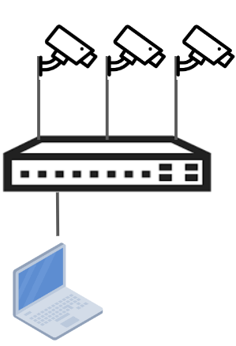
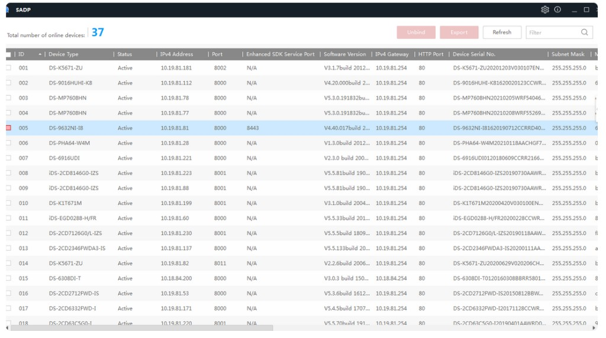
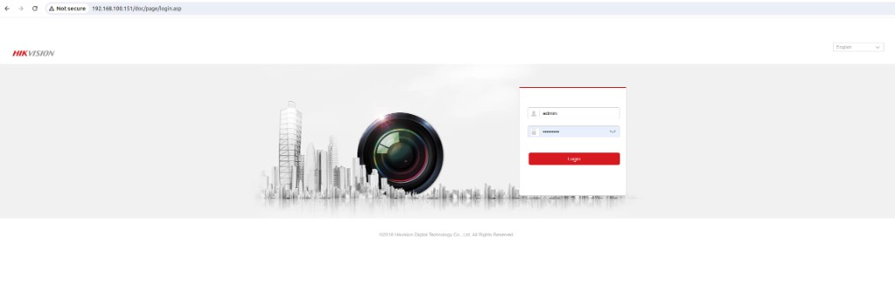
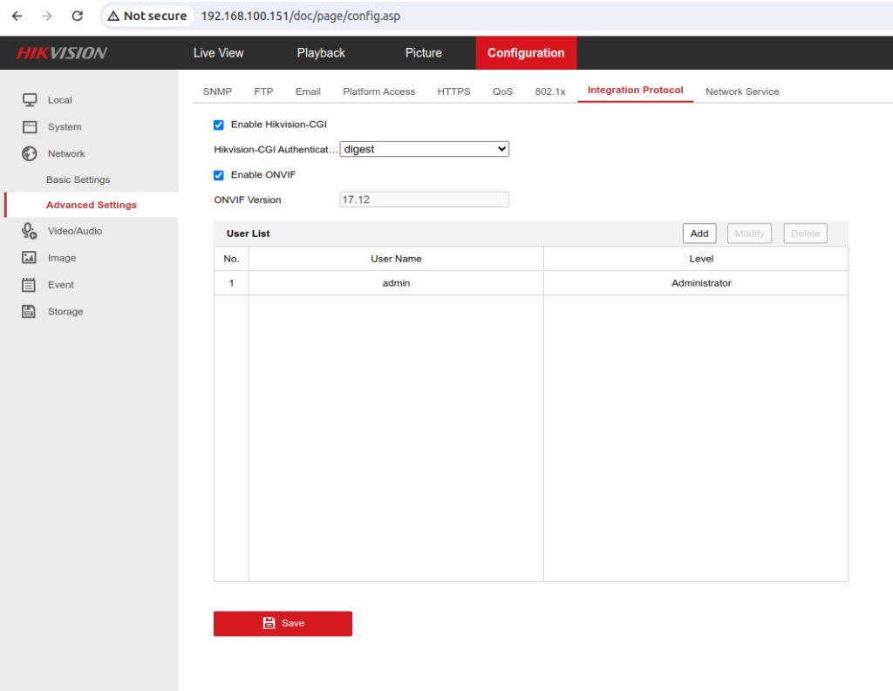
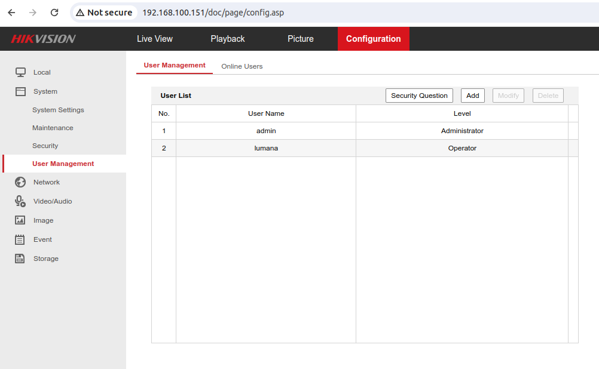
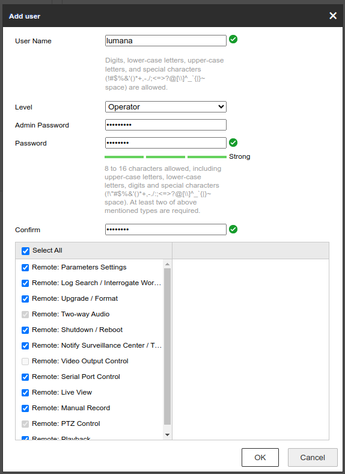

# Connect Hikvision cameras

Hikvision cameras are supported in Lumana when you use compatible series and recommended stream settings.

## Supported Hikvision models

Compatible Hikvision networked camera lines include:

* Hikvision Networked camera Value series with AcuSense
* Hikvision Networked camera Value series with ColorVu
* Hikvision Networked camera DeepinView Series
* Hikvision Networked camera Panoramic Series
* Hikvision Networked camera Performance Series
* Hikvision Networked camera Solar-powered Series
* Hikvision Networked camera Value Express Series

## Connect your Hikvision camera to Lumana Core

This guide explains how to connect your Hikvision camera to Lumana Core. If needed, you can connect using the admin credentials, an ONVIF profile, or a new profile.

Choose the connection method that fits your setup:

* **Admin credentials**: Best option when available. Gives Lumana the highest level of access and compatibility.
* **ONVIF**: Useful when you need a standards-based connection, including some PTZ use cases.
* **New profile**: Useful when you do not want to use the admin account directly and want to manage access separately.


Using reduced-permission accounts may limit some functionality in Lumana.



Use the camera's admin username and password when possible. This provides the highest level of compatibility and access.


### Prepare your Hikvision camera

Ensure your Hikvision camera is updated, correctly configured, and ready to connect, whether using admin credentials, an ONVIF profile, or a new profile.

### Activate your camera with the SADP tool

* **Download SADP Tool**: If your camera is new or hasn't been initialized yet, then download the SADP (Search Active Device Protocol) tool from the [Hikvision official website](https://www.hikvision.com/en/support/tools/hitools/clea8b3e4ea7da90a9/). This software helps find and initialize Hikvision devices on your network. Note: Hikvision's SADP tool requires Windows OS.
* **Install and launch SADP**: After downloading, install and open the SADP tool on a computer on the same local network as your Hikvision camera. For example, connect the cameras and your PC to the same switch.

* **Detect and Initialize the Camera**: The SADP tool scans your network and lists Hikvision devices. Select your camera, note its IPv4 address and status, and, if the device is not initialized yet, set a password to activate it. Keep the IP address for the next steps.

* **Assign a static IP (Recommended)**: Assign a static IP address through the camera's web interface, under network settings. This keeps the camera reachable by Lumana Core after reboots.

### Continue after you log in

In a browser, open the camera using the IP address from SADP (for example `http://192.168.x.x/...`). The sign-in page looks similar to this:

If the web sign-in succeeds with the IP address from SADP, then the camera is initialized properly. At this stage, the device is ready to connect to Lumana Core. Use the admin credentials method for the best compatibility and feature access.

If you are using admin credentials, then you can proceed directly to [Connect a camera](../../getting-started/connect-a-camera.md#connect-a-camera).

### Configure ONVIF on your Hikvision camera

1. Log in to the Hikvision Web Portal.

* **Open a web browser**: Enter the IP address of your Hikvision camera into the browser’s address bar.
* **Administrator login**: Use your administrator credentials to log into the Hikvision web portal. These credentials are the admin username and password established during the initial setup of your camera.

2. Open **Configuration** → **Network** → **Advanced Settings**, then select the **Integration Protocol** tab.

* Once logged in, locate and select the **Configuration** tab found in the top menu of the web interface.
* In the **Configuration** menu, select **Network**, then **Advanced Settings**.
* Open the **Integration Protocol** tab (names can vary slightly by firmware).

3. Enable **Hikvision-CGI** and set authentication to **Digest**.

* In the **Integration Protocol** view, enable **Hikvision-CGI**.
* Set **Hikvision-CGI Authentication** to **Digest** when present.

4. Enable ONVIF.

* Enable **ONVIF**.
* Note the **ONVIF version** if your deployment needs to record it.

5. Add an ONVIF user.

* In the **User List** for integration / ONVIF, select **Add**.
* Create a dedicated user with **Administrator** level (or the privileges your organization requires for third-party VMS access).

6. Save your settings.

* Select **Save** to apply your changes.
* Wait for a success confirmation so you know the integration settings and users were written to the device.

Example: **Integration Protocol** with **Hikvision-CGI** (digest), **ONVIF** enabled, and **Add** available for users:

After completing ONVIF setup, proceed to [Connect a camera](../../getting-started/connect-a-camera.md#connect-a-camera).

### Create a new user on your Hikvision camera

1. Access the Hikvision Web Portal.
2. Open **Configuration** → **System** → **User Management**.

* Once logged in, look for the **Configuration** tab on the top menu of the web portal's interface. Select this tab to access the various configuration settings available for your camera.
* Inside the **Configuration** menu, look for the **System** section. Under this section, select **User Management**.

3. Add a new user.

* On the **User Management** page, select **Add**.
* Enter a **username** and **password** (you might need to enter the **admin password** to authorize the change).
* Assign the **Operator** role unless your security team specifies otherwise.
* Under **permissions**, enable the capabilities Lumana needs. Typically, select all remote permissions your firmware offers. Examples include **Remote: Parameters Settings**, **Live View**, **Playback**, and related items. The exact checklist depends on model and firmware.

4. Save the new user profile.

* After you select **Save**, watch for a confirmation message or indicator that shows the new user is active.

Using an **Operator** user with broad remote permissions (often **Select all** in the **Add** user dialog) gives Lumana Core reliable access to camera and stream settings.

You can now proceed to [Connect a camera](../../getting-started/connect-a-camera.md#connect-a-camera), which guides you through adding your camera to Lumana Core and confirming that the camera is online and streaming.
