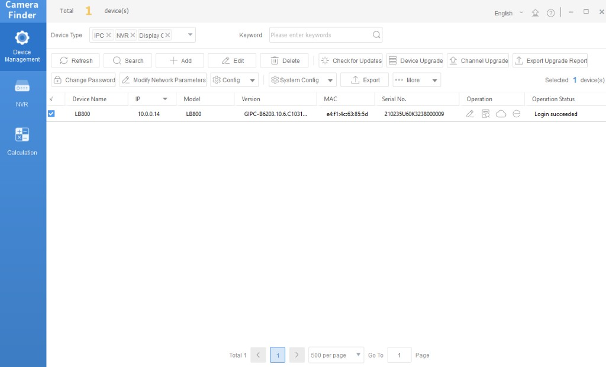

# Connect Lumana cameras

Lumana dome, bullet, and turret cameras are built for direct use with Lumana Core. Prepare addressing and passwords with **Lumana Camera Finder** on a PC, then add each device in **VMS+** so Core can pull video.

## Quick start PDFs

Printed quick starts list physical install and baseline steps by form factor:

- [Turret quick start (PDF)](https://support.lumana.ai/hc/en-us/article_attachments/17249698970770)
- [Bullet quick start (PDF)](https://support.lumana.ai/hc/en-us/article_attachments/17249693176210)
- [Dome quick start (PDF)](https://support.lumana.ai/hc/en-us/article_attachments/17249698971026)

For software- or network-specific prep, use Camera Finder and VMS+ below.

## Download Lumana Camera Finder

**Lumana Camera Finder** runs on Windows and macOS. Use it on a computer on the **same LAN** as the cameras so discovery and login succeed.

- [Download Camera Finder for Windows (Google Drive)](https://drive.google.com/file/d/1r-jZcDPfi7JrTTHKFjIRG1BGrq1rggeG/view?usp=sharing)
- [Download Camera Finder for macOS (Google Drive)](https://drive.google.com/file/d/1jxiqh_opqocBNdHJ5_VIQwqWI-a9F598/view?usp=sharing)

## Prepare cameras with Camera Finder

### Discover devices and log in

Camera Finder scans the LAN, lists discovered units, and lets you narrow results by MAC address or IP range.

You must **log in to each device** in Camera Finder before you change passwords, network settings, or other configuration.

When credentials are correct, **Device Management** shows **Login succeeded** for that row.

### Bulk and single-device configuration

**Across multiple selected devices** you can:

- **Manage device passwords:** Move from default passwords to unique credentials per camera.
- **Bulk network and service settings:** Set system time, daylight saving time, DNS, ports, UPnP, and ONVIF-related options where the tool exposes them.

**For one device at a time** you can also:

- Change the device IP address.
- Set the **Camera name**.
- **Restore default settings** to return the camera to factory configuration.

### Import and export configuration

- **Import configuration:** Apply a saved configuration file from your computer to a device.
- **Export configuration:** Save the device’s current configuration to a file for backup or reuse.

### Debugging and support

When you troubleshoot with [support@lumana.ai](mailto:support@lumana.ai), Camera Finder can expose the device **serial number** and diagnostic details from the advanced menu. Collect that data before you open a ticket.

## Connect the camera in VMS+

When each camera has a stable address and a password you control—and **Login succeeded** shows in Camera Finder—add it to your site in VMS+, using the same **username** and **password** you rely on for that device.

Follow the steps in [Connect a camera](../../getting-started/connect-a-camera.md#connect-a-camera). If the add form offers **ONVIF** or a dedicated Lumana path, select the option that matches how the camera was set in Camera Finder and the quick start PDFs.

After the camera is online in VMS+, match encoder and stream settings to [Recommended streaming settings](../recommended-streaming-settings.md).

## Next steps

- Confirm coverage and navigation with [Set up a camera floor plan](../set-up-a-camera-floor-plan.md).
- Compare third-party options on the [Supported cameras](supported-cameras.md) list.
