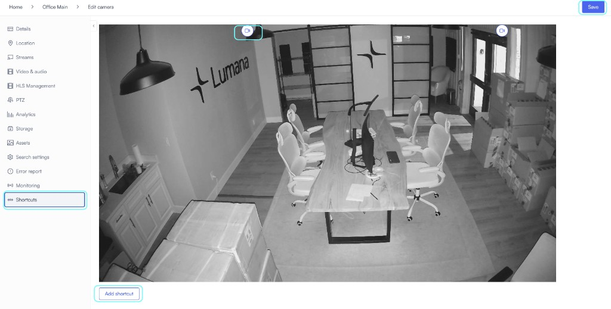
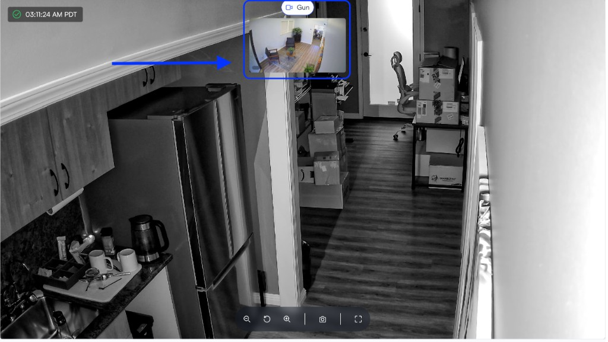

# Create camera shortcuts

**Camera shortcuts** are links you place on a camera’s image so you can open another feed from live view. This guide walks you through adding them in **Edit camera**, saving, and using them when you monitor.

## Key benefits

- **Follow movement across zones:** When activity crosses camera coverage, you jump to the next view from the scene instead of searching the device list.
- **Shorten response paths:** During an incident you can open neighboring or related cameras in fewer steps.
- **Tie views together on large sites:** You keep a simple path between areas you often view together, without breaking out of the current layout.

## Prerequisites

- You use VMS+ in a web browser.
- The cameras you want to jump between are already added to VMS+.
- You can open **Edit camera** on the camera that should display the shortcuts.

## Add shortcuts to a camera

In **Edit camera**, open **Shortcuts** to see the live image, shortcut pins, **Add shortcut**, and **Save**.

1. Open the camera where you want shortcuts, then select **Edit camera**.
2. In the left sidebar, select **Shortcuts**.
3. Select **Add shortcut**.
4. Select the camera you want the shortcut to open (the alternative view).
5. Place the shortcut on the part of the image where you want it.
6. If you need more shortcuts on the same camera, repeat steps 3 through 5.
7. Select **Save**.

Go back to the camera’s live view. A shortcut can open the linked camera in a picture-in-picture panel, or switch the main view depending on your layout.

## Next steps

- Use [Use live view](../live-video-monitoring-and-operations/live-view.md) for the player, layouts, and controls.
- Use [Set up a camera floor plan](set-up-a-camera-floor-plan.md) to map cameras to locations on your site.
