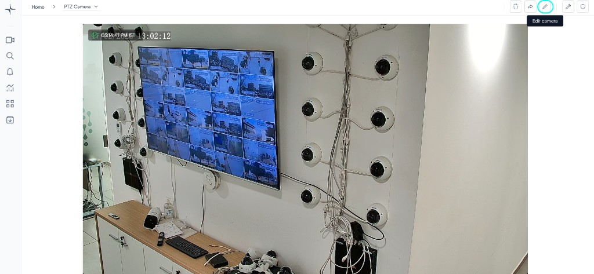
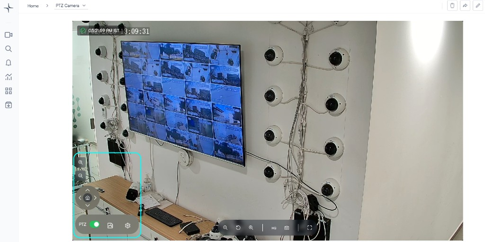

# Enable PTZ control

Lumana’s Remote PTZ (Pan-Tilt-Zoom) Control allows you to adjust camera direction and zoom in real time, enabling precise monitoring without physical access to the device.

## Before you begin

* Ensure your camera supports PTZ functionality.
* Confirm the camera is added to your Lumana organization and is online.
* Verify that PTZ is accessible via `ONVIF` or your camera’s supported protocol.

## Key capabilities

✔ **Full Coverage Control** – Pan, tilt, and zoom to monitor every area.

✔ **Remote Operations** – Control cameras from anywhere via Lumana.

✔ **Preset Positions** – Configure and return to predefined camera angles.

## Steps to enable PTZ control

1. **Select the camera**
   * Open the camera from the **Devices** list.
2.  **Open camera settings**

    * Click **Edit camera**.

    

3.  **Configure PTZ settings**

    * Navigate to the **PTZ** section.
    * Enable **PTZ support**.
    * Select the **driver**
      * Most cameras use **ONVIF** by default.
    * Enter the **PTZ control path**
      * Common format:\
        `{camera_IP}:80/onvif/device_service`
    * Specify the **port** (if different from default `80`).

    

4. **Save configuration**
   * Click **Save** to apply changes.

## Using PTZ controls

1. Open the camera from the **Devices** list.
2.  Enable **PTZ control** at the bottom of the camera view.

    

3.  Use the on-screen controls:

    * **Arrow controls** to pan and tilt
    * **Zoom controls** to adjust magnification

    

