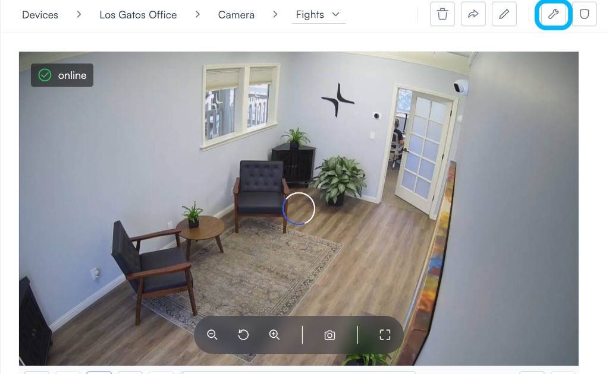
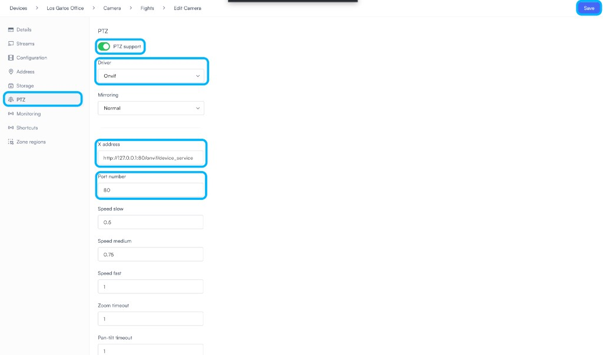

# Enable PTZ control

Use Lumana's Remote PTZ (Pan-Tilt-Zoom) control to adjust camera direction and zoom in real time. You can monitor precisely without physical access to the device. After you save these settings, operators can use PTZ from **Live view** when their role permits.

## Prerequisites

- Confirm your camera supports PTZ functionality.
- Add the camera to your Lumana organization and confirm it is online.
- Verify that PTZ is accessible via `ONVIF` or your camera's supported protocol.

## Configure PTZ on the camera

1. Open the camera from the **Devices** list.
2. Select the **Edit camera** control on the camera live view (pencil **Edit camera** icon or **Settings** gear, depending on your UI version).

    

3. Navigate to the **PTZ** section.
4. Enable **PTZ support**.
5. Select the **Driver**. Most cameras use **ONVIF** by default.
6. Enter the **PTZ control path** and address fields as your firmware labels them (**PTZ control path**, **X address**, or similar). A common path pattern is `{camera_IP}:80/onvif/device_service`.
7. Enter the **port** when it differs from the default `80`.

    

8. Select **Save** to apply changes.

   Lumana stores the PTZ profile on the camera record and shows PTZ controls where your role allows them.

## Next steps

To try PTZ in the web player after you save (pan, tilt, zoom), see [PTZ control](../live-video-monitoring-and-operations/ptz-control.md).
