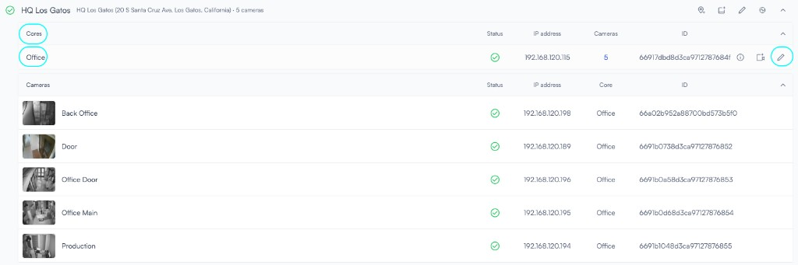
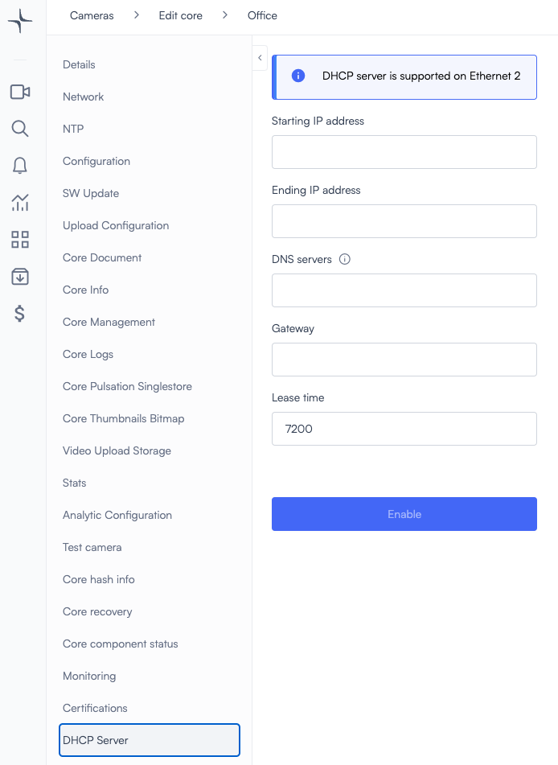
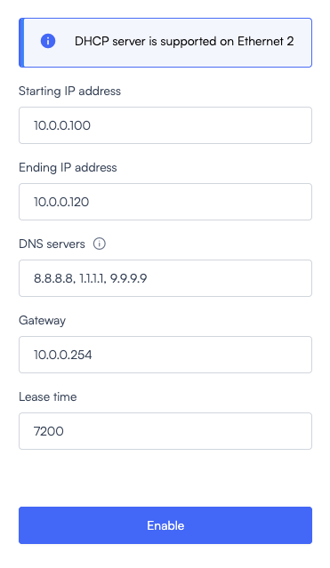
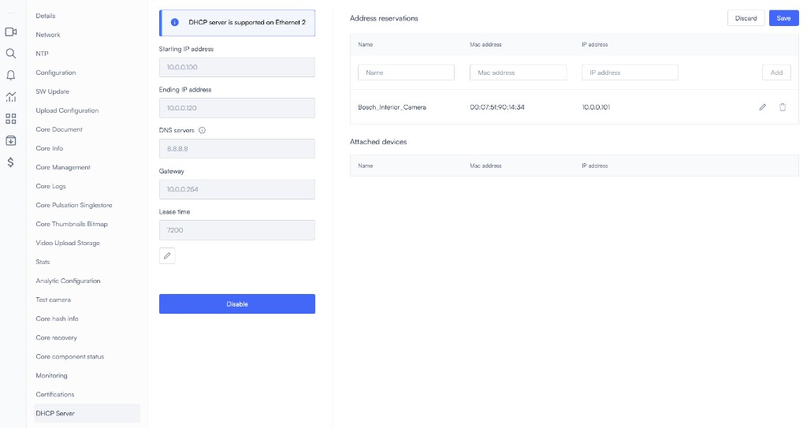

# Configure Lumana Core as a DHCP server

Lumana Core can function as a DHCP server, allowing it to dynamically assign IP addresses to connected devices on its network. This feature is supported on Ethernet 2, enabling automated network management without requiring manual IP address configuration for each device.

> **Note:** Use this feature when you want Lumana Core to assign IP addresses to devices connected on Ethernet 2.

## Key DHCP server capabilities

When enabled, the DHCP server on Lumana Core provides essential networking services, including:

- Automatic assignment of IP addresses
- Management of network connectivity for connected devices
- Centralized configuration of network settings such as DNS servers and gateways

Before you start, make sure you can edit the relevant Core and that the devices you want Lumana Core to manage are connected to Ethernet 2. If another DHCP server is already active on that network, then review the impact first because enabling this feature can change IP assignments for connected devices.

## Configure DHCP server on Lumana Core

1. In the left sidebar, click the  **Cameras** icon.

2. Select the Core where you want to enable DHCP server and click the  pencil icon.

3. Open **DHCP Server** and enter the required parameters.

## Configuration parameters

To set up the DHCP server on Lumana Core, the following parameters need to be configured:

- **Starting IP Address:** The first IP address in the DHCP pool that Lumana Core will assign to devices.
- **Ending IP Address:** The last IP address in the DHCP pool, defining the range of available IPs.
- **DNS Servers:** A list of DNS servers that clients should use for domain name resolution. Multiple servers can be specified, separated by commas.
- **Gateway:** The default gateway IP address that clients will use to communicate with external networks.
- **Lease Time:** The duration, in seconds, for which an IP address is leased to a device before it needs renewal.

## Example configuration

The example below shows a completed DHCP server configuration.

When you enable DHCP, the page shows an option to reserve IP addresses.

## Address reservation

Lumana Core supports DHCP address reservation, allowing specific devices to always receive the same IP address based on their MAC address. This feature is useful for devices that require static IPs but benefit from centralized DHCP management.

### Configure address reservation

1. Identify the MAC address of the device that requires a reserved IP.
2. Assign a specific IP address within the DHCP range to the device.
3. Ensure that the reserved IP does not overlap with dynamically assigned addresses.
4. Save the configuration so that the device always receives the assigned IP when connecting to the network.

### Address reservation use cases

- Ensuring stable IP addresses for critical infrastructure such as servers and other network devices
- Preventing IP conflicts by pre-assigning known addresses

