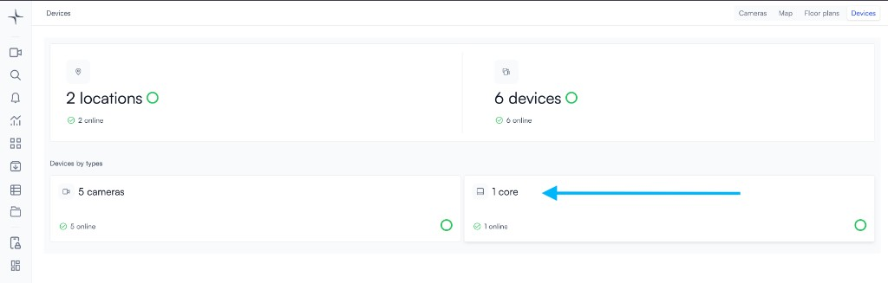
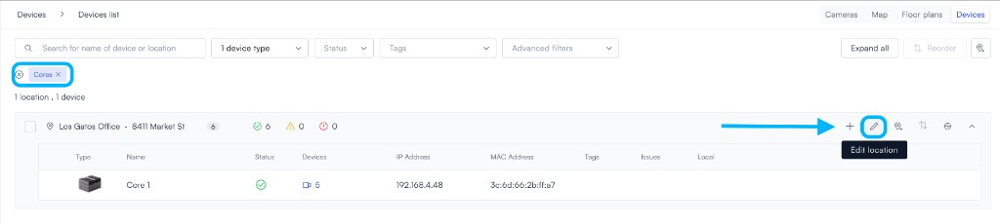
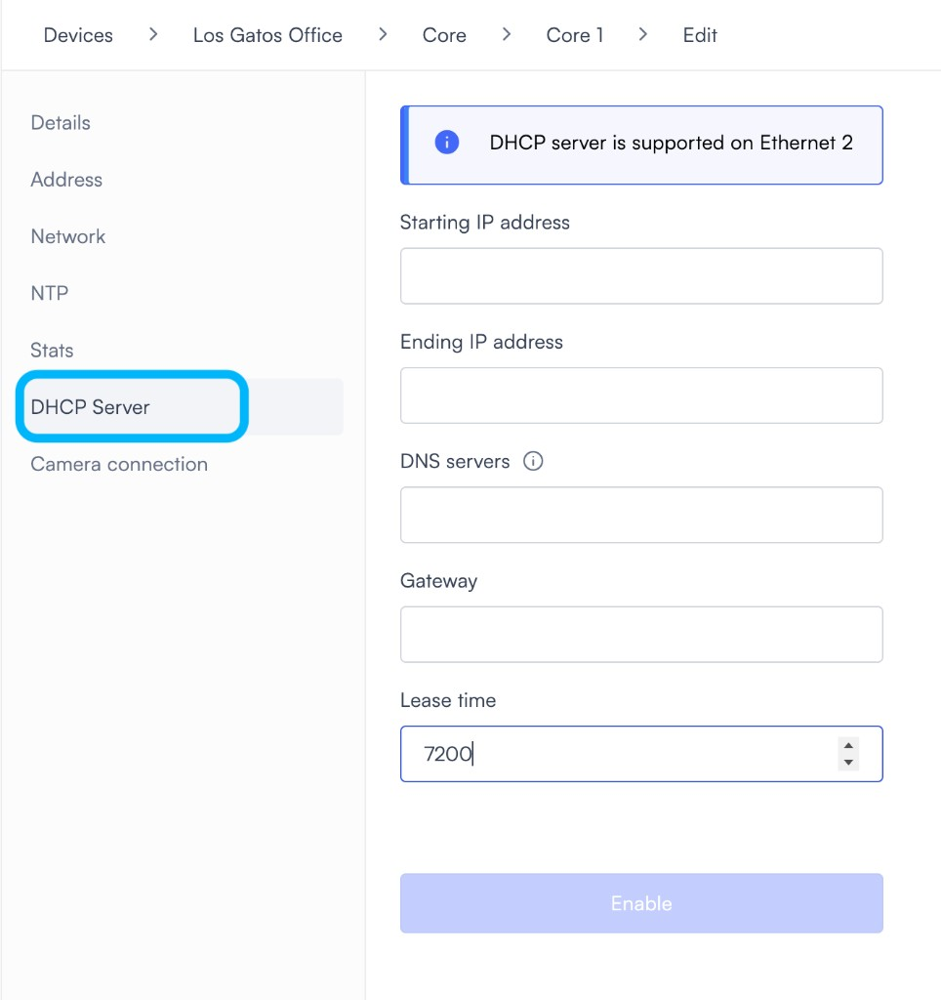
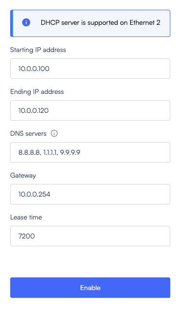
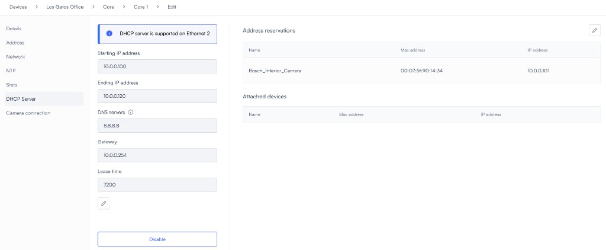

# Configure Lumana Core as a DHCP server

Lumana Core can run a DHCP server on **Ethernet 2**. It assigns IP addresses to devices on that interface so you skip manual addressing for each device.


Use this feature when you want Lumana Core to assign IP addresses to devices connected on Ethernet 2.


## Key DHCP server capabilities

When you enable DHCP on Lumana Core, the server assigns addresses and manages client connectivity basics, including:

- Automatic assignment of IP addresses
- Management of network connectivity for connected devices
- Centralized configuration of network settings such as DNS servers and gateways

## Before you start

- Confirm you can edit the relevant Core in Lumana.
- Connect the devices you want Lumana Core to manage to **Ethernet 2**.
- If another DHCP server is already active on that segment, then review the impact before you enable this feature. Turning on Lumana's DHCP server can change IP assignments for devices on the network.

## Configure DHCP server on Lumana Core

1. Select the  **Cameras** icon in the left sidebar.

2. Select **Devices**.

3. Select **Cores** under **Devices by types** (for example the **1 core** tile).

4. Apply the **Cores** filter on the **Devices list** if it is not already active.

5. Select **Edit location**  on the row for the location that contains the Core where you want DHCP.

6. Select **DHCP Server** in the Core editor sidebar.

7. Enter **Starting IP address**, **Ending IP address**, **DNS servers**, **Gateway**, and **Lease time** using the definitions in [Configuration parameters](#configuration-parameters).

8. Select **Enable**.

   The DHCP server turns on for **Ethernet 2**. Select **Save** on the Core or location editor when the UI requires it to persist the change.

## Configuration parameters

Configure the following parameters when you set up the DHCP server on Lumana Core:

- **Starting IP address**: The first IP address in the DHCP pool that Lumana Core assigns to devices.
- **Ending IP address**: The last IP address in the DHCP pool, defining the range of available IPs.
- **DNS servers**: A list of DNS servers that clients should use for domain name resolution. Separate multiple servers with commas.
- **Gateway**: The default gateway IP address that clients will use to communicate with external networks.
- **Lease time**: How long, in seconds, a device keeps an IP address before it must renew the lease.

## Example configuration

The example below shows a completed DHCP server configuration.

When you enable DHCP, the page shows an option to reserve IP addresses.

## Address reservation

Lumana Core supports DHCP address reservation, allowing specific devices to always receive the same IP address based on their MAC address. This feature is useful for devices that require static IPs but benefit from centralized DHCP management.

### Configure address reservation

1. Open the address reservation section on the **DHCP Server** page.

   It sits below the pool fields on the same page after **Enable** is on for that Core.
2. Add a reservation row using the control the UI provides (for example **Add** or an empty row in the reservation table).

3. Enter the client's **MAC address** and the **IP address** you want to reserve. Keep the IP inside the pool from **Starting IP address** through **Ending IP address**.

4. Confirm the IP does not duplicate another reservation or conflict with addresses you need for non-DHCP devices.

5. Select **Save** on the Core or location editor if prompted, so Lumana Core stores the reservation.

### Address reservation use cases

- Stable IP addresses for critical infrastructure such as servers and dedicated cameras
- Fewer conflicts when you pre-assign addresses that operators expect to stay fixed

## Next steps

After you configure DHCP on Lumana Core, you can continue with related setup tasks.

- Use [Firewall requirements](firewall-requirements.md) to align outbound rules with the new pool.
- Use [Local time and NTP configuration](local-time-and-ntp-configuration.md) to keep Core timestamps accurate.
- Use [Set up a static IP address](../set-up-a-static-ip-address.md) when you need fixed addresses outside the DHCP pool.
