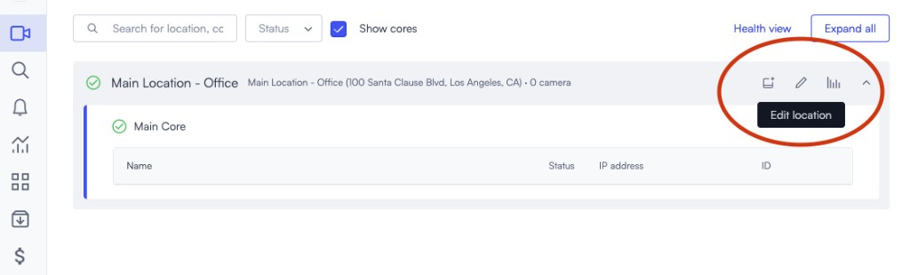

# Local time and NTP configuration

The time shown in live view and playback is determined by the time zone configured on the location where the Core and cameras are installed.

## Change the location time zone

Update the location time zone so live view and playback show the correct local time for the site. This keeps timestamps aligned with the location where the Core and cameras are installed.

1. Hover the name of the relevant location and click **Edit location**.

2. Edit the **Time Zone** field.

## Configure Network Time Protocol (NTP)

Configure NTP so Lumana Core can keep its system time accurate. Use this task if you need to point the Core to a local NTP server instead of the default Lumana NTP servers.

Lumana Core must connect to a Network Time Protocol (NTP) server to synchronize time correctly.

Lumana's default NTP servers are:

- `0.pool.ntp.org`
- `1.pool.ntp.org`
- `0.fr.pool.ntp.org`

If you want to use a local NTP server instead:

1. Click the pencil icon for the Core you want to update.
2. Select **NTP**.
3. Click **Add server** and enter the URL of the server you want to add.
4. Click **Save**.
