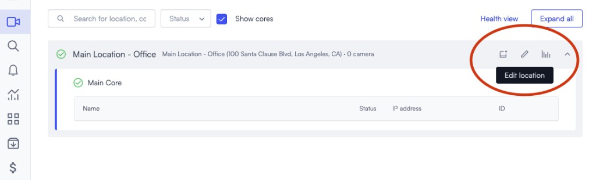
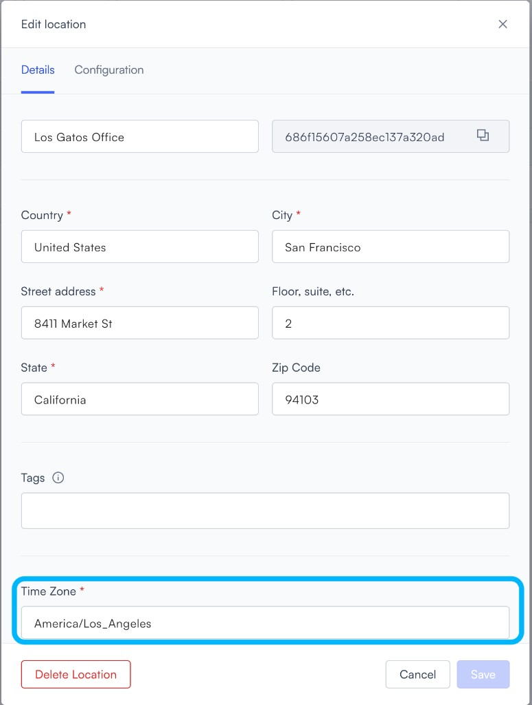

# Local time and NTP configuration

Live view and playback show the local time for each location. Set the time zone on the location that holds the Core and cameras so timestamps stay correct.

## Change the location time zone

Update the location time zone so live view and playback show the correct local time for the site. This keeps timestamps aligned with the location where the Core and cameras are installed.

1. Open **Devices** → **Devices list**. Use the **Cores** filter if it helps you find the site. On the location row for the Core whose time zone you are changing, select **Edit location**.

2. On the **Details** tab, set **Time Zone**, then select **Save**.

## Configure NTP

Configure Network Time Protocol (NTP) so Lumana Core can keep its system time accurate. Use this task if you need to point the Core to a local NTP server instead of the default Lumana NTP servers.

An _NTP (Network Time Protocol) server_ uses NTP to provide accurate time. Devices reach it over the internet or your LAN, which keeps machine clocks aligned with _UTC (Coordinated Universal Time)_.

Lumana Core uses NTP to synchronize its system clock so events, recordings, and logs stay consistent.

Lumana's default NTP servers are:

- `0.pool.ntp.org`
- `1.pool.ntp.org`
- `0.fr.pool.ntp.org`

If you want to use a local NTP server instead:

1. Select the pencil icon for the Core you want to update.
2. Select **NTP**.
3. Select **Add server** and enter the hostname or IP of the server you want to add.
4. Select **Save**.

## Next steps

After you configure local time and NTP, you can continue with related infrastructure tasks.

- Use [Firewall requirements](firewall-requirements.md) to allow the NTP servers your Core uses.
- Use [Configure Lumana Core as a DHCP server](configure-lumana-core-as-a-dhcp-server.md) to manage addresses on Ethernet 2.
- Read [Lumana Core hardware specifications](lumana-core-hardware-specifications.md) for port and environment details.
