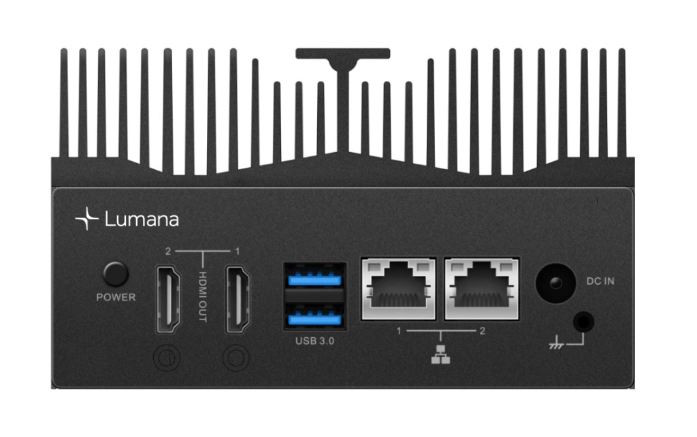
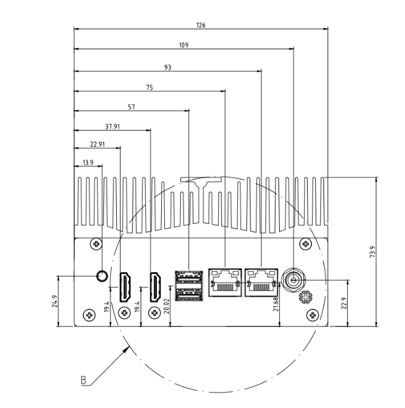

# Lumana Core hardware specifications

Lumana Core is the on-site appliance that runs **VMS+**: managed video, AI-assisted analytics, and browser-based administration. This page lists physical ports, default Ethernet behavior, environmental limits, and other hardware details you need for rack or bench installation.

For full network onboarding steps, see [Connect Lumana Core to the network](https://support.lumana.ai/hc/en-us/articles/11458480360850).

## Rear panel

## Installation

### Power connection

Lumana Core ships with a **120 V** AC to **12 V DC** power adapter. Connect it to the **POWER** input on the rear panel.

### Network connection

Lumana Core has **two 1 GbE RJ-45** ports. You can use one link toward your broader network and one toward a dedicated camera LAN, depending on your topology.

Out of the box, **Ethernet 1** uses **DHCP**. **Ethernet 2** uses a static **192.168.1.158** address with subnet mask **255.255.255.0**.

For detailed steps, see [Connect Lumana Core to the network](https://support.lumana.ai/hc/en-us/articles/11458480360850).

## Product specifications

| Feature | Details |
| --- | --- |
| NVIDIA GPU SoC module | NVIDIA® Jetson |
| Networking | 2× GbE RJ-45 |
| Display output | For internal use |
| Operating temperature | 0 °C ~ 50 °C |
| Storage temperature | −40 °C ~ 85 °C |
| Relative humidity | 40 °C @ 95%, non-condensing |
| Storage | 2 TB / 4 TB SSD |
| Expansion header | 20 pins: 4× GPIOs |
| Input power | 100–240 V ~ 1.8 A (50–60 Hz) |
| Power consumption | 3.5 W ~ 28.5 W |
| Certifications | CE, FCC |
| Country of origin | Taiwan |

## Product dimensions (mm)

## Related configuration

When Core is on your network, you may also need [Firewall requirements](firewall-requirements.md) or [Configure Lumana Core as a DHCP server](configure-lumana-core-as-a-dhcp-server.md).
