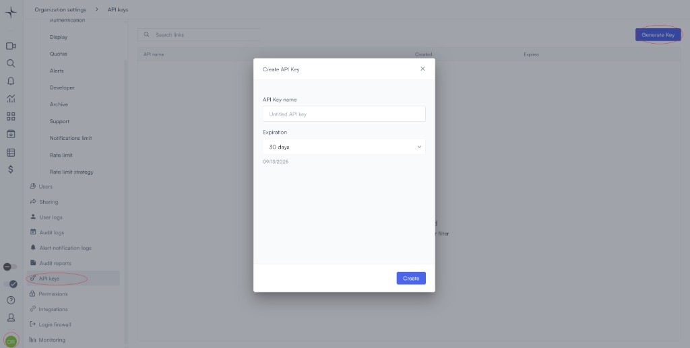
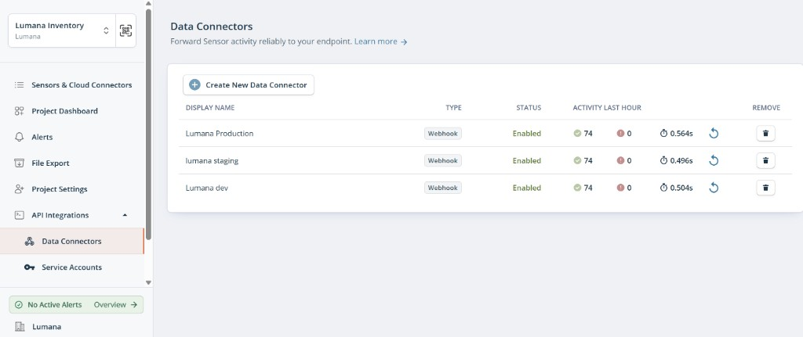
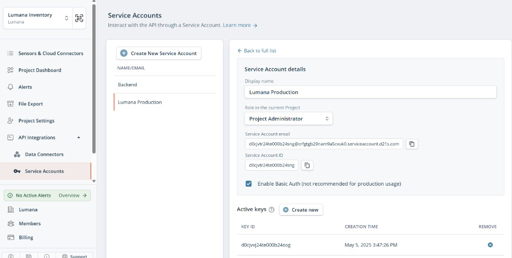
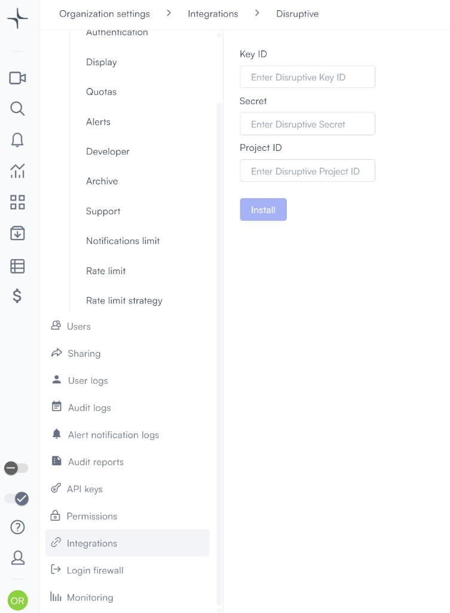
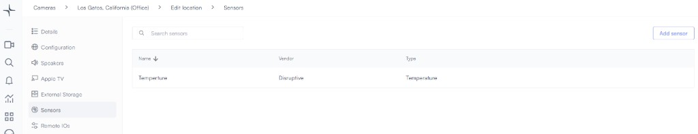

# Disruptive sensors

Integrating your Disruptive sensor with Lumana allows integration with external signals, such as temperature, and live camera views. For example, you can automatically send a snapshot when the temperature crosses a set threshold.

## Connecting Disruptive sensors to Lumana

1. Generate Lumana API Key

* Log in to the Lumana portal.
* Navigate to **Org** -> **Settings** -> **API Keys**.
* Generate a key and save it for later (used in step 2).

2. Configure in Disruptive portal

* In **Data Connector**, create a new connector and name it (for example, `Lumana Production`).
* Set the **Endpoint URL** to:

`https://access.lumana.ai/v1/sensors/disruptive/heartbeat`

* In **Custom HTTP Request Header**, add the Lumana API key from step 1.

3. Create Disruptive Service Account

* Create a new service account in the Disruptive portal.
* Generate a key and save the `Key ID` and `Secret`.
* Go to **Project Settings** and note the `Project ID`.

4. Link Disruptive to Lumana

* In the Lumana platform, go to **Organization Settings** -> **Integration** -> **Disruptive**.
* Enter the `Project ID`, `Key ID`, and `Secret`.
* Click **Install**.

5. Connect Sensors to Cameras

* In Lumana, navigate to **Devices** -> **Location** -> **Edit Location**.
* Add sensors from the available list.
* Assign each sensor to the relevant camera.

