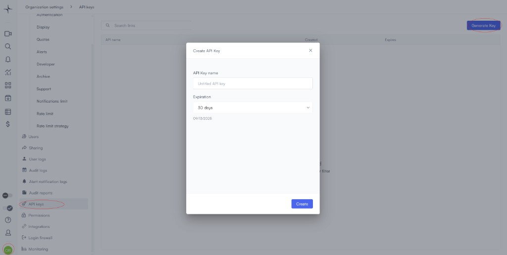
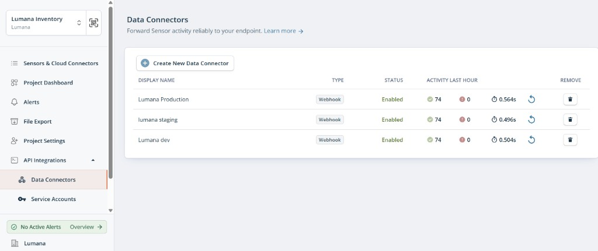
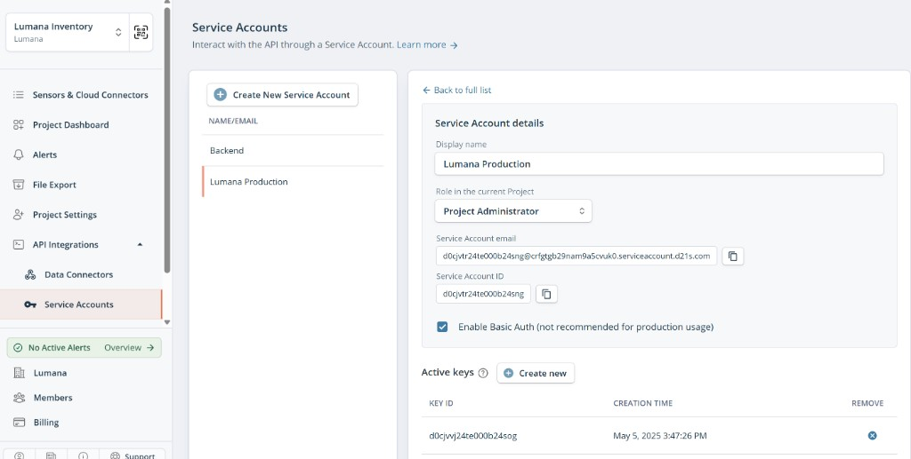
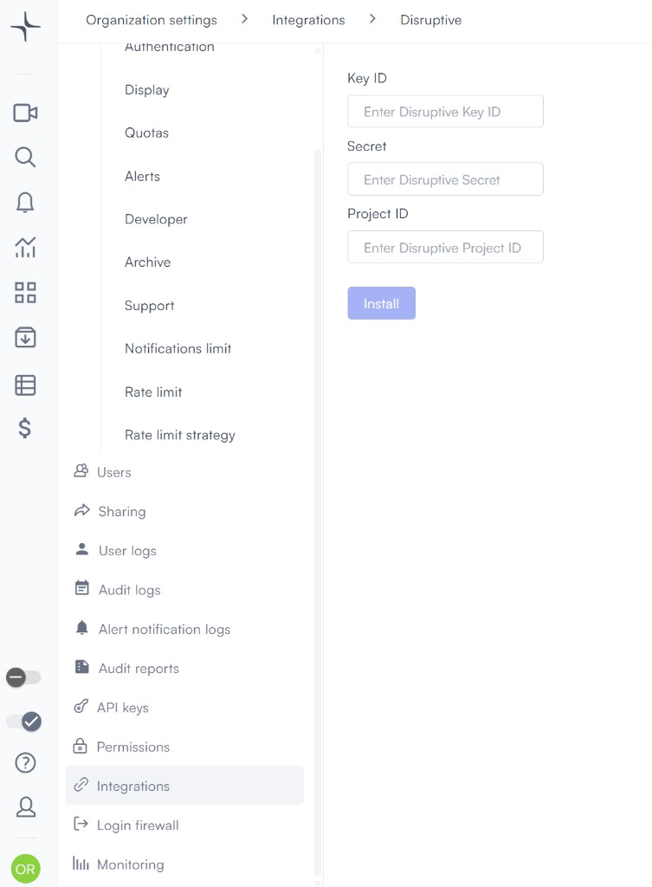
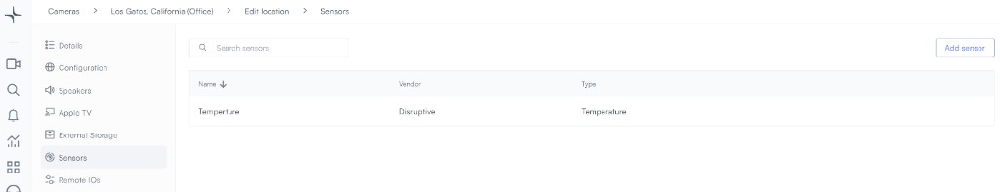

# Disruptive sensors

Connecting a Disruptive sensor to Lumana lets you link sensor events, such as temperature changes, to camera views and automated actions. For example, you can automatically send a snapshot when the temperature crosses a set threshold.

## Connect Disruptive sensors to Lumana

1. Generate a Lumana API key.

   Log in to the Lumana portal, then navigate to **Organization settings** -> **API Keys**. Generate a key and save it. You will use it in the next step.

2. Configure a data connector in the Disruptive portal.

   In **Data Connector**, create a new connector and name it, for example `Lumana Production`. Use the following endpoint in **Endpoint URL**: `https://access.lumana.ai/v1/sensors/disruptive/heartbeat`. Then add the Lumana API key from step 1 in **Custom HTTP Request Header**.

3. Create a Disruptive service account.

   Create a new service account in the Disruptive portal. Generate a key and save the `Key ID` and `Secret`, then go to **Project Settings** and note the `Project ID`.

4. Link Disruptive to Lumana.

   In the Lumana platform, go to **Organization Settings** -> **Integration** -> **Disruptive**. Enter the `Project ID`, `Key ID`, and `Secret`, then select **Install**.

5. Connect sensors to cameras.

   In Lumana, navigate to **Devices** -> **Location** -> **Edit Location**. Add sensors from the available list, then assign each sensor to the relevant camera.

## Next steps

After you connect Disruptive sensors, you can continue with related setup tasks.

- Use [GPIO devices](gpio-devices.md) when you also need wired triggers from the Lumana Core.
- Use [Smart speakers](smart-speakers.md) to add audio responses to Disruptive-driven alerts.
- Read [Camera networking options](../camera-networking-options.md) to plan remote access to camera and sensor admin pages.
