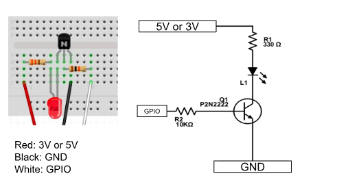
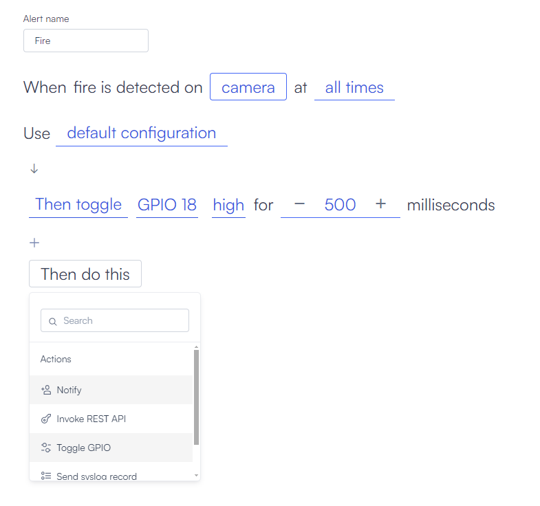

# GPIO devices

GPIO (General-Purpose Input/Output) is an interface on Lumana Core that allows it to interact with external devices.

In Lumana, GPIO pins can be programmed to toggle high or low in response to an alert, enabling third-party devices to read hardwired signals from Lumana or control devices such as LEDs, motors, or relays.

## Pinout

Use the following pinout reference when wiring a device to GPIO.

## Connect a device

In the example below, an LED is connected to the GPIO. Each time the alert is triggered, the LED will blink.

### Parts list

* A 5mm red LED
* A P2N2222 Transistor
* 1 330Ω resistor
* 1 10kΩ resistor

### Wiring notes

The transistor will act as a switch and amplify the current to the led

R1 is the current limiting resistor for the LED

R2 is the Base Resistor which tells how much current to let flow in the circuit.

## Use GPIO in alerts

1. Contact your technical support team to enable GPIO on your core.

2. Once enabled, add the action to toggle the GPIO in the alerts.

3. Select the GPIO to use. The core can support up to 4 GPIOs, toggle high or low, and control how long the signal remains active.

