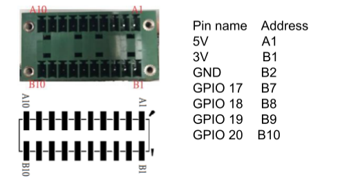
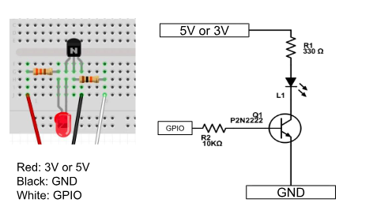
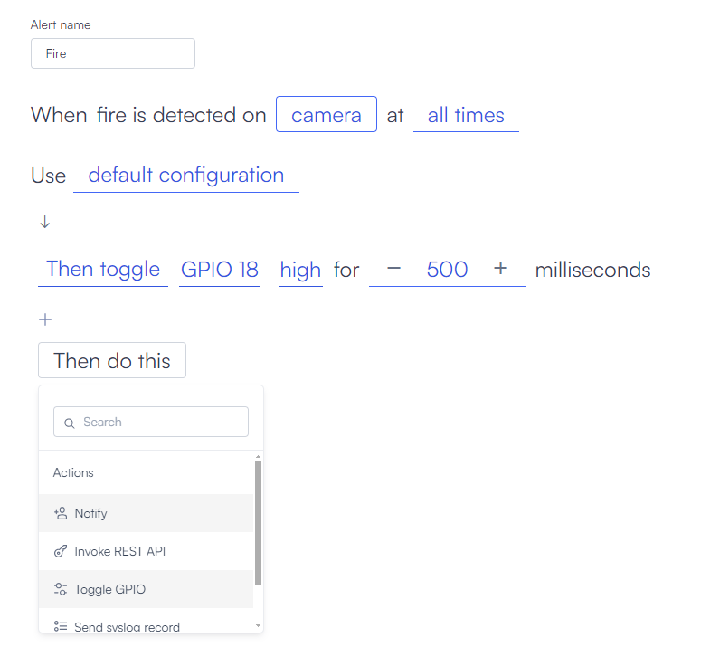

# GPIO devices

GPIO (general-purpose input/output) is an interface on Lumana Core that allows it to interact with external devices.

In Lumana, you can program GPIO pins to toggle high or low in response to an alert. Third-party devices can read those hardwired signals from Lumana, or you can drive devices such as LEDs, motors, or relays.

## Pinout

Use the following pinout reference when wiring a device to GPIO.

## Connect a device

In the example below, you wire an LED to the GPIO. Each time the alert triggers, the LED blinks.

Gather the parts before you wire the circuit—the values below match the reference diagram.

### Parts list

* A 5mm red LED
* A P2N2222 Transistor
* 1 330Ω resistor
* 1 10kΩ resistor

### Wiring notes

- The transistor acts as a switch and amplifies the current to the LED.
- `R1` is the current-limiting resistor for the LED.
- `R2` is the base resistor that controls how much current flows in the circuit.

## Use GPIO in alerts

1. Contact your technical support team to enable GPIO on your Core.

2. After your support team enables GPIO on your Core, open the alert editor and add the **Toggle GPIO** action.

3. Select the GPIO to use. The Core can support up to 4 GPIOs, toggle high or low, and control how long the signal remains active.

## Next steps

After you wire and enable GPIO, you can continue with related setup tasks.

- Use [Disruptive sensors](disruptive-sensors.md) when you also want sensor-driven alerts and snapshots.
- Use [Smart speakers](smart-speakers.md) to add audio responses to GPIO-triggered alerts.
- Read [Lumana Core hardware specifications](../network-and-infrastructure-configuration/lumana-core-hardware-specifications.md) for the full pin and connector layout.
