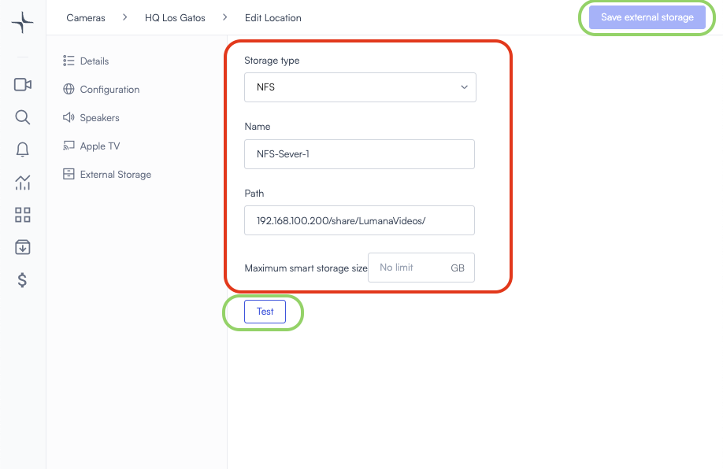
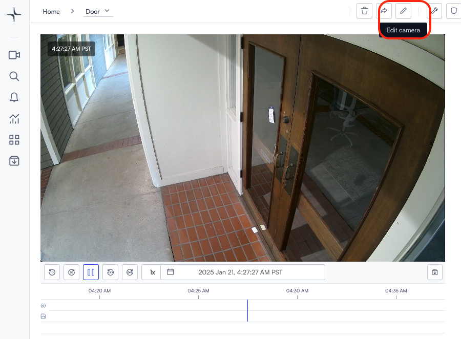

# Network Attached Storage (NAS) devices

This article explains how to connect an external network storage device (NAS) to Lumana to increase recording capacity or for additinal backup.

The user will retain all of Lumana’s capabilities. The NAS will serve both as a backup for the data recorded on the core and as an extension of the core’s storage for longer recording durations. If you choose to record on the NAS for more than 30 days and wish to maintain smart search functionality, an additional NAS license will be required. However, no license is needed for the first 30 days.

Prerequisites: The network storage device must support either NFS or S3-compatible object storage. Additionally, the storage device must be accessible on the network by the Lumana core unit.

## Part 1: Add an external storage server to Lumana

1. Save the IP of your network storage server as well as a path to which Lumana should be saving videos.

For example:

NAS IP: 192.168.100.200

NAS Path: /share/LumanaVideos

2. In the Lumana console, on the Devices page, find the Location where the NAS device is physically connected and click "Edit Location".

3. On the left menu, click "External Storage" then click "Add external storage"

4. Choose your storage type, this could be either NFS or Object Storage. See NFS example below:

Storage type: NFS

Name: name your external storage server

Path: NAS IP and a directory path

Check the connectivity to the NFS server by clicking "Test" and then click "Save external storage"

Congratulations! You added an external storage server to Lumana. The next step is to configure cameras to use this server and save videos to it.

## Part 2: Configure your cameras to store videos in the external storage server

1. On the live-view page of the camera, click "Edit Camera".

2. On the edit camera menu, on the left side, click "Storage" and then scroll down to "Additional Storage".

Toggle the "Additional storage" option to ON and then select "External".

After selecting "External", you will be prompted to choose the server where the camera should record. In our case, select the NFS server added earlier, named "NFS-Server-1"

a. Choose the retention period for videos on the external storage 30 / 60 / 90 / 180 / 365 days

b. enable: Storage (SQ) (for saving ordinary footage)

c. enable: Alerts (HQ) (for saving high-resolution clips of triggered alerts)

d. If you wish to restrict the times in which the core uploads videos to the NAS server, use the scheduler at the bottom "When the upload should occur".

Congratulations! You configured your cameras to back-up videos to an external storage device.

## Storage Capacity calculation:

RAID 5 - minimum 3 disks

RAID 6 - minimum 4 disks

For 5MP camera SQ (700Kbps) 0.3TB is required for 30 days of storage

For 8MP camera SQ (1000Kbps) 0.45TB is required for 30 days of storage

## Exampls of NAS Servers

QNAP TS-1673AU-RP-16G,16 Bay NAS

QNAP TS-464U-RP-8G 4Bay NAS 2.5Gbe

## Exampls of HDDs

MG09ACA18 Toshiba Enterprise 3.5HDD 512E 18TB

MG09ACA16 Toshiba Enterprise 3.5HDD 512E 16TB

MG09ACA14 Toshiba Enterprise 3.5HDD 512E 14TB
