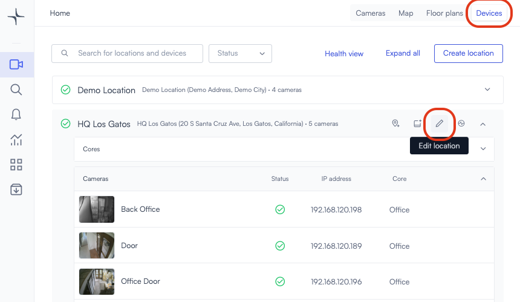
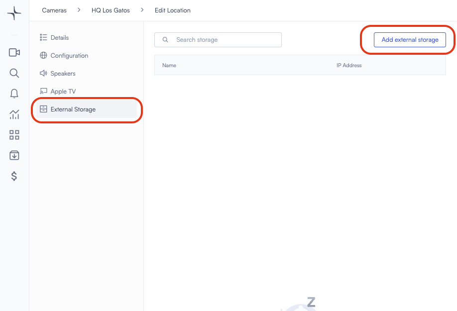
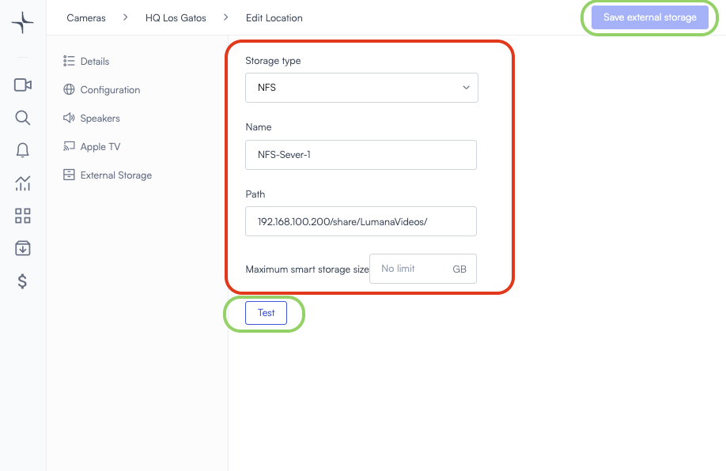
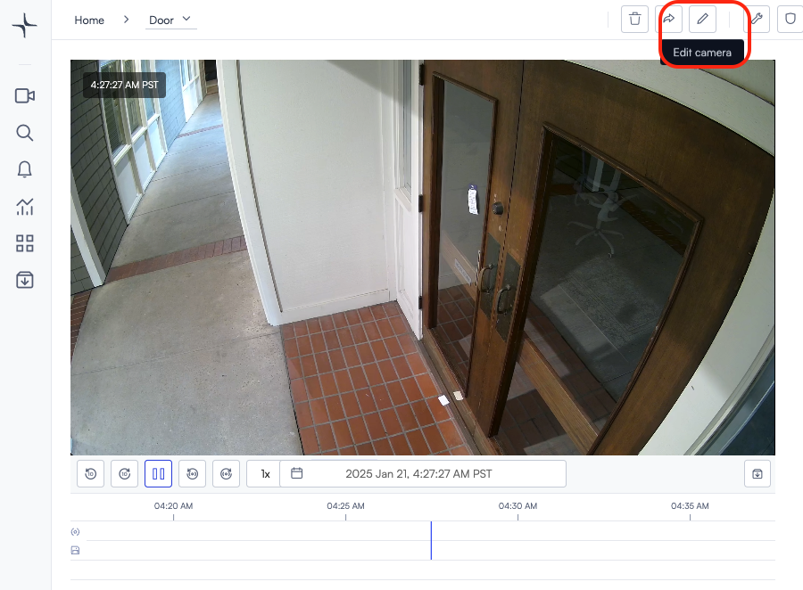
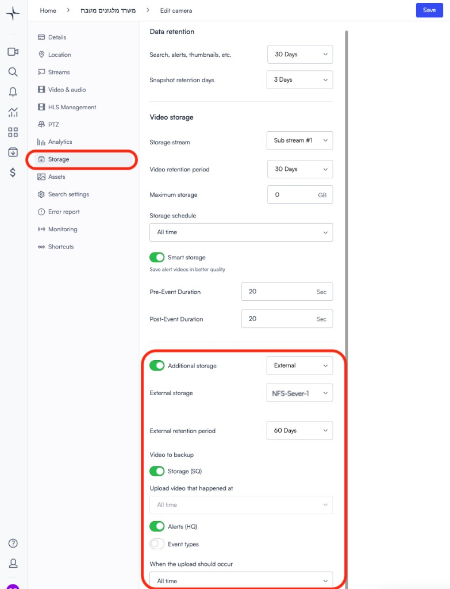

# Network Attached Storage (NAS) devices

Connect a network attached storage (NAS) device to Lumana to expand recording storage and keep a backup of recorded video.

Adding a NAS does not replace Lumana Core. The NAS works alongside the Core as both an additional storage location for longer retention and a backup target for recorded data. Lumana's standard capabilities remain available.


If you record to NAS for more than 30 days and want to keep smart search functionality, an additional NAS license is required. No license is needed for the first 30 days.


## Prerequisites

* The storage device must support NFS or S3-compatible object storage.
* The storage device must be reachable on the network by the Lumana Core unit.

## Add an external storage server

1. Save the IP of your network storage server and the path where Lumana should save videos.

   For example:

   * **NAS IP**: `192.168.100.200`
   * **NAS Path**: `/share/LumanaVideos`

2. In the Lumana console, open the **Devices** page, find the location where the NAS is used, and select **Edit location** (pencil icon) for that site.

3. In the left menu, select **External Storage**, then select **Add external storage**.

4. Choose your storage type. This can be either **NFS** or **Object Storage**. See the NFS example below.

   * **Storage type**: `NFS`
   * **Name**: a label you will recognize when assigning cameras (for example `NFS-Server-1`)
   * **Path**: combine the NAS IP and export path, for example `192.168.100.200/share/LumanaVideos/` (format can vary; match what your NAS expects)

5. Select **Test** to verify connectivity to the server, then select **Save external storage**.

## Configure cameras to use the external storage server

1. Open the camera’s live view (or the camera page). In the top bar, select **Edit camera** (pencil icon).

2. In the edit camera menu, select **Storage**, then scroll to **Additional storage**.

3. Set **Additional storage** to **On**, set the target type to **External**, and choose the NFS (or object storage) entry you created for this location—for example `NFS-Server-1`.

4. Set **External retention** and what to copy to the NAS:

   * Choose the retention period for videos on external storage: 30 / 60 / 90 / 180 / 365 days (or the options your UI shows).
   * Turn on **Storage (SQ)** for standard-quality continuous footage backups.
   * Turn on **Alerts (HQ)** for high-quality clips tied to alerts.
   * Use **Event types** only if you want that subset of footage uploaded.

5. Optional: under **When the upload should occur**, leave **All time** for continuous backup or limit uploads to specific schedules.

6. Select **Save** on the edit camera page to apply your storage settings.

Example — **Storage** with **Additional storage** on **External**, a named NAS target, retention, **Storage (SQ)** / **Alerts (HQ)**, and upload timing:

## Storage capacity calculation

* `RAID 5` - minimum 3 disks
* `RAID 6` - minimum 4 disks
* For `5MP` camera SQ (`700Kbps`), `0.3TB` is required for 30 days of storage
* For `8MP` camera SQ (`1000Kbps`), `0.45TB` is required for 30 days of storage

## Examples of NAS servers

* QNAP TS-1673AU-RP-16G,16 Bay NAS
* QNAP TS-464U-RP-8G 4Bay NAS 2.5Gbe

## Examples of HDDs

* MG09ACA18 Toshiba Enterprise 3.5HDD 512E 18TB
* MG09ACA16 Toshiba Enterprise 3.5HDD 512E 16TB
* MG09ACA14 Toshiba Enterprise 3.5HDD 512E 14TB
