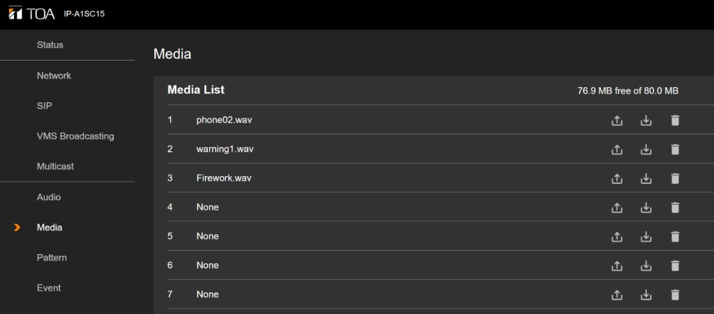
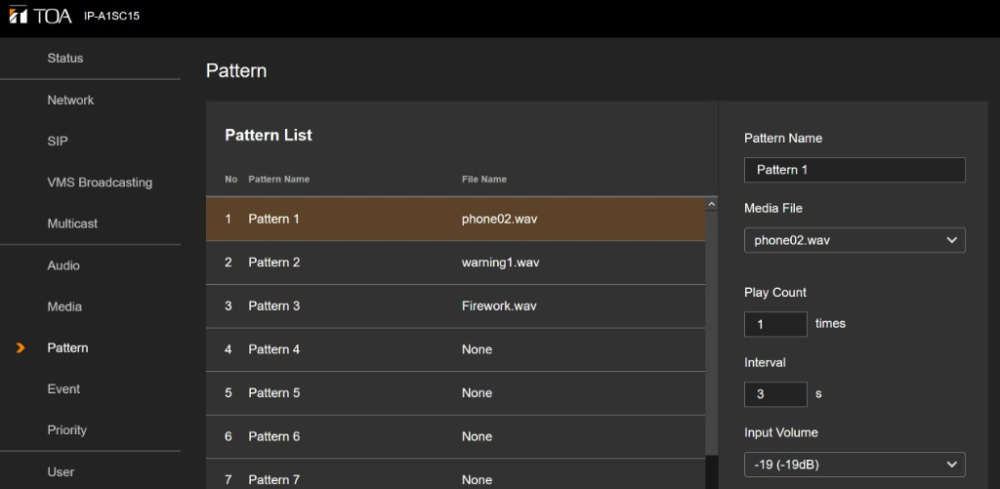
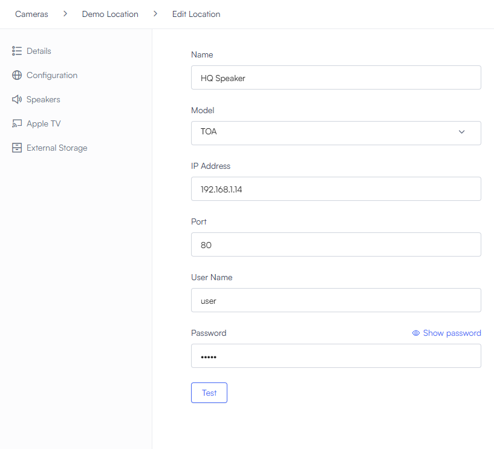
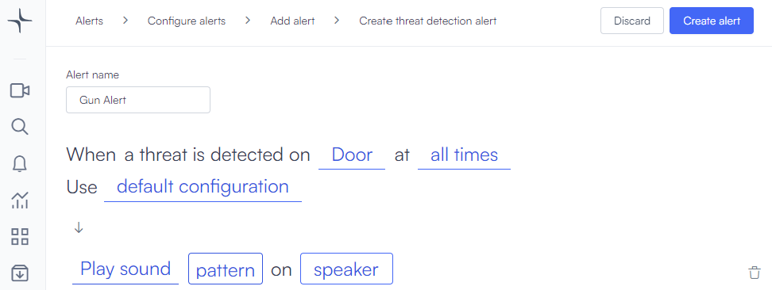

# Smart speakers

You can tie IP speakers to **VMS+** so alerts trigger audible messages: pre-recorded clips, warnings, or other patterns you define on the device.

Lumana can also use Session Initiation Protocol (SIP) with supported network speakers. That usually involves firewall or router rules on your side plus SIP account settings on each speaker. For Check Point SIP configuration and Uniview or TOA setup examples, see [Configure SIP for smart speakers](sip-for-smart-speakers.md).

## Key use cases

Typical reasons teams add speakers include:

- **Pre-recorded alarms:** When the system flags a threat, play a stored clip to alert people nearby.
- **Voice-style alerts:** Call out safety issues, such as someone too close to machinery or an unsafe lane.
- **Deterrence:** Make it clear the site is monitored so fewer people take risks.
- **Emergency signaling:** Trigger outbound or on-site signals when the system detects events such as fire, smoke, or a firearm.

## Supported devices

Lumana can work with IP speakers you can trigger over the network with a **REST** API or direct **TCP**/**UDP** messaging. You add the speaker in Lumana, load audio and patterns on the device, then attach alert actions to play those patterns.

Lumana has tested integration with the **TOA IP-A1SC15** and **SIP-S21M UNV** speakers. The steps below focus on the TOA IP-A1SC15.

## Configure the TOA IP-A1SC15

The TOA IP-A1SC15 has many settings in its own web UI. This guide covers what you need so the speaker is reachable from Lumana. For full TOA documentation, see the TOA support site for your model.

### Connect and address the speaker

Power and network access must be in place before you configure audio or add the device to Lumana.

1. Connect the IP-A1SC15 to a **PoE** switch so it powers up on the network.
2. Log in to the speaker at its default IP address. Assign a **static IP** that fits your LAN.
3. If you need the factory default IP or password, then check the TOA manual for this model.

### Upload media and define a pattern

Patterns reference audio files stored on the speaker. Upload clips first, then create a pattern that points at the right file and level.

1. In the speaker web UI, open **Media**.
2. Upload the audio files you want to use (for example **.wav** files in the media list).

3. Open **Pattern**. Create at least one pattern. Each pattern gets a **name** and **number** so you can pick it from Lumana later. Set the **media file**, **volume**, and any other options the form offers.

### Add the speaker in VMS+

You register the speaker under a location so Lumana Core knows how to reach it.

1. In the **VMS+** navigation bar, select **Add speaker** (or the add control your site uses).
2. Enter the speaker **name**, **model** (for example **TOA**), **IP address**, **port**, **username**, and **password**.
3. Select **Test** to confirm Core can reach the speaker.
4. Select **Create** (or **Save**) to finish. If the add fails, recheck the IP, port, and credentials on the LAN.

### Play a pattern from an alert

Alert actions tell VMS+ which pattern number to play and which speaker to use.

1. Open the flow to **create** or **edit** an alert.
2. Add an action that plays sound on a **pattern** and **speaker** (for example **Play sound** with **pattern** and **speaker** fields, as your UI shows).

Below is an example: a threat-detection alert on **Door** that plays a pattern on a speaker when a gun is detected.

## Next steps

- Use [Configure alerts](../../alerts-and-ai-detection/configure-alerts.md) to build or refine alert rules and actions.
- For camera-side networking context, see [Camera networking options](../camera-networking-options.md).
