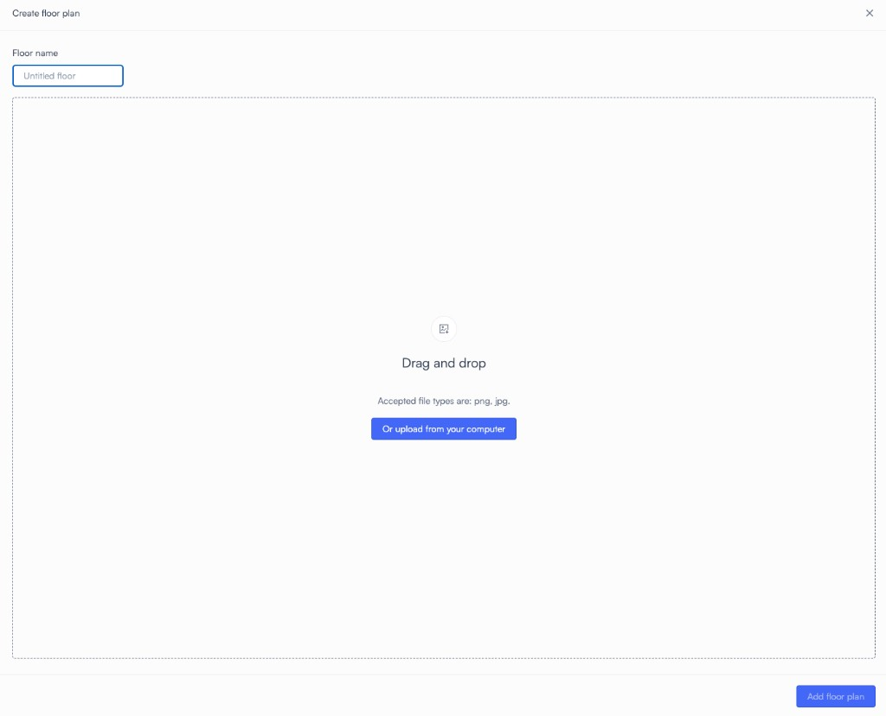
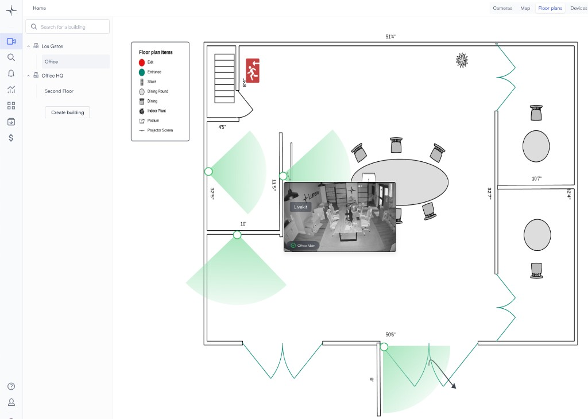

# Set up a camera floor plan

Lumana’s Floor Plan feature provides a real-time, interactive view of camera locations. Upload facility layouts, place cameras accurately, and preview live feeds instantly—simplifying security management.

Key Benefits:

✔ Instant Awareness – See coverage areas at a glance.

✔ Faster Response – Quickly access live feeds.

✔ Effortless Navigation – Manage multiple cameras easily.

✔ Scalable & Versatile – Ideal for large facilities and multi-site operations.

> **Common use cases:** Offices, malls, hospitals, warehouses, and schools.

### How to Use the Camera Floor Plan Feature

1. Go to Floor Plans menu

2. Create building

3. Upload a floor plan

4. Click on the Camera icon to start adding and positioning your cameras on the floor plan

5. Save when finished

Now you are able to view the floor plan, when you hover over a camera you will get a live view for it.

