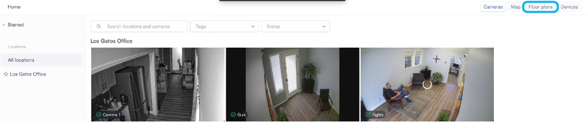
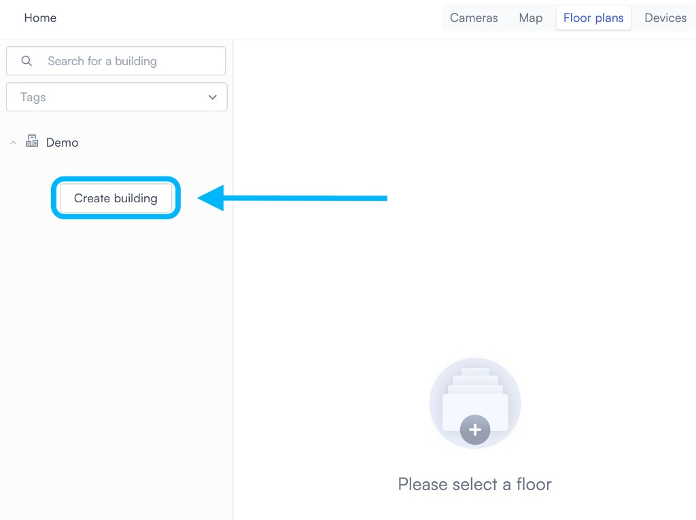
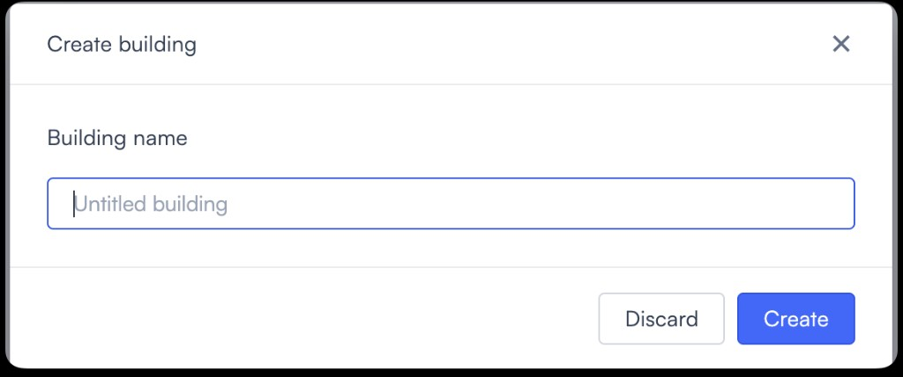
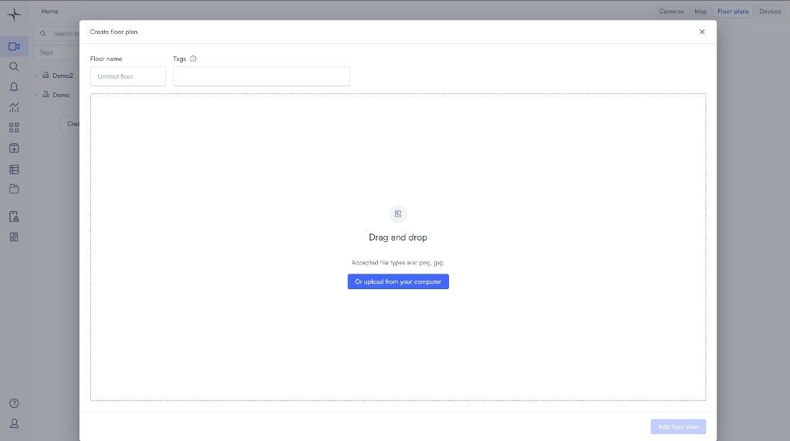
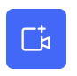
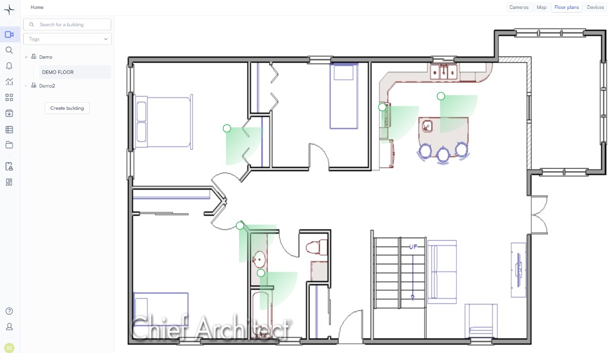
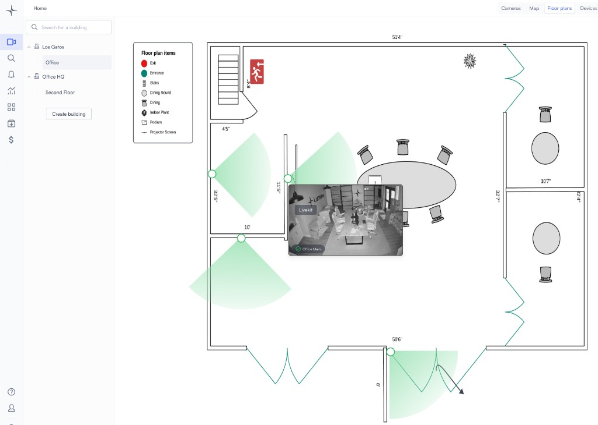

# Set up a camera floor plan

This guide walks you through adding a *floor plan*, an interactive map of your location that labels where each camera is located. From this map you can select a camera to watch the live video feed.

Floor plans tie each camera to a location on your site, which makes coverage easier to understand than scrolling a list of devices.

## Key benefits

- **Instant awareness**: Allows you to see coverage areas at a glance.
- **Faster response**: Opens live feeds from cameras on the floor plan so you do not have to search the full device list first.
- **Effortless navigation**: Lets you work with many cameras on one layout and move between them by location.
- **Scalable and versatile**: Supports multiple floors and buildings when your organization spans more than one site or structure.


**Common use cases**: Offices, malls, hospitals, warehouses, and schools.


## Use the camera floor plan feature

1. Go to the **Floor plans** menu at the top left corner of the screen.

2. Select **Create building**.

3. Enter a **Building name** and select **Create** to create the building.

4. In the **Create floor plan** dialog, enter a **Floor name**.
5. Optionally add **Tags** in the field on the right.
6. Add your image using drag and drop or **Or upload from your computer**. Use a PNG or JPG file.

7. Select the  icon in the top right corner to start adding and positioning your cameras on the floor plan.

8. Select **Add floor plan** to save the floor plan.

The floor plan is ready to use. Hover over any camera marker to see its live view.

## Next steps

- Use [Create camera shortcuts](create-camera-shortcuts.md) to jump between related camera views from the same scene.
- Open [Live view](../live-video-monitoring-and-operations/live-view.md) to monitor cameras from your floor plan in real time.
- Read [Camera networking options](camera-networking-options.md) when you need to add or move cameras before placing them on the plan.
