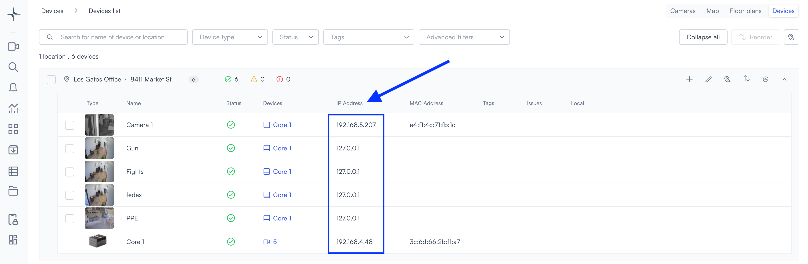

# Set up a static IP address

Assign a static IP address so your camera stays reachable and does not change after reboots or network interruptions.

> **Note:** Do not assign a static IP that falls inside the **Dynamic Host Configuration Protocol (DHCP)** pool unless you use a reservation for that address. Otherwise you can get IP conflicts.

**DHCP** expands to **Dynamic Host Configuration Protocol**. That service assigns each device an IP address automatically, usually from a range your router, firewall, or Lumana Core manages. Devices can then communicate without manual IP entry on each device.

### How do I know if I have a DHCP server?

**DHCP** is the service that hands out IP addresses automatically. Most sites have one.

You likely have DHCP if a **router, office firewall, or Lumana Core** on the network assigns addresses and your camera already shows an IP in Lumana without you setting a static address on the device. Check your router or Core admin UI for **DHCP** or **LAN** settings if you are unsure.

You likely **do not** have DHCP if every device uses manually entered IPs and nothing on the subnet offers leases.

## Choose your setup scenario

- **Scenario 1**: DHCP server present; use a **reservation** so the camera always gets the same IP.
- **Scenario 2**: DHCP server present; **manual static on the camera** outside the lease pool (camera UI steps are in **Scenario 3**).
- **Scenario 3**: **No** DHCP server; configure the camera’s IP in its local web UI.

| Scenario | When to use it |
| --- | --- |
| **Scenario 1 — DHCP reservation** | You have a DHCP server. You leave the camera on **DHCP** and map its **MAC address** to a fixed IP on the DHCP server (router or Core). Prefer this when you want central control on the server and fewer changes on the camera. |
| **Scenario 2 — Static IP outside the pool** | You have a DHCP server, but you set a **static IP on the camera** in a range **outside** the DHCP lease pool instead of using a reservation. Prefer this when policy or operations favor camera-side statics, or you do not want to maintain reservations. |
| **Scenario 3 — No DHCP server** | Nothing on the network hands out leases. You open the camera’s local web interface and set **Static IP**, **subnet mask**, and **gateway** yourself. You may need a temporary static IP on your laptop to reach the camera’s factory or default address first. |

### Scenario 1: Your network includes a DHCP server and you wish to assign a permanent IP address

1. Connect the camera to your network
2. Find the camera's IP address and MAC address
   - Open the Lumana app
   - Go to the **Devices** list
   - Add the camera to your organization
3. Find the camera's IP address and MAC address:
   - In Lumana, open the camera from the **Devices** list.
   - Use the **IP address** shown for the camera.

 

   - Open **Camera** -> **Edit camera** -> **Details** to copy the **MAC address**.

 

4. Configure DHCP reservation on your router using the MAC address.
The camera keeps the same IP address after reboots or power interruptions when the server always offers that lease to this MAC address.
Refer to your router documentation for instructions.

Here's an example of [static mapping configuration](https://www.cisco.com/c/en/us/td/docs/ios/12_2sb/12_2sba/feature/guide/sbhcpsm.html) for Cisco routers.

### Scenario 2: Assign a static IP outside the DHCP pool

Use this method if you want to manually assign a static IP on the camera without a DHCP reservation, and the address sits **outside** the range your DHCP server may assign.

**Before you begin**

- Identify your network’s DHCP range
- Choose an IP address outside that range

> **Note:** Assigning an IP address inside the DHCP pool without a reservation can cause duplicate IP conflicts.

On the camera, follow the same workflow as in [Scenario 3: Your network lacks a DHCP server](#scenario-3-your-network-lacks-a-dhcp-server). If you can already open the camera’s local web UI, continue from **Setup → Network**, switch to **Static IP**, enter **IP address**, **subnet mask**, and **gateway**, then save. If you cannot reach the camera yet, start at the beginning of that scenario and stop when the static values are saved.

### Scenario 3: Your network lacks a DHCP server

If your network does not have a DHCP server, you will need to connect to the camera via the local page and configure the IP address directly on the camera.

**Default camera settings (example)**

- Default IP address for the camera is: `192.168.1.13`
- Default Subnet Mask: `255.255.255.0`
- Default user: `admin`
- Default password: `123456`

1. If your device is not receiving an IP address automatically, assign a temporary static IP address on the same subnet as the camera (for example, `192.168.1.10` with subnet mask `255.255.255.0`).

> **Note:** If needed, refer to your computer or operating system documentation for instructions on setting a temporary static IP address.

2. Open a web browser on a device connected to the same network.

3. Enter the camera’s IP address and log in.

    

4. Change the default password when prompted.

5. Go to **Setup → Network**.
    

6. Change the network mode from DHCP to Static IP.

7. Enter your **IP address**, **subnet mask**, and **gateway**.

8. Save your changes.

