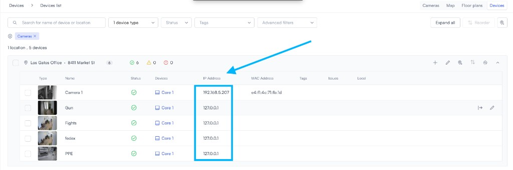
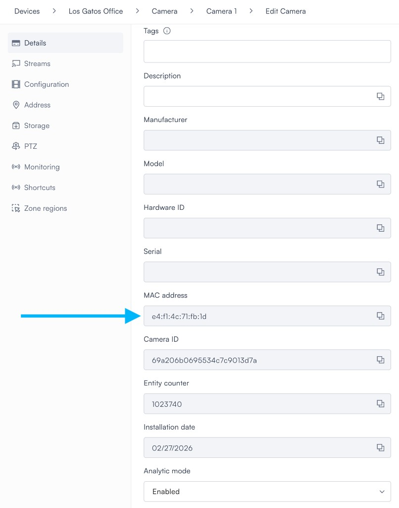
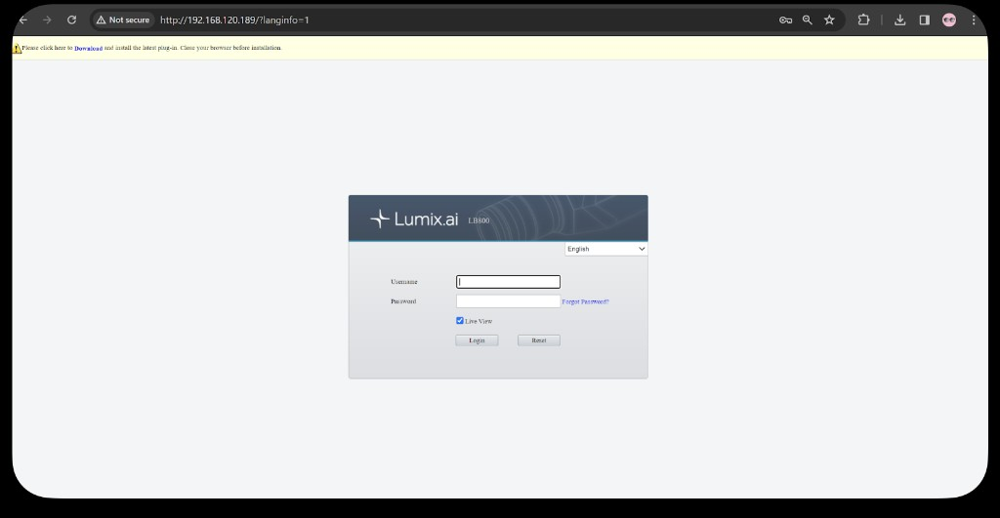
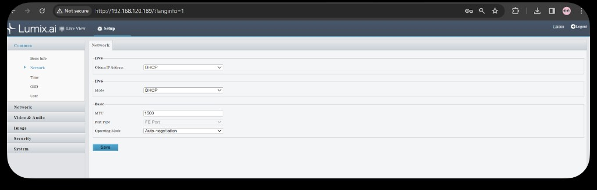
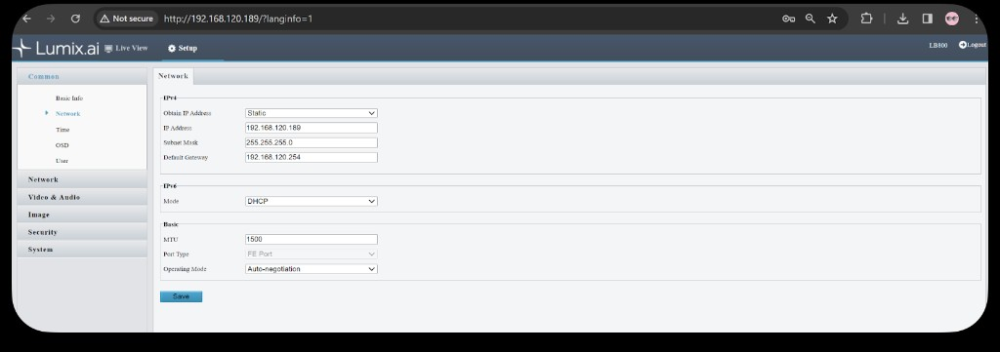

# Set up a static IP address

Assign a static IP address so your camera keeps the same IP after reboots or when DHCP would otherwise supply a new address.

Lumana and other systems can keep using that one address for the camera.

## Choose your setup scenario

Follow the scenario below that matches your network.

- **Scenario 1**: Your network includes a DHCP server and you want to assign a permanent IP address — You keep the camera on DHCP and create a reservation on the router or Core so this camera always receives the same address.
- **Scenario 2**: Your network includes a DHCP server and you want a permanent static IP on the camera outside the DHCP pool — You set a fixed **IP address**, **subnet mask**, and **gateway** on the camera, outside the DHCP pool.
- **Scenario 3**: Your network lacks a DHCP server — No device hands out DHCP leases. You configure the camera’s IP in its local web interface (you may need a temporary static IP on your PC first).

If you are not sure whether your network uses DHCP, then use the following subsection to pick Scenario 1, 2, or 3.

### How do I know if I have a DHCP server?

_DHCP_ stands for Dynamic Host Configuration Protocol. That service assigns each device an IP address automatically, usually from a range your router, firewall, or Lumana Core manages. Devices can then communicate without manual IP entry on each device.

You likely have DHCP if a router, office firewall, or Lumana Core on the network assigns addresses and your camera already shows an IP in Lumana without you setting a static address on the device. Check your router or Core admin UI for DHCP or LAN settings if you are unsure.

You likely do not have DHCP if every device uses manually entered IPs and nothing on the subnet offers leases. Use Scenario 3 in that case.

### Scenario 1: Your network includes a DHCP server and you want to assign a permanent IP address

1. Connect the camera to your network.
2. In Lumana, collect the **IP address** and **MAC address** you will map on the DHCP server. If the camera is not listed under **Devices** yet, [add the camera to your organization](../getting-started/connect-a-camera.md#connect-a-camera) first.
   - From **Devices**, open the camera and note the **IP address**.

   

   - Open **Edit camera** → **Details** and copy the **MAC address**.

   


Do not forget to create a DHCP reservation for the camera’s address on the router or Core. Otherwise, the server can still offer that address to another device, and you can get an IP conflict.


3. Configure DHCP reservation on your router using the MAC address.
This way the camera keeps the same IP address after reboots or power interruptions when the server always offers that lease to this MAC address.
Refer to your router documentation for instructions.

Here is an example of [static mapping configuration](https://www.cisco.com/c/en/us/td/docs/ios/12_2sb/12_2sba/feature/guide/sbhcpsm.html) for Cisco routers.

### Scenario 2: Your network includes a DHCP server and you want a permanent static IP on the camera outside the DHCP pool

Assign a static IP on the camera itself and skip a DHCP reservation on the server. DHCP can keep running on the network for other devices.

#### Before you begin

Confirm which addresses on your network sit outside the DHCP pool before you choose the camera’s IP. Some LAN documentation describes that block as the static IP range for your LAN.

- Identify your network’s DHCP pool range.
- Choose an IP address outside that range.
- Do not use an in-pool address unless you also create a DHCP reservation for it. Otherwise, DHCP may assign the same address to another device and cause duplicate IP conflicts.

When you have an address picked out, complete [Scenario 3: Your network lacks a DHCP server](#scenario-3-your-network-lacks-a-dhcp-server). Use Scenario 3’s first step only when the camera did not get an address automatically.

### Scenario 3: Your network lacks a DHCP server

If your network does not have a DHCP server, connect to the camera’s local page and configure the IP address on the camera.

#### Default camera settings (example)

- Default IP address for the camera is: `192.168.1.13`
- Default Subnet Mask: `255.255.255.0`
- Default user: `admin`
- Default password: `123456`

1. Assign a temporary static IP on your computer, on the same subnet as the camera (for example `192.168.1.10`, subnet mask `255.255.255.0`), if the camera did not receive an address automatically.


If needed, refer to your computer or operating system documentation for instructions on setting a temporary static IP address.


2. Open a web browser on a computer on the same network as the camera. Enter the camera IP address in the address bar to open the configuration page.

3. Enter the camera **username** and **password** on the login page, then sign in.

    

4. Change the default password when prompted, then record the new credentials where your team expects them.

5. Go to **Setup → Network**.
    

6. Change the **network mode** from **DHCP** to **Static IP**.

7. Enter your **IP address**, **subnet mask**, and **gateway**.

8. Select **Save** to apply your changes.

