# Manage users and permissions

This guide shows you how to control who can access your cameras, Cores, and locations in Lumana. You manage access through groups. Each group defines a set of permissions, and every user you add to that group gets those permissions automatically.

To open Permissions, select **Organization settings** in the left navigation, then select **Permissions**.


You need admin access to manage permissions.


## Create a permission group

Creating a group is the first step in setting up access control. You name the group and then assign users and access rights to it.

1. In the left navigation, select **Organization settings**, then select **Permissions**. The Permissions page opens, showing all existing groups.

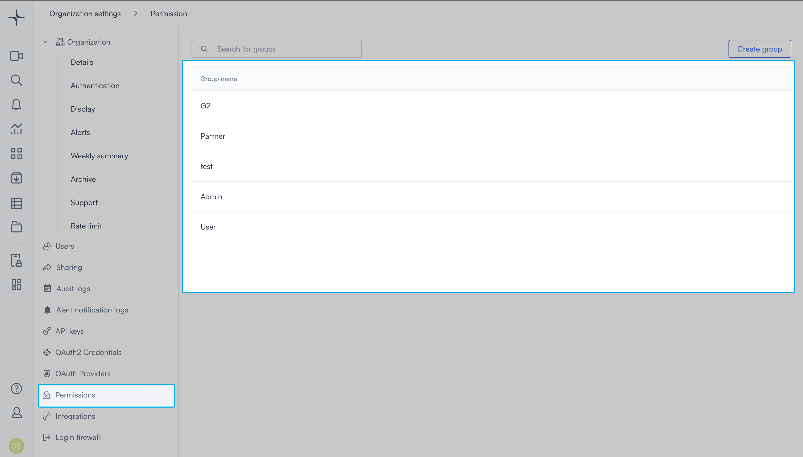

2. Select **Create group** in the top right. A text field appears inline in the group list.

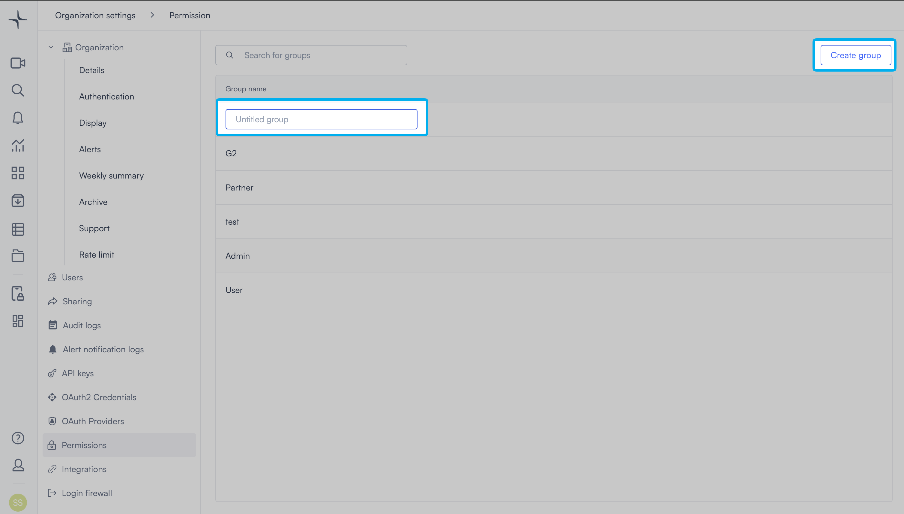

3. Enter a name for the group, then select the save icon. Use a name that reflects the role, for example "Security operators" or "Site managers."

The group opens to the group page with three tabs: **Users**, **Organizations**, and **Access rights**.

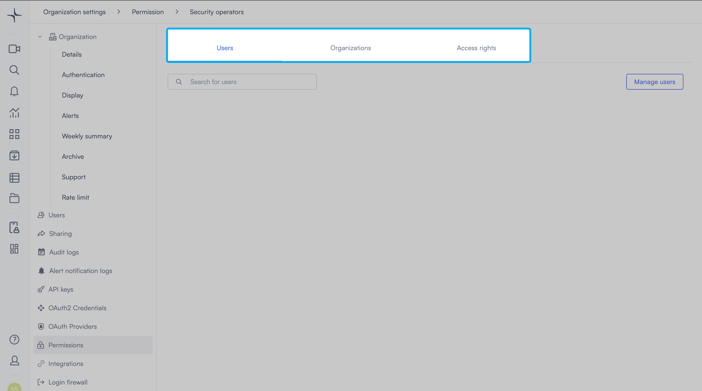

## Add users to a group

Users must have already accepted their invitation to your organisation before you can add them to a group. If you need to invite a new user first, then see [Invite a new user to the group](#invite-a-new-user-to-the-group).

1. On the Permissions page, select the group. The group page opens.
2. Select **Manage users** in the top right. The Manage users panel opens.

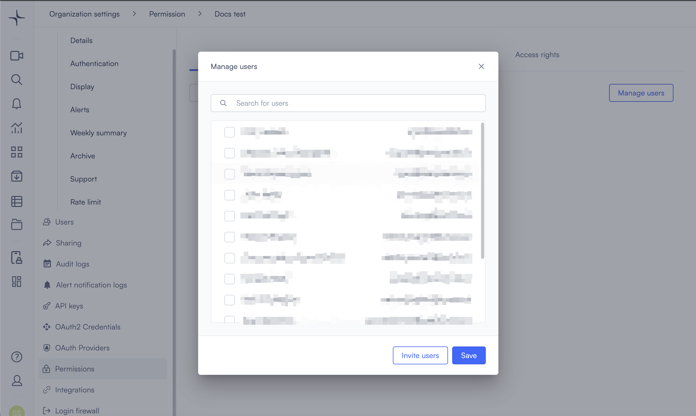

3. Select the checkbox next to each user you want to add. To find a specific user, use the **Search for users** field.
4. Select **Save**. A confirmation message appears: "Users have been updated."

The **Users** tab updates to show all users in the group, their email addresses, and the date and time of their last login.

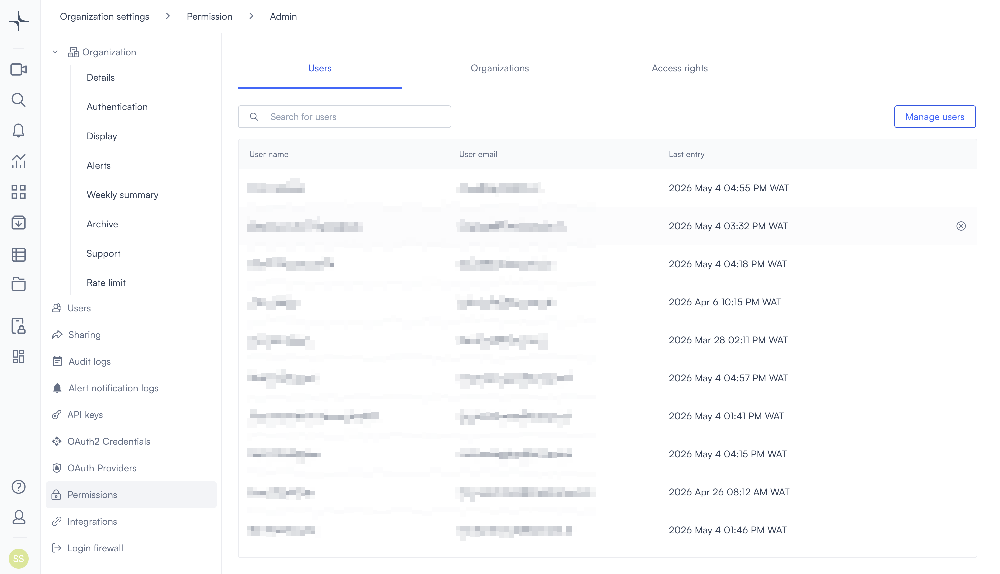

## Invite a new user to the group

If a user isn't in the list, then you can invite them directly from the Manage users panel. They'll receive an email prompting them to accept the invitation. Until they accept, they appear in the pending invitations list.

1. On the Permissions page, select the group. The group page opens.
2. Select **Manage users** in the top right. The Manage users panel opens.
3. Select **Invite users**. The Invite users panel opens.

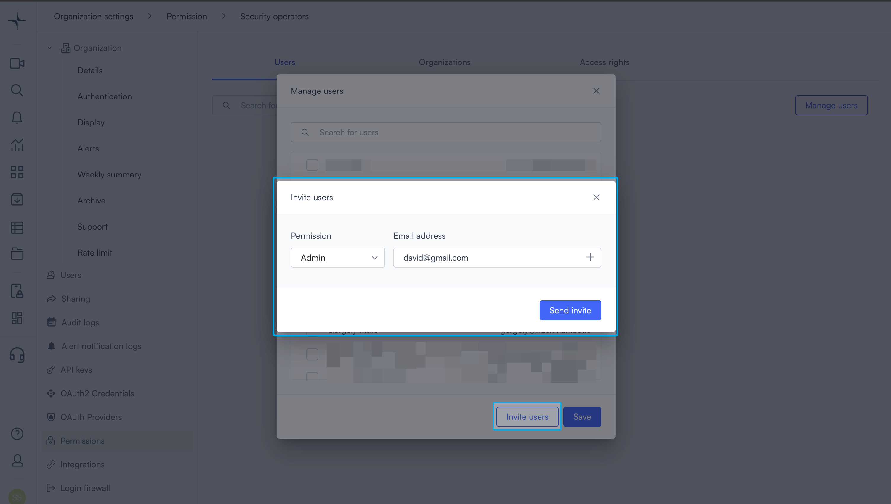

4. Select a permission level from the **Permission** dropdown.
5. Enter the user's email address in the **Email address** field. To invite more people, select **+** to add another row.
6. Select **Send invite**. Lumana sends each person an invitation email.

## Remove a user from a group

Removing a user from a group takes away the access rights that group provides. Use this when a user's role changes or they no longer need access to specific resources.

1. On the Permissions page, select the group. The group page opens.
2. On the **Users** tab, select the **X** next to the user you want to remove. A confirmation prompt appears.

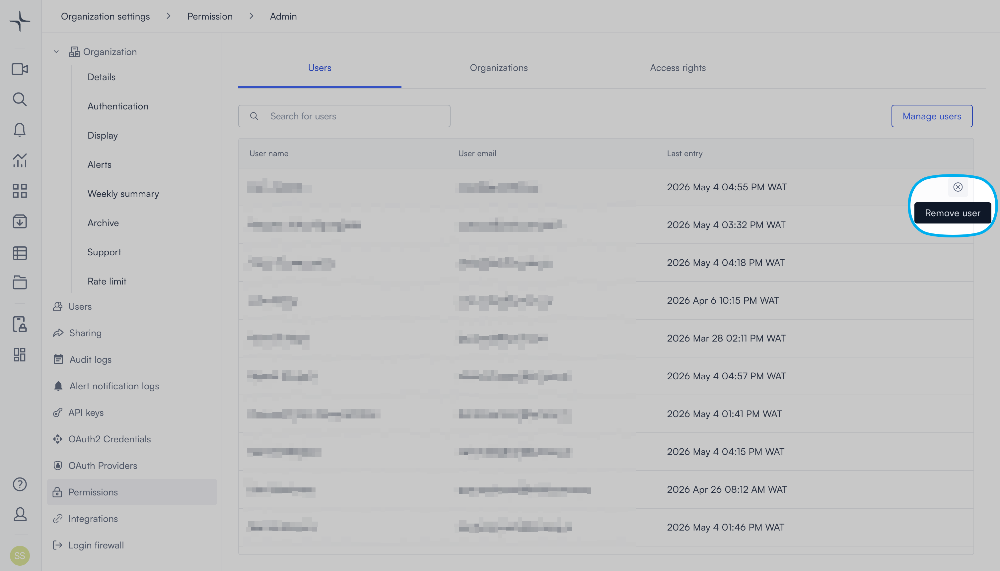

3. Select **OK**. Lumana removes the user from the group.


If the user belongs to other groups, then those access rights remain unchanged.


## Add an organization to a group

The **Organizations** tab lets you invite a partner organization to your group using an invite code. Use this when you can't list or manage the partner's individual users. For example, if a partner has multiple customers and all of them need access, then invite the organization directly. This is faster than inviting each person by email.

Invite codes come from Lumana Support. Contact Support to get the code for the organization you want to add before starting.

1. On the **Organizations** tab, select **Manage organizations**. The Manage organizations panel opens.

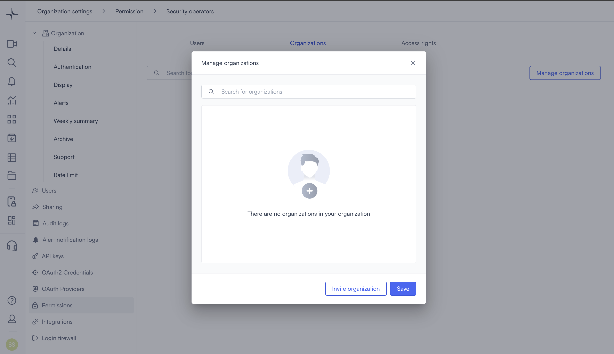

2. Select **Invite organization**. The Invite support panel opens.

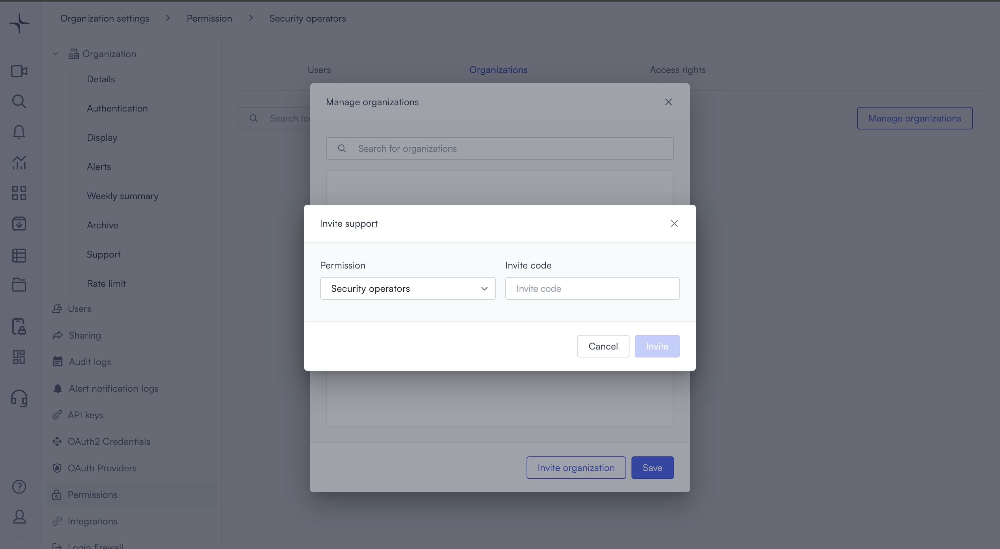

3. Select a permission group from the **Permission** dropdown.
4. Enter the invite code in the **Invite code** field.
5. Select **Invite**.

## Invite a support organization

Inviting a support organization gives its members access to your system. The primary use case is inviting the Lumana Support team so they can help troubleshoot issues in your environment.

Contact Lumana Support to get an invite code before starting.

1. Select the organization icon in the bottom left. Select **Settings**. Organization settings opens.
2. Select **Users** in the left navigation.
3. Select **Invite Support** in the top right. A panel opens.
4. Select a permission level from the **Permission** dropdown.
5. Enter the invite code in the **Invite code** field.
6. Select **Invite**.

## Set access rights

Access rights define what users in the group can see and do. You set them on the **Access rights** tab.

The left panel shows your organisation's full hierarchy: organisation, then locations, then Cores, then cameras. Selecting any item in the hierarchy updates the right panel to show that item's permissions.

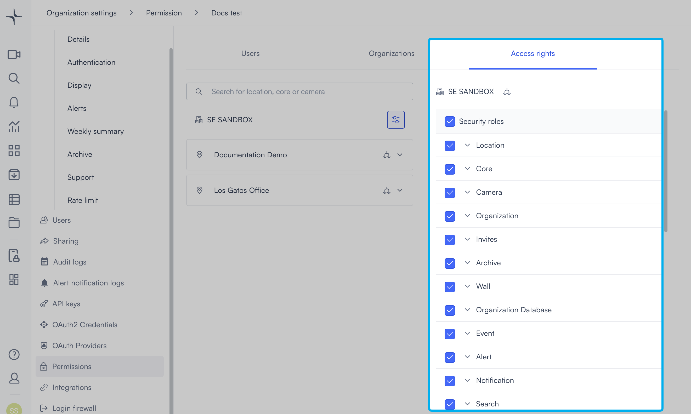

### Set permissions at the organisation level

Permissions you set at the organisation level apply to all locations, Cores, and cameras by default. Start here to establish a baseline for the group before overriding individual items.

1. On the Permissions page, select the group. The group page opens.
2. Select **Access rights**.
3. In the left panel, select the organisation name. The full permission list appears in the right panel.
4. Select or clear the checkboxes to set the permissions for this group. Changes save automatically.

For a description of each permission, see [Available permissions](available-permissions.md).

### Set permissions for a specific location, Core, or camera

You can override the organisation-level permissions for any individual location, Core, or camera. Use this when a group needs different access to specific parts of your site.

1. In the left panel of the **Access rights** tab, expand the hierarchy to find the item you want to configure.
2. Select the item. The right panel updates to show that item's permissions.
3. Select the sliders icon next to the item. This switches it from inheriting permissions to using a custom permission set.

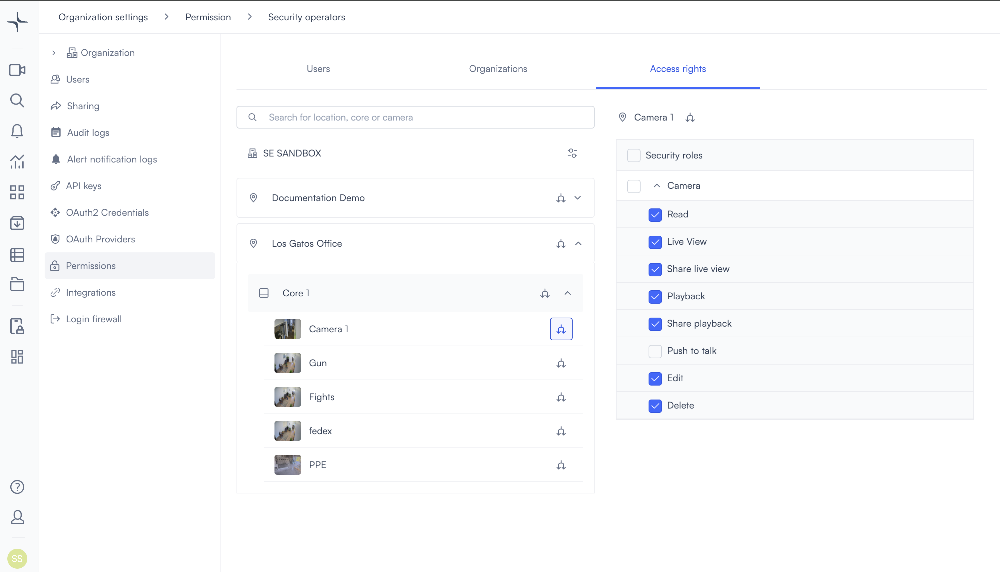

4. Select or clear the checkboxes to set custom permissions for that item. Changes save automatically.

To return an item to inheriting permissions from its parent, select the circular arrows icon next to it.


The circular arrows icon means the item inherits its permissions from its parent level. The sliders icon means the item uses its own custom permission set, independent of the parent.


### Sublocation visibility

A location's visibility to users depends on whether it has cameras attached.

- **No camera attached**: All users can see the location, even if it's empty.
- **Camera attached**: Only users with access to at least one camera in that location can see the location.

## Rename a group

You can rename a group at any time. The change takes effect immediately and doesn't affect any users or access rights in the group.

1. On the Permissions page, select the pencil icon next to the group you want to rename. The group name becomes an editable text field.
2. Enter the new name, then select the save icon. The group list updates with the new name.

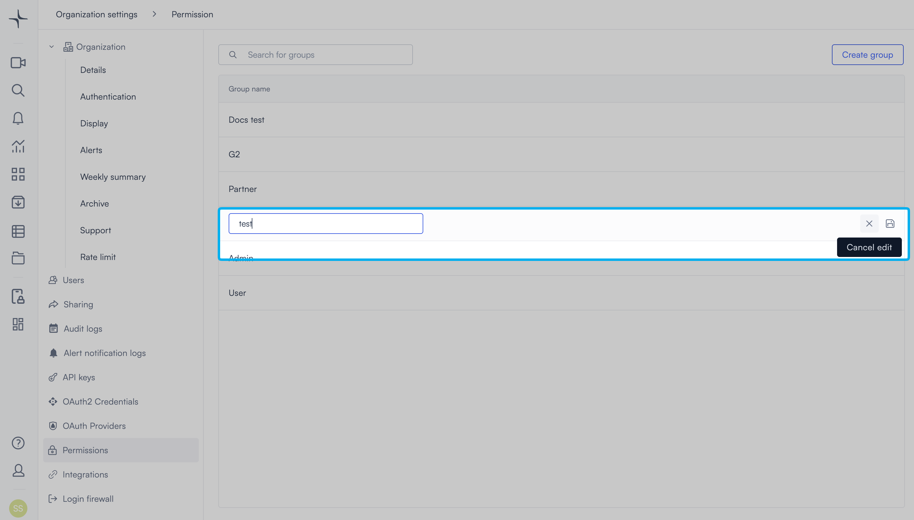

## Delete a group

Deleting a group removes the group and all its access rights permanently. Users in the group don't lose their account, but they lose the access that group provided.


You cannot undo this action. If the group has users assigned, then those users lose all access rights the group provided.


1. On the Permissions page, select the trash icon next to the group you want to delete. A confirmation prompt appears: "Are you sure you want to remove [group name]?"
2. Select **Yes I'm sure**. Lumana removes the group from the list.

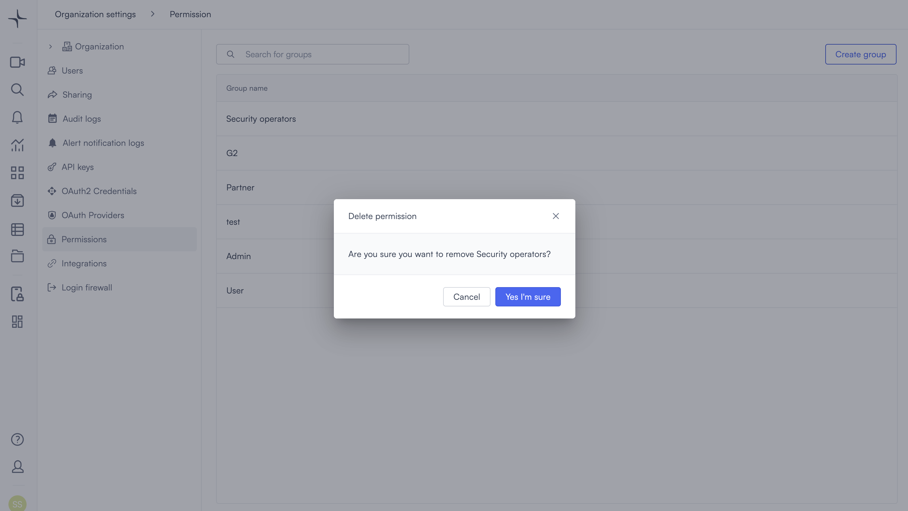

