# System logs

Lumana provides two types of logs for administrators: audit logs and alert notification logs. Audit logs track actions taken within your organization. Alert notification logs track whether alert notifications were delivered to users.


You need admin access to view system logs.


## Open Organization settings

Both log types are in Organization settings. To open it, select the **organization icon** in the bottom left of the navigation, then select **Settings**.

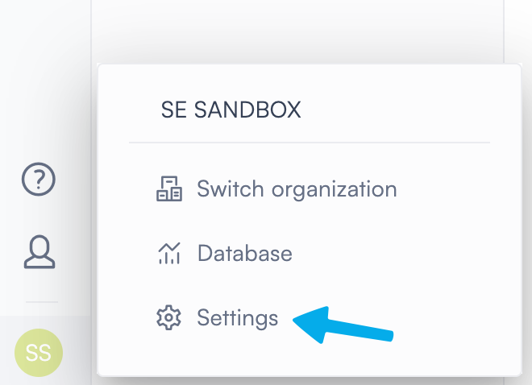

Organization settings opens with a sidebar listing all sections.

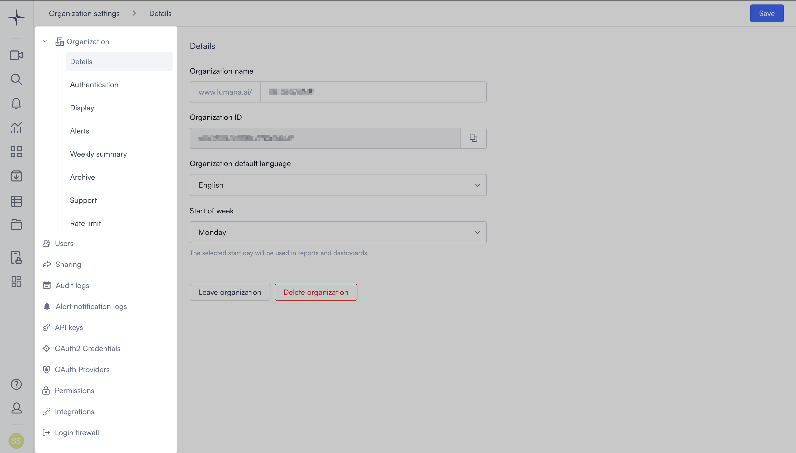

## Audit logs

Audit logs record every action taken by users in the Lumana portal. Use audit logs to track administrative operations, monitor user activity, and support compliance reviews.

Select **Audit logs** in the Organization settings sidebar. 

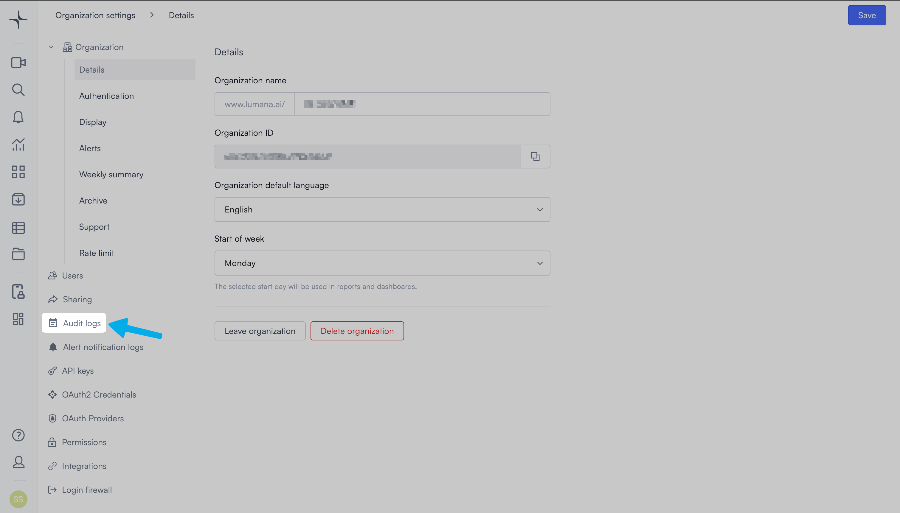

The Audit logs page opens.

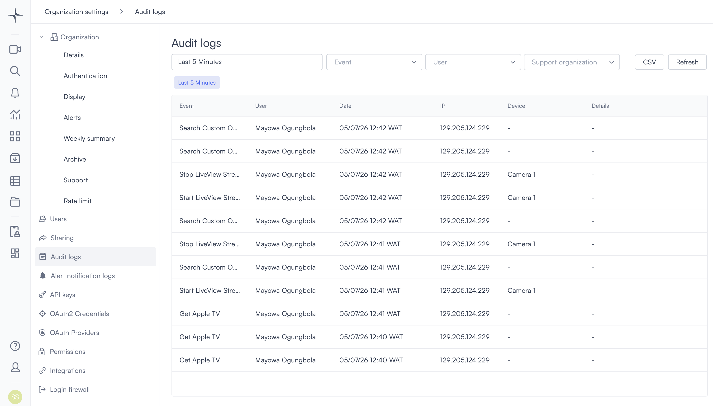

### Filter audit logs

Use the filters at the top of the page to narrow the results:

* **Timeframe**: Select a time range to limit results. The default is the last 5 minutes. Selecting the timeframe field opens a picker with two modes:
  * **Relative**: Select a preset value in minutes, hours, days, or weeks. You can also enter a custom value using the number field and unit dropdown.
  * **Calendar**: Select a specific start and end date, with hour and minute precision.

  Select **Done** to apply the timeframe.

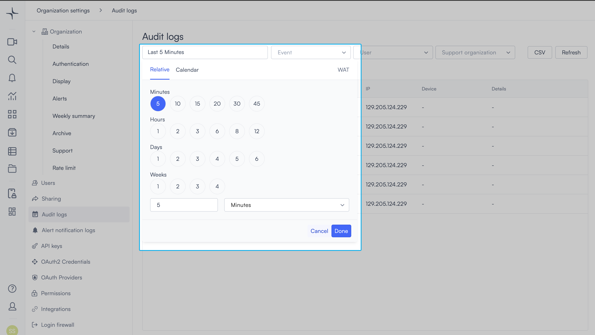

* **Event**: Opens a searchable dropdown. Select one or more event types to filter the log.

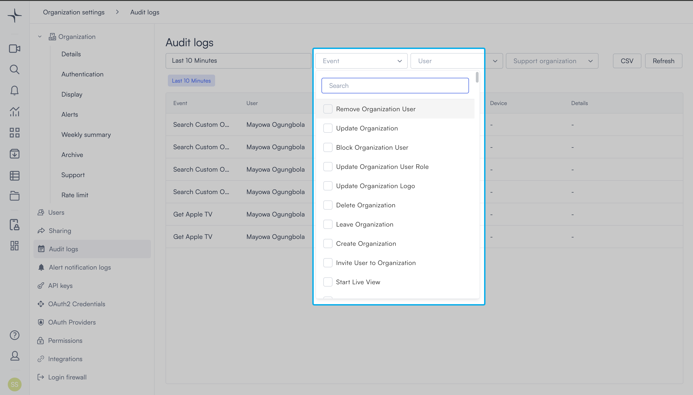

* **User**: Opens a searchable dropdown. Select one or more users to filter the log.

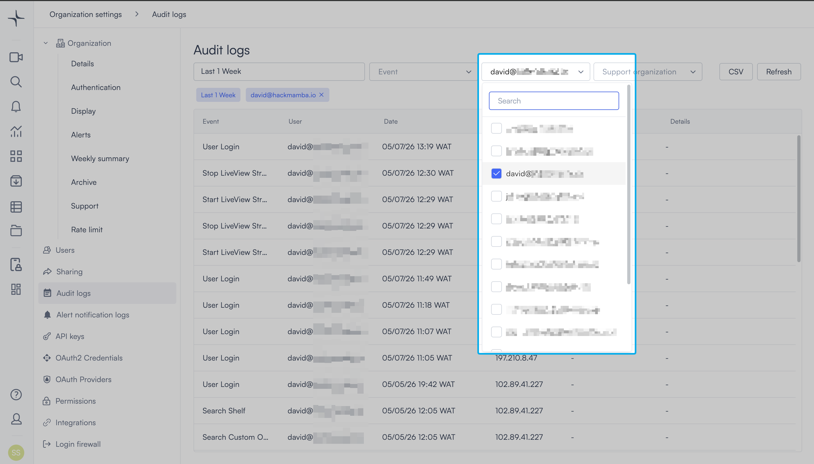

* **Support organization**: Filter the log by the actions a support organization took. A support organization is an external organization you've invited into your own, such as the Lumana Support team. Inviting one gives its members access to your system to help with troubleshooting. If you haven't invited a support organization, then this dropdown is empty.

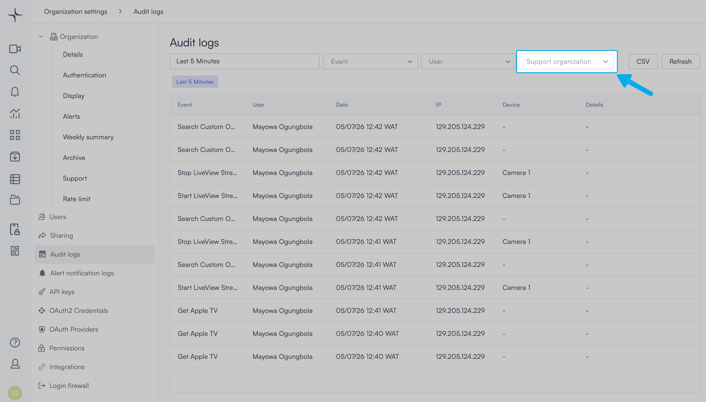

Select **CSV** to download the current audit log results as a CSV file. Select **Refresh** to reload the log.

### Audit log table

Each row in the audit log shows:

* **Event**: The action that was performed.
* **User**: The user who performed the action.
* **Date**: The date and time of the action.
* **IP**: The IP address from which the action was performed.
* **Device**: The device involved, if applicable.
* **Details**: Additional context about the action.

### Tracked events

Lumana tracks over 150 events in the audit log. For the full list with descriptions, see [Audit log events](audit-log-events.md).

## Alert notification logs

Alert notification logs show whether Lumana successfully delivered each alert notification. Use these logs to confirm delivery to email, SMS, and the mobile app, and to investigate missed notifications.

Select **Alert notification logs** in the Organization settings sidebar. The Alert notification logs page opens.

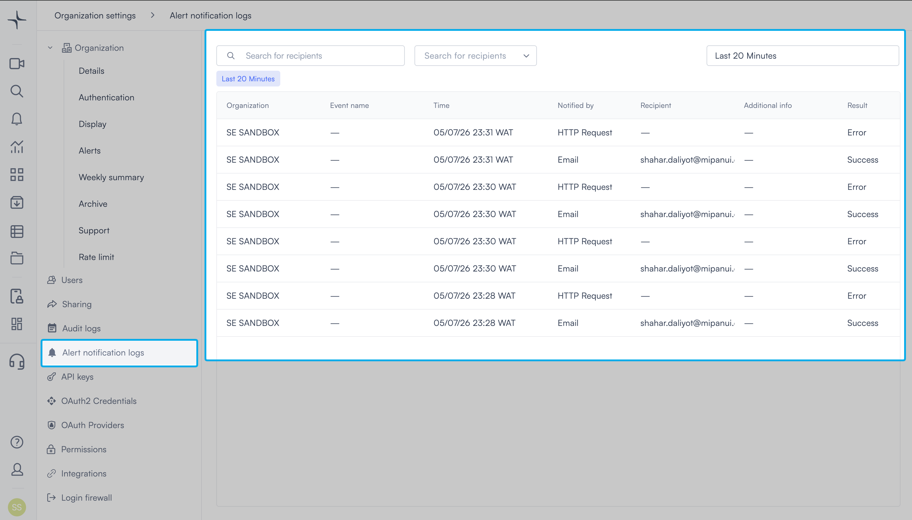

### Filter alert notification logs

Use the filters at the top of the page to narrow the results:

* **Search for recipients**: Enter a recipient's name or email to filter the log.
* **Notification type**: Opens a dropdown to filter by delivery channel. The available channels are:
  * Email
  * SMS
  * Mobile Push
  * HTTP Request
  * Slack
  * Team3

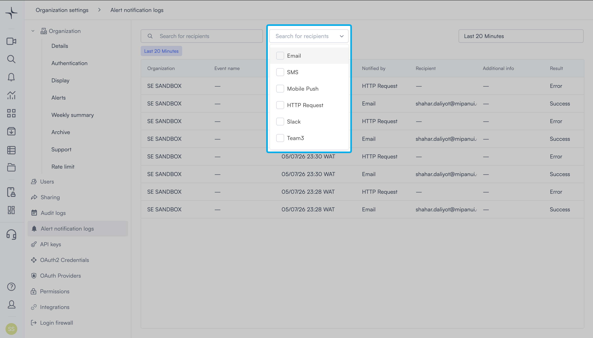

* **Timeframe**: Select a time range to limit results. The default is the last 5 minutes. Selecting the timeframe field opens a picker with two modes:
  * **Relative**: Select a preset value in minutes, hours, days, or weeks. You can also enter a custom value using the number field and unit dropdown.
  * **Calendar**: Select a specific start and end date, with hour and minute precision.

<figure data-with-frame="true">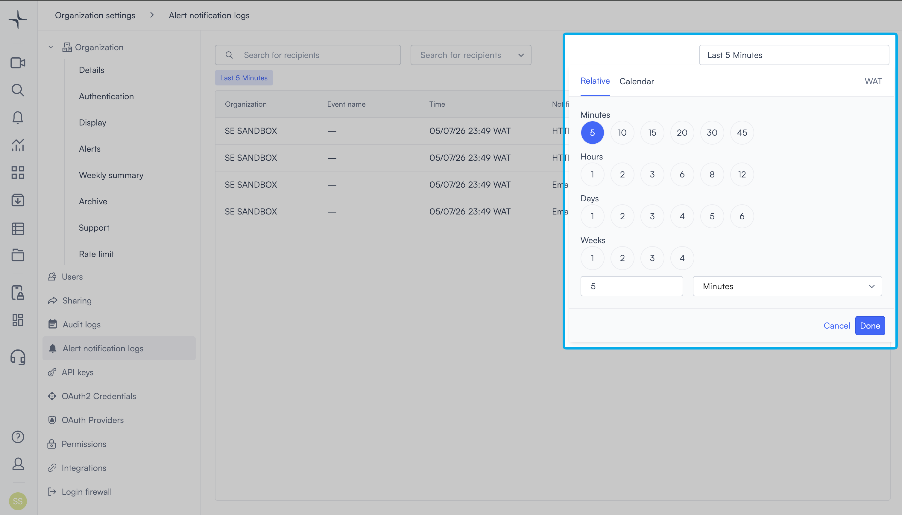<figcaption></figcaption></figure><figure data-with-frame="true">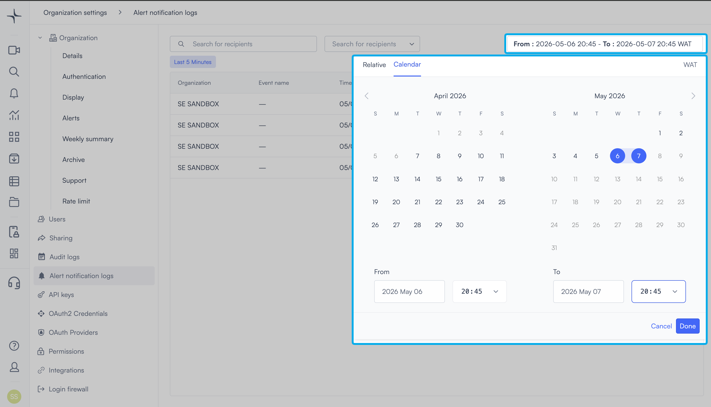<figcaption></figcaption></figure>

  Select **Done** to apply the timeframe.

### Alert notification log table

Each row in the log shows:

* **Organization**: The organization the alert belongs to.
* **Event name**: The name of the alert that triggered the notification.
* **Time**: The date and time the notification was sent.
* **Notified by**: The delivery channel used.
* **Recipient**: The user or address the notification was sent to.
* **Additional info**: Any extra delivery detail.
* **Result**: Whether the notification was delivered successfully.
