# User settings

User settings let you manage your personal account information, security preferences, and display options. Your changes apply only to your own account.

To open user settings, select the person icon in the bottom left of any Lumana page. Select **User settings** from the menu.

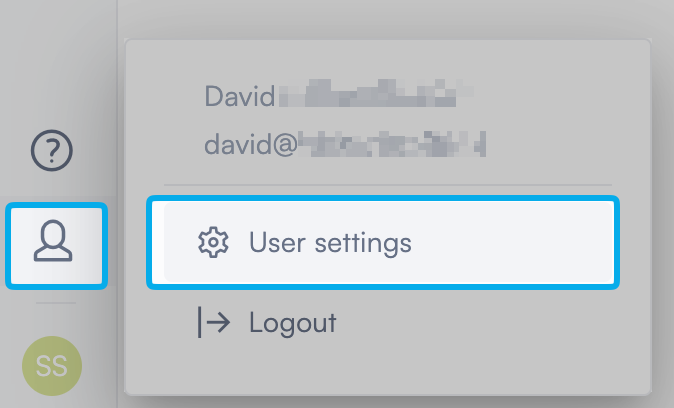

The User settings page opens with six sections in the left navigation: **Organizations**, **Account details**, **Security**, **Identities**, **Live view test**, and **Notifications limit**.

## Manage your organizations

The **Organizations** section shows all Lumana organizations linked to your account. You can create a new organization, switch between existing ones, accept pending invitations, and leave organizations you no longer need.

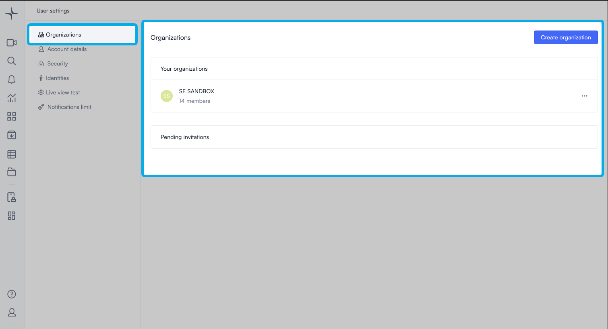

### Create an organization

Creating an organization sets up a new Lumana workspace. The process runs across four steps. You add the organization's details, invite team members, invite partner organizations, and then confirm.

1. Select **Create organization** in the top right. The organization setup flow opens.


[PLACEHOLDER — step 1 screenshot and steps needed: organization name and details.]


2. Enter the email address of each person you want to invite. Select a permission group for each person from the dropdown. To add more people, select **Add more people...**

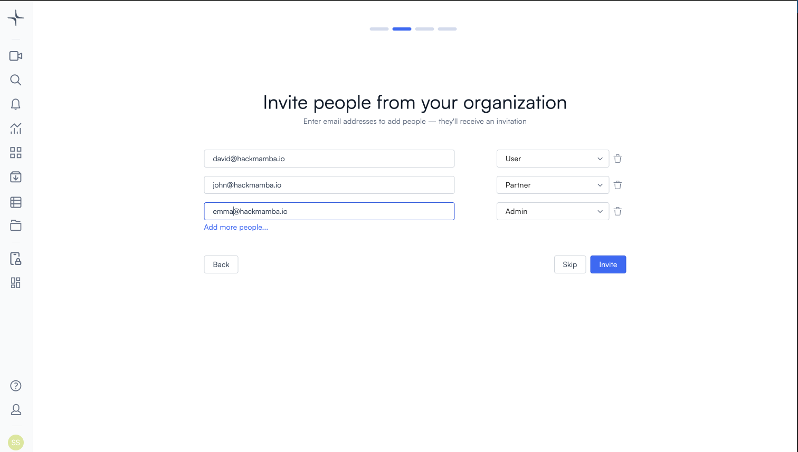

3. Select **Invite**, or select **Skip** to continue without inviting anyone.
4. To invite a partner organization, enter its invite code in the field provided. Select a permission group for that organization. To add more organizations, select **Add more organizations...**

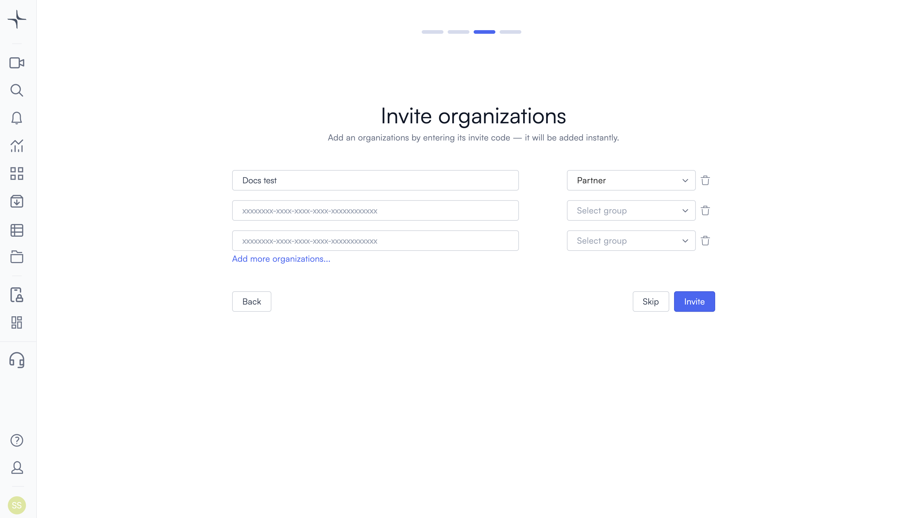

5. Select **Invite**, or select **Skip** to continue without inviting any organizations.
6. Review the summary. It shows the organization name, your email, and the list of people invited. Select **Confirm**.

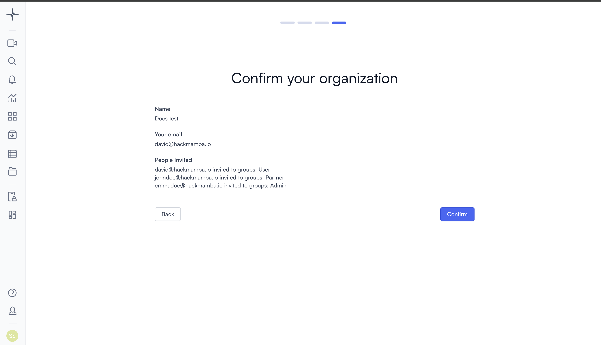

A confirmation message appears: "Organization has been created." A prompt asks if you want to switch to the new organization immediately.

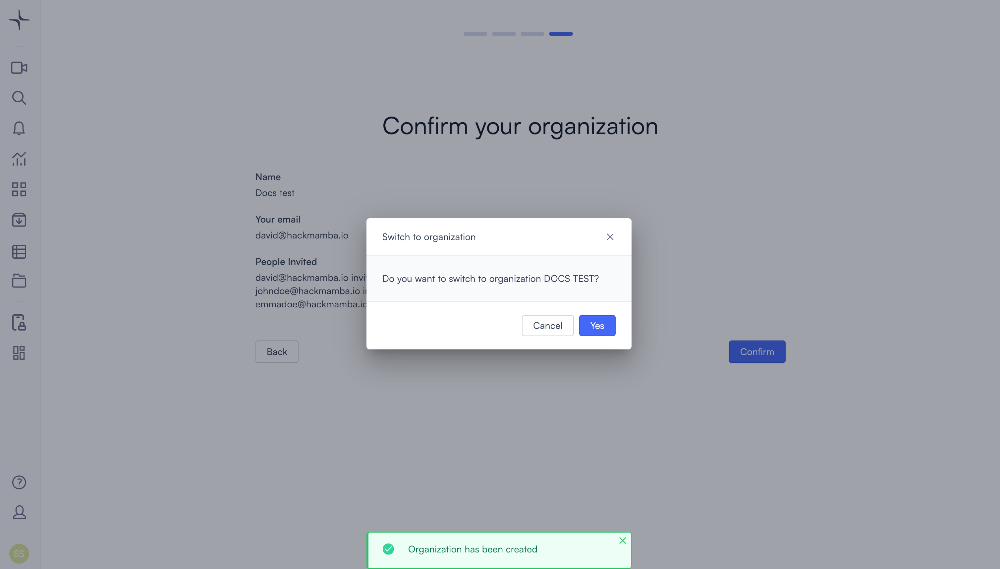

### Switch to an organization

If you belong to more than one organization, then you can switch between them from the Organizations section.

1. In the **Your organizations** list, find the organization you want to switch to.
2. Select **Switch to organization** next to it. A confirmation prompt appears.
3. Select **Yes**. Lumana switches you to that organization.

### Accept or decline a pending invitation

Invitations from other organizations appear in the **Pending invitations** section. You can accept or decline each one individually.

- To accept an invitation, select the checkmark next to it.
- To decline an invitation, select the **X** next to it.

### Leave an organization

Leaving an organization removes your access to it. Your account isn't deleted.

1. In the **Your organizations** list, select the **...** menu next to the organization you want to leave.
2. Select the leave option. A confirmation prompt appears: "Are you sure you want to leave organization?"
3. Select **Yes I'm sure**. Lumana removes the organization from your list.

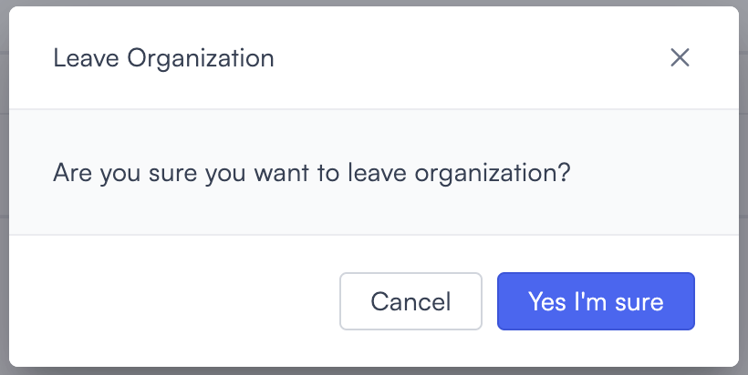

## Update your account details

The **Account details** section lets you update your personal information and display preferences. Select the pencil icon next to any setting to edit it.

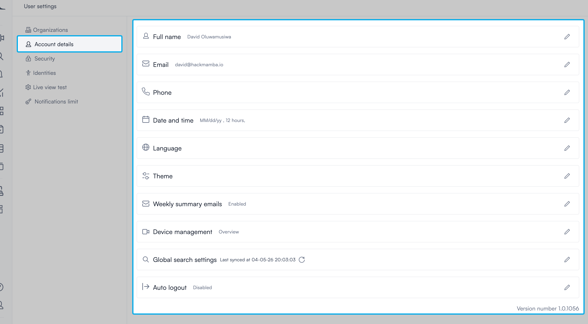

Update your **Full name**, **Email**, and **Phone** to keep your profile current. Lumana uses your phone number for alert notifications, so make sure it's correct if you receive SMS alerts.

Set your preferred **Date and time** format (including 12 or 24-hour clock), **Language**, and **Theme** to match how you work. Turn on **Weekly summary emails** if you want a regular digest of activity sent to your inbox.

Set **Auto logout** to control whether Lumana signs you out after a period of inactivity and how long that period is. Turn this off if you need to stay signed in during long shifts.


[PLACEHOLDER — SME answer needed: What does Device management show? What does Global search settings sync?]


## Manage your security settings

The **Security** section controls how you authenticate and access your account.

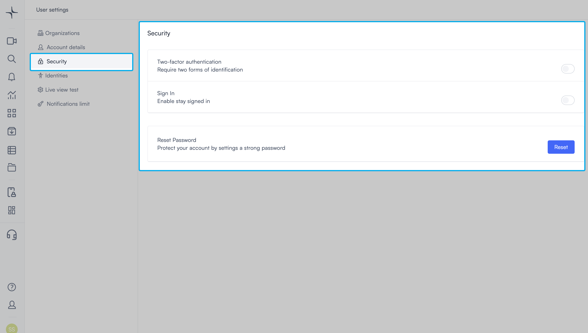

### Two-factor authentication

Requires a second form of identification when you sign in. Turn this on to add an extra layer of security to your account.

### Sign in

Keeps you signed in between sessions. Turn this on if you don't want to sign in each time you open Lumana.

### Reset password

Lets you reset your account password. Select **Reset** to begin.


[PLACEHOLDER — SME answer needed: What happens after selecting Reset? Does it send an email link or open a direct reset flow?]


## Change your password

The **Identities** section shows accounts linked to your Lumana profile. You can change your password here.

1. Select **Identities** in the left navigation. The Linked accounts page opens.
2. Select the pencil icon next to **Username and password**. The Change password panel opens.

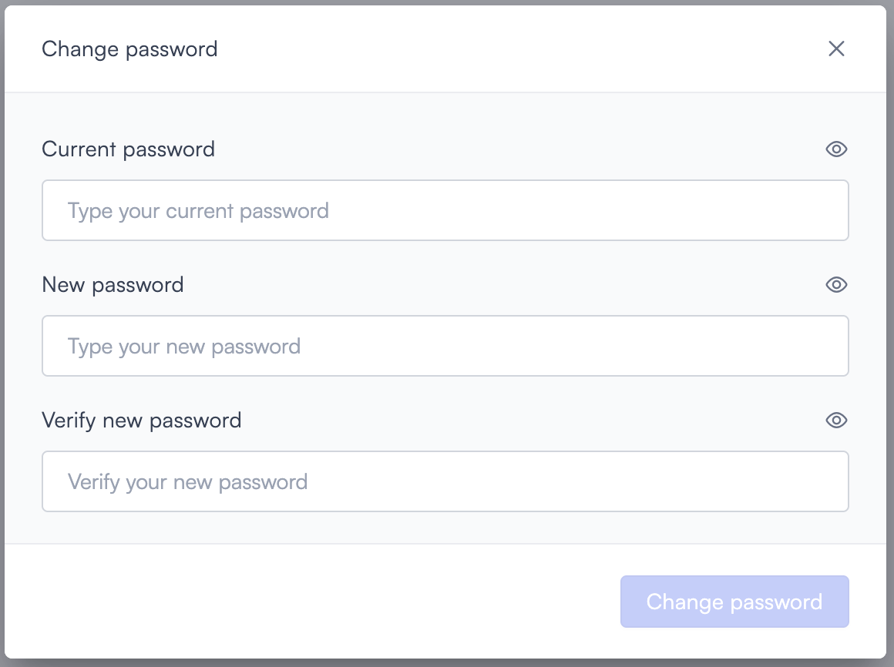

3. Enter your current password in the **Current password** field.
4. Enter your new password in the **New password** field.
5. Enter your new password again in the **Verify new password** field.
6. Select **Change password**.

## Test your live view connection

The **Live view test** section lets you check whether your live view connection is working. Use this if your live view isn't loading as expected.

1. Select **Live view test** in the left navigation.
2. Select your region from the **Live view region** dropdown.
3. Select **Test Connection**. Your browser asks for permission to use your camera.
4. Select **Allow while visiting the site** or **Allow this time** to grant camera access. The test runs automatically.

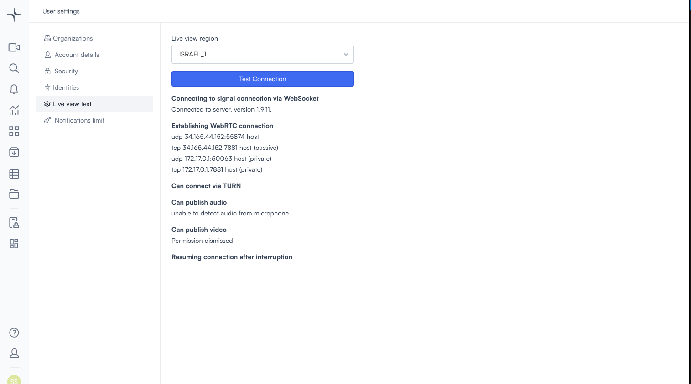

Lumana checks your signal connection, peer-to-peer video connection, TURN relay fallback, and your browser's access to your microphone and camera. Each check shows a status message below it.

A passing check shows a confirmation or no additional message. A failing check describes what went wrong. "Unable to detect audio from microphone" means your microphone isn't accessible. "Permission dismissed" means you denied camera access in the browser prompt.


If you select **Never allow** in the browser prompt, then the video check shows "Permission dismissed." To re-run the test with camera access, reset your browser's camera permission for app.lumana.ai and then select **Test Connection** again.


## View your notification limits

The **Notifications limit** section shows the maximum number of notifications your account can receive per day. Your account can receive up to 500 SMS messages, 2,000 emails, and 5,000 push notifications daily. These limits reset every day and you can't change them from User settings.

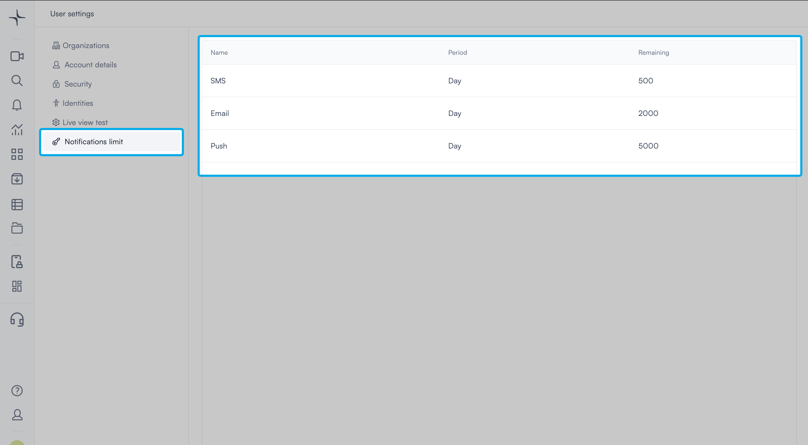

