# User settings

User settings let you manage your personal account information, security preferences, and display options. Your changes apply only to your own account.

To open user settings, select the person icon in the bottom left of any Lumana page. Select **User settings** from the menu.

The User settings page opens with six sections in the left navigation: **Organizations**, **Account details**, **Security**, **Identities**, **Live view test**, and **Notifications limit**.

## Manage your organizations

The **Organizations** section shows all Lumana organizations linked to your account. You can create a new organization, switch between existing ones, accept pending invitations, and leave organizations you no longer need.

### Create an organization

Creating an organization sets up a new Lumana workspace. The process runs across four steps. You add the organization's details, invite team members, invite partner organizations, and then confirm.

1. Select **Create organization** in the top right. The organization setup flow opens.

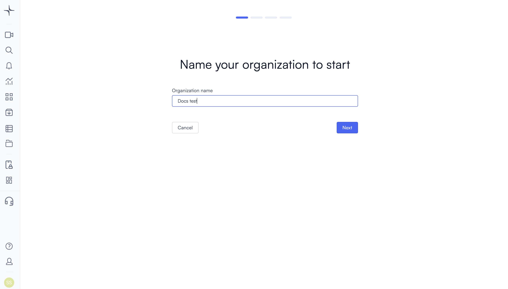

2. Enter the email address of each person you want to invite. Select a permission group for each person from the dropdown. The available roles are **Partner**, **User**, and **Admin**. To add more people, select **Add more people...**

3. Select **Invite**, or select **Skip** to continue without inviting anyone.
4. To invite a partner organization, enter its invite code in the field provided. Select a permission group for that organization. The available roles are **Partner**, **User**, and **Admin**. To add more organizations, select **Add more organizations...**

5. Select **Invite**, or select **Skip** to continue without inviting any organizations.
6. Review the summary. It shows the organization name, your email, and the list of people invited. Select **Confirm**.

A confirmation message appears: "Organization has been created." A prompt asks if you want to switch to the new organization immediately.

### Switch to an organization

If you belong to more than one organization, then you can switch between them from the Organizations section.

1. In the **Your organizations** list, find the organization you want to switch to.
2. Select **Switch to organization** next to it. A confirmation prompt appears.
3. Select **Yes**. Lumana switches you to that organization.

### Leave an organization

Leaving an organization removes your access to it. Your account isn't deleted.

1. In the **Your organizations** list, select the **...** menu next to the organization you want to leave.
2. Select the leave option. 

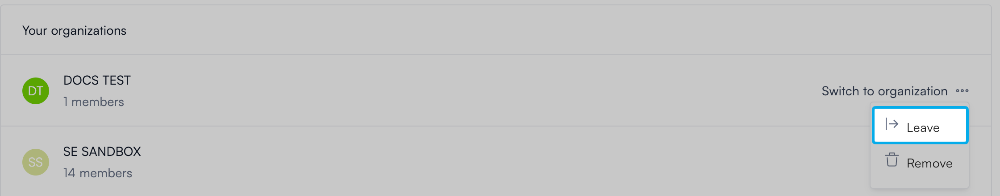

3. A confirmation prompt appears: "Are you sure you want to leave organization?" Select **Yes I'm sure**. Lumana removes the organization from your list.

### Remove an organization

Removing an organization permanently deletes it and all its data. This action is only available to organization admins.


Removing an organization is permanent and cannot be undone.


1. In the **Your organizations** list, select the **...** menu next to the organization you want to remove.
2. Select the remove option. 

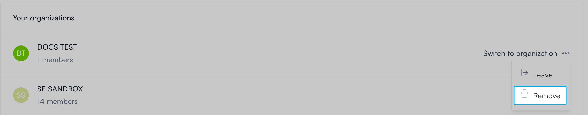

3. A confirmation prompt appears: "Are you sure you want to remove organization?" Select **Yes I'm sure**. Lumana permanently deletes the organization.

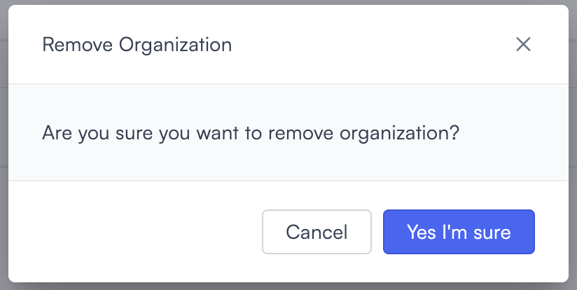

## Update your account details

The **Account details** section lets you update your personal information and display preferences. Select the pencil icon next to any setting to edit it.

Update your **Full name** and **Phone** to keep your profile current. Lumana uses your phone number for alert notifications, so make sure it's correct if you receive SMS alerts.

To change your **Email**, enter your new address in the **New email** field and select **Get Code**. Lumana sends a verification code to your new email address. Enter the code to confirm the change.

Select **Date and time** to set your date format, hour format (12 or 24-hour), and timezone. Select **Save** to apply your changes.

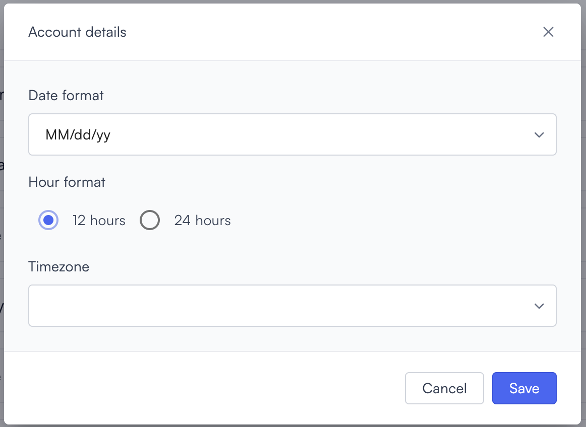

Select **Language** to change the display language for your account.

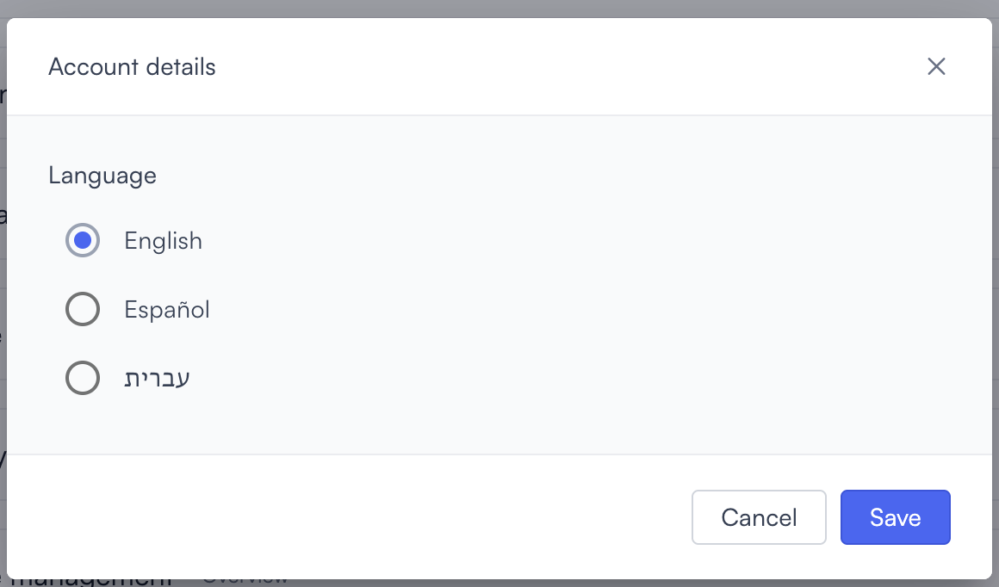

Select **Theme** to switch between light and dark mode.

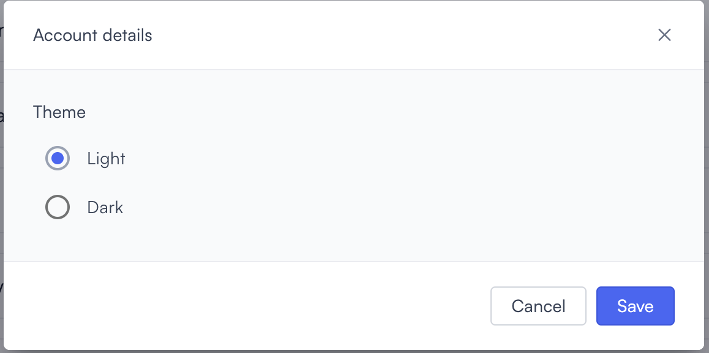

Turn on **Weekly summary emails** if you want a regular digest of activity sent to your inbox.

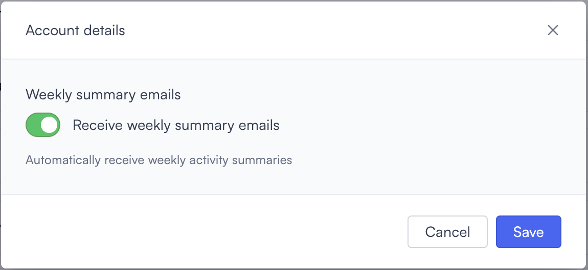

Select **Device management** to choose how your devices display. Select **Overview** for a summary view or **Table** for a list view. Select **Save** to apply your choice.

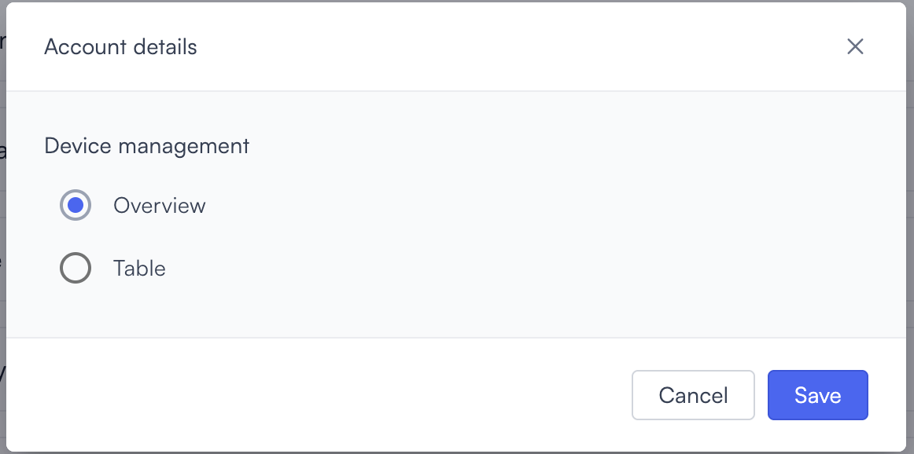

Select **Global search settings** to control how search results display across your account. Turn on **Highlight search matches** to highlight matching terms in results. Turn on **Include match reasons** to show why each result was returned. Select **Save** to apply your changes.

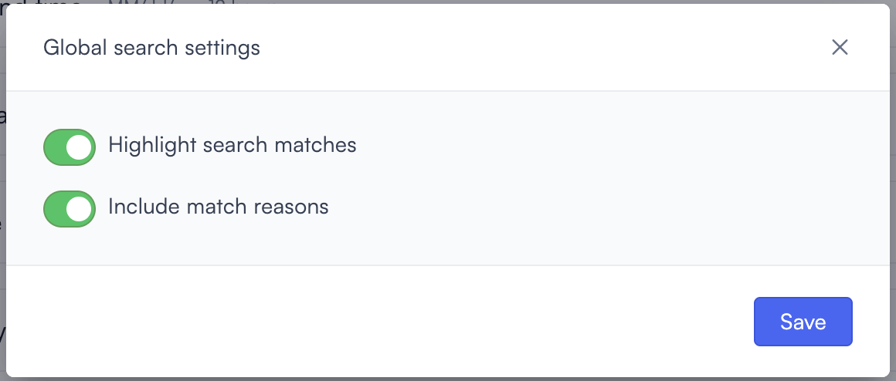

Select **Auto logout** to control whether Lumana signs you out after a period of inactivity and how long that period is. Turn this off if you need to stay signed in during long shifts.

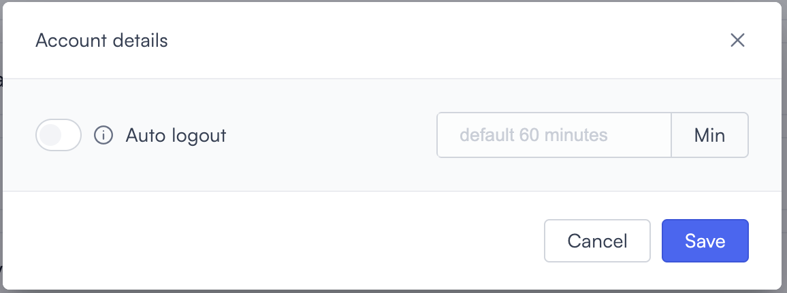

## Manage your security settings

The **Security** section controls how you authenticate and access your account.

### Two-factor authentication

Requires a second form of identification when you sign in. Turn this on to add an extra layer of security to your account.

### Sign in

Keeps you signed in between sessions. Turn this on if you don't want to sign in each time you open Lumana.

### Reset password

Select **Reset** to trigger a password reset email. Lumana sends the email to your registered address. Follow the link in the email to set a new password.

## Change your password

The **Identities** section shows accounts linked to your Lumana profile. You can change your password here.

1. Select **Identities** in the left navigation. The Linked accounts page opens.

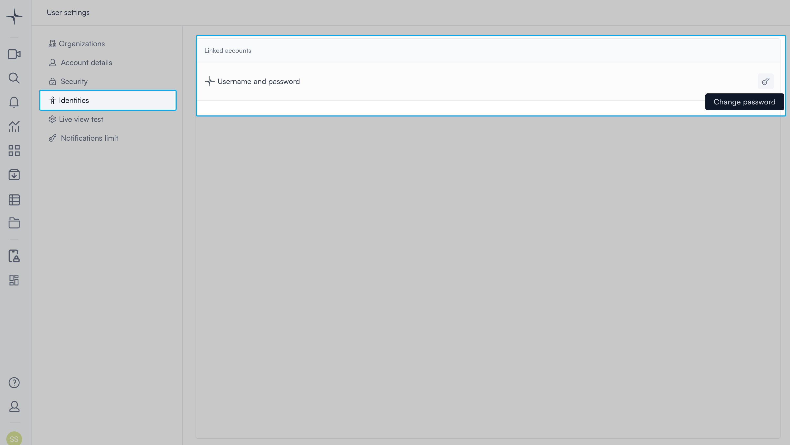

2. Select the pencil icon next to **Username and password**. The Change password panel opens.

3. Enter your current password in the **Current password** field.
4. Enter your new password in the **New password** field.
5. Enter your new password again in the **Verify new password** field.
6. Select **Change password**.

## Test your live view connection

The **Live view test** section lets you check whether your live view connection is working. Use this if your live view isn't loading as expected.

1. Select **Live view test** in the left navigation.

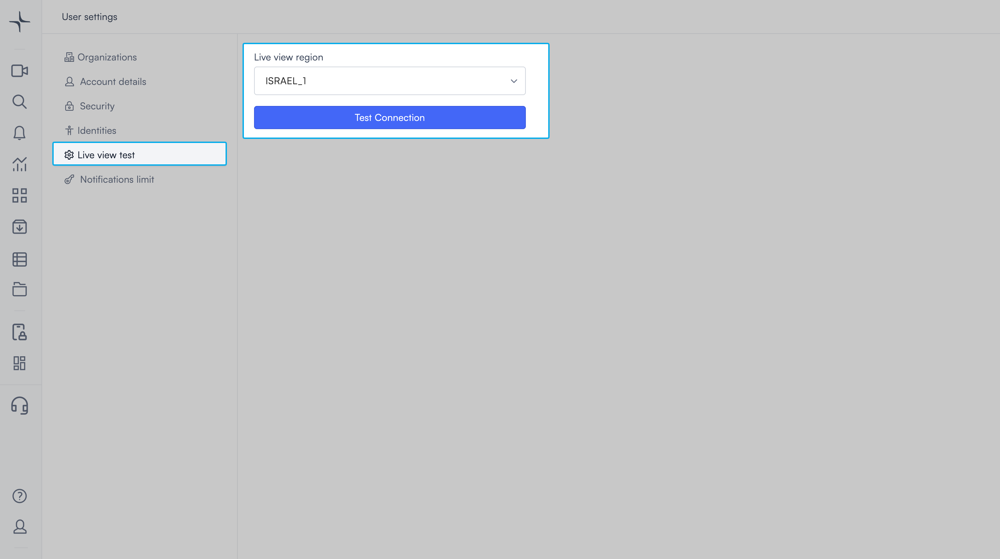

2. Select your region from the **Live view region** dropdown.
3. Select **Test Connection**. Your browser asks for permission to use your camera.

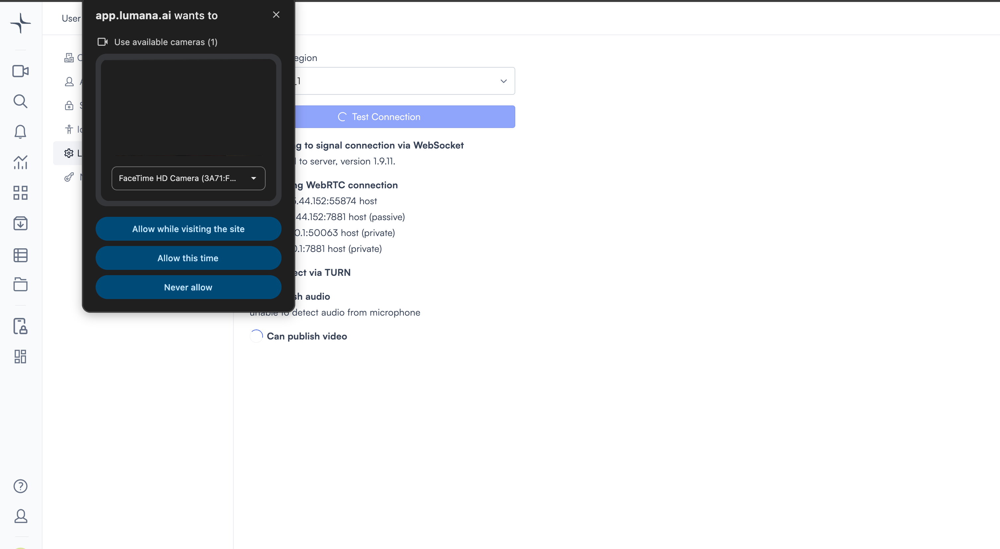

4. Select **Allow while visiting the site** or **Allow this time** to grant camera access. The test runs automatically.

Lumana runs six checks: signal connection, WebRTC connection, TURN relay, audio publishing, video publishing, and connection resumption. Each check shows a status message below it.

A passing check shows a confirmation or no additional message. A failing check describes what went wrong. "Unable to detect audio from microphone" means your microphone isn't accessible. "Permission denied" means you denied camera access in the browser prompt.


If you select **Never allow** in the browser prompt, then the video check shows "Permission denied." To re-run the test with camera access, select **Test Connection** again.


## View your notification limits

The **Notifications limit** section shows the maximum number of notifications your account can receive per day. Your account can receive up to 500 SMS messages, 2,000 emails, and 5,000 push notifications daily. These limits reset every day and you can't change them from User settings.

