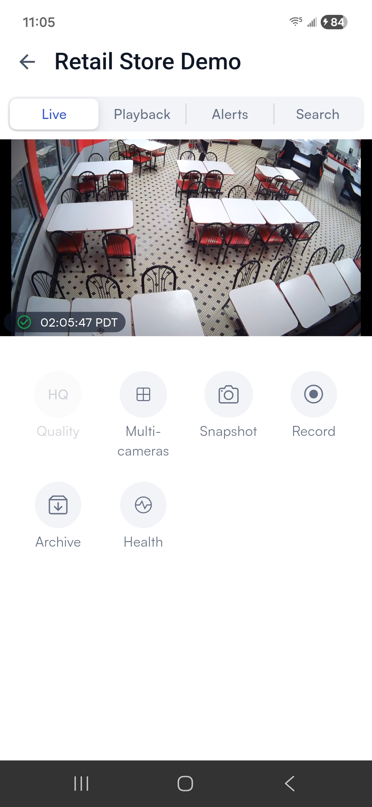

# Access camera control

To access camera control, use the steps described on the [View live feed from a single camera](../view-live-feed-from-a-single-camera.md) page.

## On the camera control screen

<figure><figcaption></figcaption></figure>

The camera control screen has multiple tabs:

* [**Live**](./#view-the-live-feed-from-a-single-camera): (default) Watch the camera's live feed
* [**Playback**](play-back-recorded-footage.md#play-back-recorded-footage): Play back recorded footage
* [**Alerts**](../monitor-alerts.md#from-a-single-camera): View the alerts that were triggered by this camera
* [**Search**](../search-footage-for-people-or-objects.md#from-a-single-camera): Search for people or objects in this camera's footage

### View the live feed from a single camera

This is the default view when you open camera control, by tapping any camera's static thumbnail or live feed tile from [View live feed from a single camera](../view-live-feed-from-a-single-camera.md). Tap **Live** to reach it from any of the other camera control tabs.

<figure><figcaption></figcaption></figure>

On this screen, you can:

* Watch the camera's live feed
* Swipe left or right to switch to another camera
* Rotate your phone to watch the live feed in full screen
* [**Multi-cameras**](../view-feeds-from-multiple-cameras/#create-a-video-wall-spontaneously): View live footage from multiple cameras at once
* [**Quality**](../view-live-feed-from-a-single-camera.md#change-camera-quality): Change camera quality
* [**Snapshot**](share-a-snapshot-or-recording.md#share-a-snapshot-from-live-or-playback-footage): Share a snapshot from the camera feed
* [**Record**](share-a-snapshot-or-recording.md#share-a-recording-of-live-or-playback-footage): Share a recording from the camera feed
* [**Archive**](save-footage-to-the-archives.md): Save archive footage to your account
* [**Share**](share-a-cameras-live-feed.md): Share a link so that others can temporarily watch the video feed from this camera
* [**PTT**](push-to-talk.md): Use the camera's built-in speaker, if available
* [**PTZ**](ptz-pan-tilt-zoom-control.md): Control the camera's pan, tilt, and zoom, if available
* [**Door locked/unlocked**](lock-or-unlock-doors-in-view.md): Lock or unlock a door that has been connected to this camera
* [**Health**](check-camera-connection-status-and-history.md): Check the camera's connection status and history
