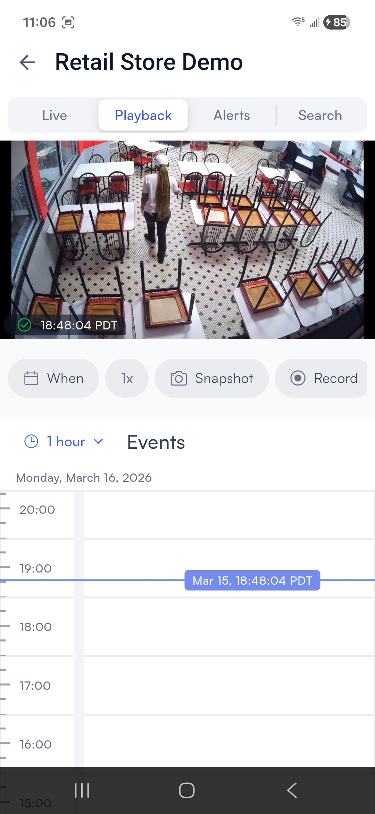
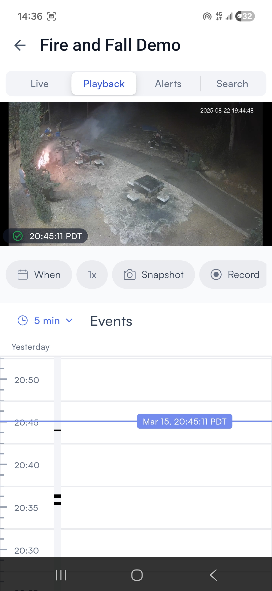

# Play back recorded footage

### Play back recorded footage

On this screen, you can:

* Watch the camera's live feed
* Swipe left or right to switch to another camera
* Rotate your phone to watch the live feed in full screen
* [**Multi-cameras**](play-back-recorded-footage.md#view-the-live-feed-from-multiple-camera): View live footage from multiple cameras at once
* [**Quality**](play-back-recorded-footage.md#change-camera-quality)**:** Change camera quality
* [**Snapshot**](play-back-recorded-footage.md#share-a-snapshot-from-the-camera-footage)**:** Share a snapshot from the camera feed
* [**Record**](play-back-recorded-footage.md#share-a-recording-of-the-camera-footage)**:** Share a recording from the camera feed
* [**Archive**](play-back-recorded-footage.md#save-footage-to-your-accounts-archives)**:** Save archive footage to your account
* [**Health**](play-back-recorded-footage.md#check-camera-connection-status)**:** Check the camera's connection status, past and present

1.  Tap on a camera's live feed and select the **Playback** tab. 

    <figure><figcaption></figcaption></figure>
2. Scroll the timeline to the time and date you want to review.
3. Tap **When** to open the date and time picker. Scroll the wheels to select a date, hour, minute, and AM/PM, then tap **Save** to jump to that point.
4. Use the **1x** control to adjust playback speed.
5. Scroll down to the **Events** section to see activity detected in that period.

The **Playback** tab also has the following controls:

* **Record**: Start a local recording of the current footage. A timer appears at the top of the feed while recording is active. Tap the red stop button to end the recording.
* **Archive**: Save a specific clip to your archives. Enter a name, set the **From** and **To** times, and tap **Create**.
* **Multi-cameras**: View up to four cameras simultaneously on the same screen.
* **Album**: Browse all archived clips for the camera, filtered by time.

 

 

