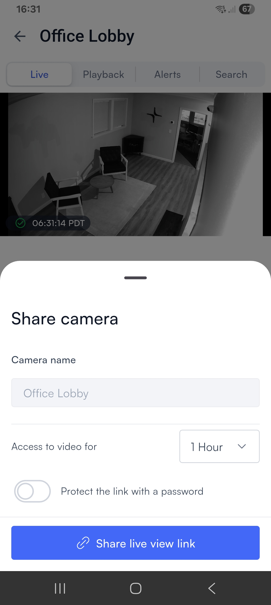

# Share a camera's live feed

There will be times when you want to provide people outside of your organization with access to your live camera feed. For example, you may want law enforcement to be able to see what is happening while they respond to an incident.

To share a camera feed, tap the **Share** icon on the [camera control screen](./).

<figure><figcaption></figcaption></figure>

The **Share camera** screen opens:

<figure><figcaption></figcaption></figure>

Use the dropdown to select how long this access will last (from 1 hour to 4 months). If you want the link to be password-protected, select **Protect the link with a password**, which adds a Password and a Confirm Password field to the window.

Finally, select **Share live view link** to bring up the Android or iOS sharing menu, from which you can choose what to do with the link:

<figure><figcaption></figcaption></figure>

