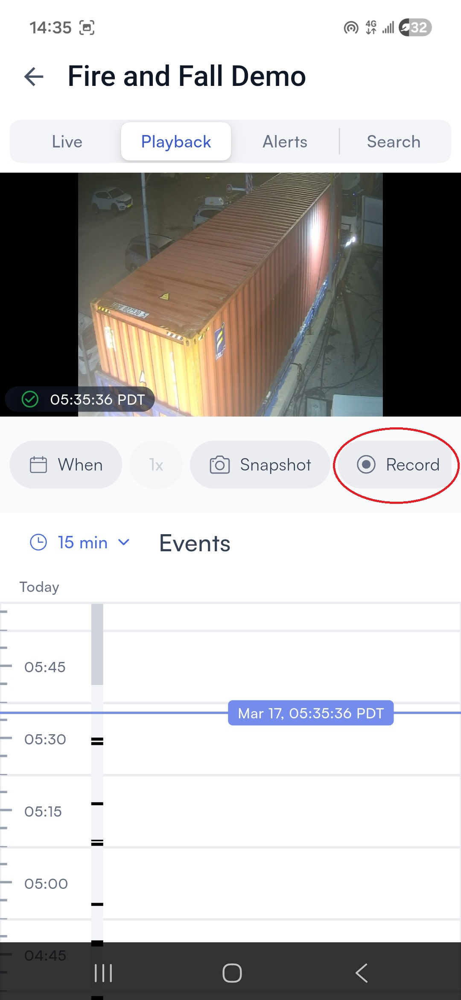
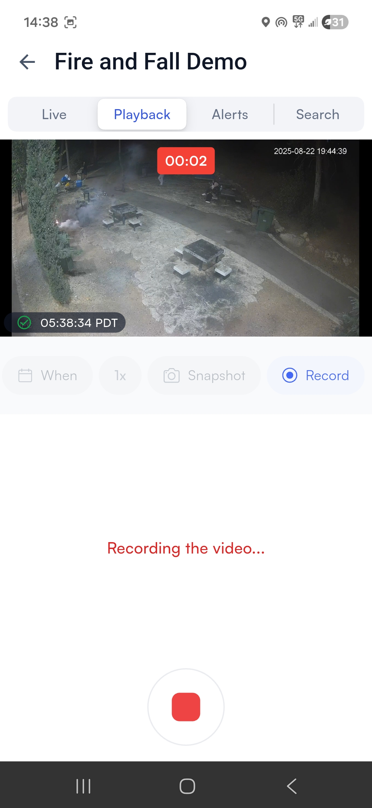

# Share a snapshot or recording

### Share a snapshot from live or playback footage

From a [camera control screen](share-a-snapshot-or-recording.md#camera-control), tap **Snapshot**. This feature is available on both the **Live** tab and the **Playback** tab.




<figure><figcaption></figcaption></figure>





<figure><figcaption></figcaption></figure>




The app brings up the Android or iOS sharing menu, from which you can choose what to do with the image:

<figure><figcaption></figcaption></figure>

### Share a recording of live or playback footage

From a [camera control screen](share-a-snapshot-or-recording.md#camera-control), tap **Record**. This feature is available on both the **Live** tab and the **Playback** tab.




<figure><figcaption></figcaption></figure>





<figure><figcaption></figcaption></figure>




The app begins recording:

<figure><figcaption></figcaption></figure>

Press the stop button to end the recording. The app briefly processes the recording, then brings up the Android or iOS sharing menu, from which you can choose what to do with the recording:

<figure><figcaption></figcaption></figure>

