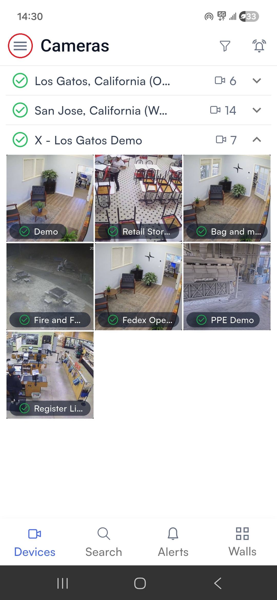
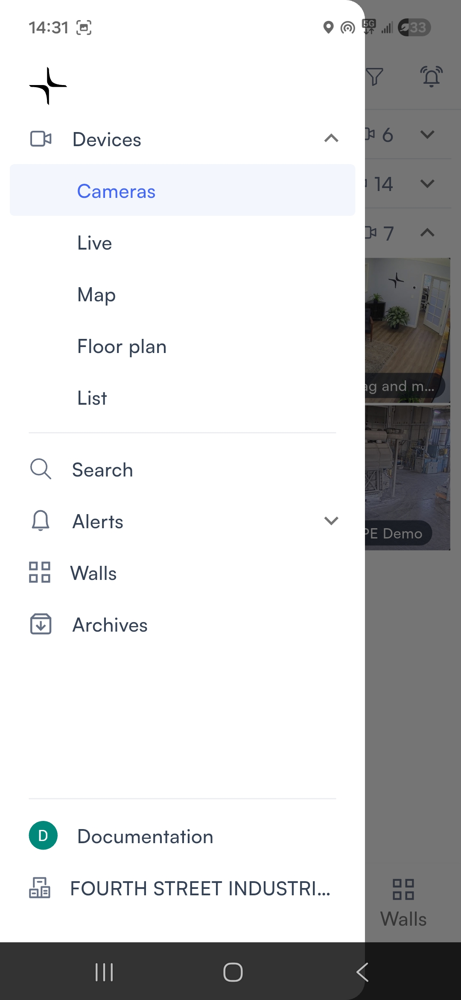

# Navigation

## Quick links

The bottom navigation bar contains links to the most commonly used screens in the mobile app:

<figure><figcaption></figcaption></figure>

* [**Devices**](view-live-feed-from-a-single-camera.md): Browse the camera feeds and other devices owned by your organization. By default, this brings you to the [**Cameras**](view-live-feed-from-a-single-camera.md#cameras) screen; you can change this in [Change default camera selection screen](settings/change-default-camera-selection-screen.md).
* [**Search**](search-footage-for-people-or-objects.md): Search for people or objects across your cameras using filters.
* [**Alerts**](monitor-alerts.md#from-all-cameras): View past and present notifications triggered by your Lumana system.
* [**Walls**](view-feeds-from-multiple-cameras/): Open and monitor multi-camera video walls.

## Left (full) navigation bar

Tap the **menu icon (≡)** in the top left to open the full navigation bar:

<figure><figcaption></figcaption></figure> <figure><figcaption></figcaption></figure>

This menu contains links to the following sections:

* [**Devices**](view-live-feed-from-a-single-camera.md): Expands to show:
  * [**Cameras**](view-live-feed-from-a-single-camera.md#cameras)**:** A list of cameras in your system, grouped by location
  * [**Live**](view-live-feed-from-a-single-camera.md#live)**:** Browse the live video feeds of all of the cameras in your system
  * [**Map**](view-live-feed-from-a-single-camera.md#map)**:** A world map that shows the location of each device in your system
  * [**Floor plan**](view-live-feed-from-a-single-camera.md#floor-plan)**:** Floor plans of the areas covered by your Lumana system, and the location of each camera in that floor plan
  * [**List**](view-live-feed-from-a-single-camera.md#list)**:** A complete list of devices (cameras, Lumana Cores, and others) in your system
* [**Search**](search-footage-for-people-or-objects.md#from-all-cameras): The Search screen.
* [**Alerts**](monitor-alerts.md#from-all-cameras): Expands to show **Monitoring** and **Configuration**.
  * **Monitoring**:
  * **Configuration**:
* [**Walls**](view-feeds-from-multiple-cameras/): Monitor your organization's preset video walls.
* [**Archives**](view-archive-footage.md): Displays recordings that were saved to the archive.
