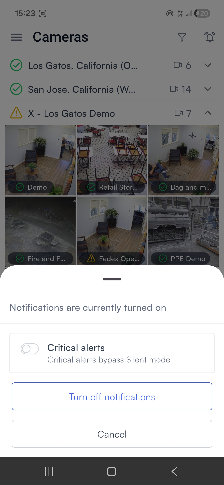

# Notification settings

## Set up mobile notifications

To receive alert notifications on your phone, you need to enable them in two places: inside the Lumana app and in your device settings.

### In the Lumana app

<figure><figcaption></figcaption></figure>

The bell icon in the top right controls your in-app notification settings. Tap it to open the notification panel.

 <figure><figcaption></figcaption></figure>

From the notification panel you can:

* Toggle **Critical alerts** on to allow critical notifications to bypass Silent mode on your device.
* Tap **Turn off notifications** to stop receiving notifications from the app.
* Tap **Cancel** to dismiss without making changes.

### On iOS

If notifications aren't already enabled for Lumana, then turn them on in your iPhone or iPad settings.

1. Open **Settings** on your iPhone or iPad.
2. Select **Apps**.
3. Find and select **Lumana**.
4. Select **Notifications**.
5. Toggle **Allow Notifications** on.

### On Android

If notifications aren't already enabled for Lumana, then turn them on in your Android app settings.

1. Open **Settings** on your Android device.
2. Select **Apps and notifications**, then select **Lumana**.
3. Select **Notifications**.
4. Toggle notifications on.

With notifications enabled, Lumana can alert you to events in real time regardless of which device you're on. The app gives you full access to your cameras, footage, alerts, and video walls from anywhere.
