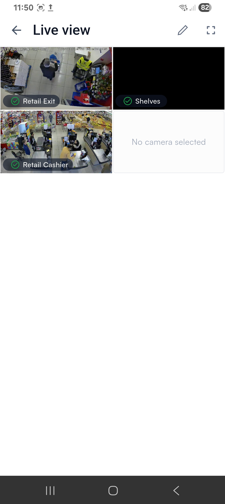
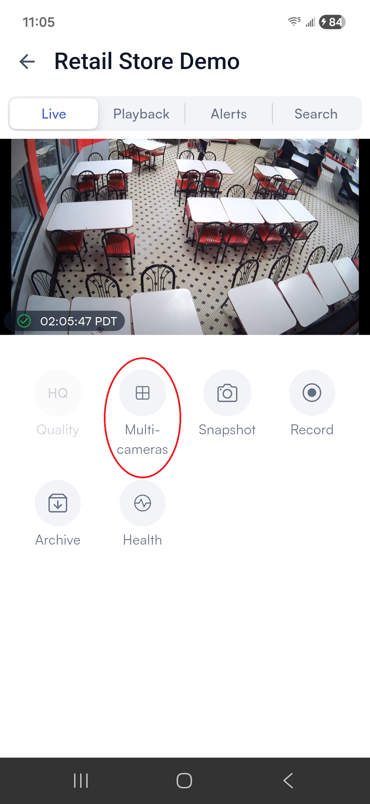
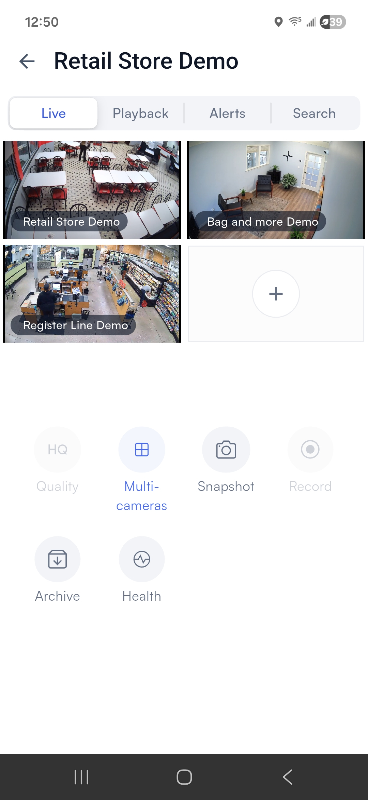
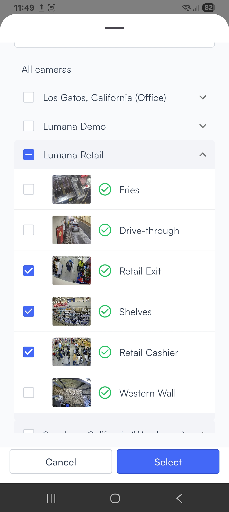
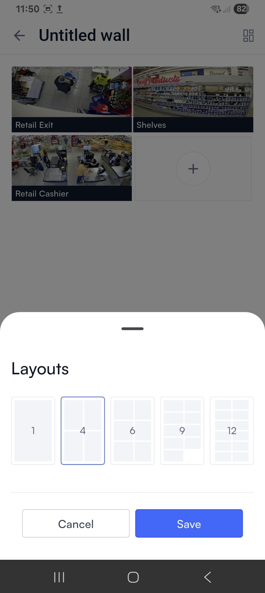

# View feeds from multiple cameras

A video wall is a collection of feeds from multiple cameras, arranged in a grid. This way you can monitor multiple cameras simultaneously.

Your organization may already have [permanent video walls created by your administrators](create-a-permanent-video-wall.md). You can create your own temporary video walls, which only last for as long as you are viewing them.

## View an existing video wall

Tap **Walls** in the bottom navigation bar or in the left navigation bar to open the Walls page. This page presents a list of available video walls.

<figure><figcaption></figcaption></figure>

Tap the name of any wall on the list to open it. While the live view is open, you can rotate your device or tap the .png>) (**Full screen**) icon to expand the images for a closer look.

<figure><figcaption></figcaption></figure>

If you have the necessary permissions, you can tap the .png>)(**Edit**) icon to make changes to the video wall.

## Create and monitor a temporary video wall

You can create a video wall spontaneously while watching a camera's live or playback footage, or use the Walls page to build a temporary video wall (known as a "live view") from scratch.

### Create a video wall spontaneously

This procedure is useful when reviewing playback footage that you want to monitor through multiple cameras simultaneously. It can also be used to monitor a situation live.

This type of video wall is limited to a maximum of four cameras.

1. While watching the live feed or playback footage of a camera on its [camera control screen](../access-camera-control/), tap **Multi-cameras**.




<figure><figcaption></figcaption></figure>





<figure><figcaption></figcaption></figure>




2. The video feed from the current camera is made smaller and placed in the corner of a 2x2 grid. Each other cell in the grid displays a **+** icon. Tap this icon to bring up a list of the other cameras in your system.
3. Tap on a camera's thumbnail, then tap **Select** to add it to that location in the grid. This screenshot, for example, shows a spontaneous video wall with three camera feeds and room for one more:

<figure><figcaption></figcaption></figure>

4. If you want to add more cameras, repeat steps 2 and 3 for the other cells in the grid. You can also tap on a feed you already selected to replace its footage with that of another camera.


While in this mode, the **Quality**, **Archive**, and **Health** buttons only affect the first camera's video feed.


### Build a live view (temporary video wall)

This type of wall is useful when you want to monitor live footage from more than four cameras at once. It cannot be used to review playback footage.

1. Tap **Walls** in the bottom navigation bar or in the left navigation bar to open the Walls page. Then tap the **+** icon in the upper right to create a new video wall.

<figure><figcaption></figcaption></figure>

2. A list of the cameras in your system appears. Select any number of cameras, then tap **Select**.

<figure><figcaption></figcaption></figure>

3. A preview of your video wall appears. Before creating the live view, you may make any of the following changes:
   1. Tap the **+** icon in a blank tile to add another camera feed.
   2. Tap an existing camera feed to replace it with another.
   3. Tap the Layout icon in the upper right to change the size and number of the tiles.




<figure><figcaption></figcaption></figure>





<figure><figcaption></figcaption></figure>





If you select a layout that supports fewer cameras than you have in your wall, the extra camera feeds will not be visible. You can still edit the video wall after it is created to make those feeds visible again.


4. Finally, tap **Create live view**. The app loads the video feeds from the selected cameras.

<figure><figcaption></figcaption></figure>

While the live view is open, you can rotate your device or tap the .png>) (**Full screen**) icon to expand the images for a closer look.

To edit the live view, tap the .png>)(**Edit**) icon. There you can change the camera feeds or the layout as described in step 3 above.


The live view is not permanently saved; it only exists as long as you are viewing it.

