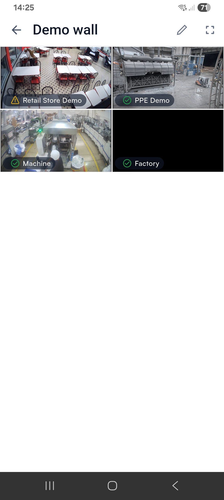
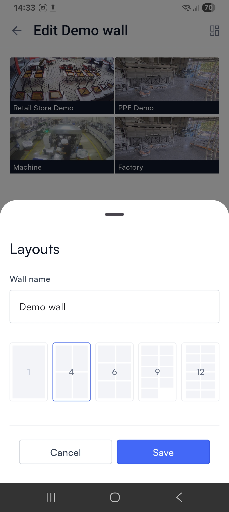

# Create a permanent video wall

These steps create a video wall that is permanently saved in your organization and can be reopened later.

You will be able to choose whether to keep the wall visible to anyone in your organization, or to label it as private (visible only to you).

Creating a permanent video wall is very similar to [creating a live view (temporary video wall)](./#build-a-live-view-temporary-video-wall).

1. Tap **Walls** in the bottom navigation bar or in the left navigation bar to open the Walls page. Then tap the **+** icon in the upper right to create a new video wall.

<figure><figcaption></figcaption></figure>

2. A list of the cameras in your system appears. Select any number of cameras, then tap **Select**.

<figure><figcaption></figcaption></figure>

3. A preview of your video wall appears. Before creating the wall, you may make any of the following changes:
   * Tap the **+** icon in a blank tile to add another camera feed.
   * Tap an existing camera feed to replace it with another.
   * Tap the Layout icon in the upper right to change the size and number of the tiles.




<figure><figcaption></figcaption></figure>





<figure><figcaption></figcaption></figure>





If you select a layout that supports fewer cameras than you have in your wall, the extra camera feeds will not be visible. You can still edit the video wall after it is created to make those feeds visible again.


4. Finally, tap **Create wall**. Enter a name for the wall in the dialog that opens. Optionally, you can select **Private** if you want the wall to be visible only to you. Then tap **Save**.

<figure><figcaption></figcaption></figure>


The Private setting cannot be changed after the wall is created.


While the video wall is open, you can rotate your device or tap the .png>) (**Full screen**) icon to expand the images for a closer look.

<figure><figcaption></figcaption></figure>

### Edit a video wall

<figure><figcaption></figcaption></figure>

To make changes to a video wall, first open the wall on, then tap the .png>)(**Edit**) icon in the upper right. You can make these changes:

* Tap the **+** icon in a blank tile to add another camera feed.
* Tap an existing camera feed to replace it with another.
* Tap the Layout icon in the upper right to change the name of the wall or the size and number of the tiles.



<figure><figcaption></figcaption></figure>



<figure><figcaption></figcaption></figure>





If you select a layout that supports fewer cameras than you have in your wall, the extra camera feeds will not be visible. You can still edit the video wall after it is created to make those feeds visible again.

